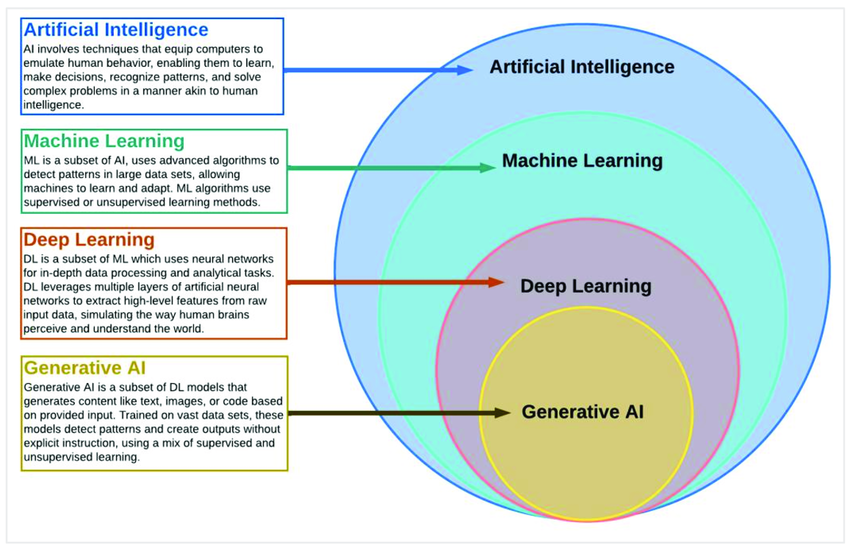

# Introduction to Artificial Intelligence

## Apa itu Kecerdasan Artifisial?

## Apa itu Machine Learning?

Machine Learning adalah cabang dari Artificial Intelligence (AI) dan ilmu komputer yang berfokus pada penggunaan data dan algoritma untuk memungkinkan AI meniru cara manusia belajar, secara bertahap meningkatkan akurasinya. ML memungkinkan sistem komputer untuk meningkatkan kinerjanya pada tugas tertentu melalui pengalaman, tanpa perlu diprogram secara eksplisit.

## Bagaimana Machine Learning Bekerja?

Menurut UC Berkeley, sistem pembelajaran dalam algoritma machine learning terdiri dari tiga bagian utama:

- A Decision Process Keputusan: Algoritma ML umumnya digunakan untuk membuat prediksi atau klasifikasi. Berdasarkan data input (berlabel atau tidak berlabel), algoritma akan menghasilkan estimasi tentang pola dalam data.
- An Error Function : Fungsi error mengevaluasi prediksi model. Jika ada contoh yang diketahui, fungsi error dapat membuat perbandingan untuk menilai akurasi model.
- A Model Optimization Process: Jika model dapat lebih baik menyesuaikan dengan titik-titik data dalam set pelatihan, maka bobot disesuaikan untuk mengurangi perbedaan antara contoh yang diketahui dan estimasi model. Algoritma akan mengulangi proses "evaluasi dan optimisasi" ini secara iteratif, memperbarui bobot secara otonom hingga ambang akurasi tertentu tercapai.

## Konsep Dasar Machine Learning
Machine Learning terdiri dari beberapa komponen utama:

- Data: Bahan baku utama untuk model ML. = Algoritma: Metode yang digunakan untuk "belajar" dari data.
- Model: Hasil dari proses pembelajaran yang dapat digunakan untuk prediksi atau klasifikasi.
- Evaluasi: Proses mengukur kinerja model.

**Contoh Sederhana Use Case Machine Learning : Klasifikasi Email**

Salah satu contoh sederhana penerapan machine learning adalah klasifikasi pada email yang masuk pada gmail Anda terkait pemisahan email spam/non spam.

**Langkah-langkah sederhana:**

- Pengumpulan Data: Kumpulkan dataset email yang sudah dilabeli sebagai spam atau bukan spam.
- Pra-pemrosesan: Ubah email menjadi format yang dapat diproses (misalnya, One hot/label encoding).
- Pemilihan Algoritma: Pilih algoritma klasifikasi.
- Pelatihan Model: Gunakan sebagian data untuk melatih model.
- Evaluasi: Uji model dengan data yang belum pernah dilihat sebelumnya.
- Penerapan: Gunakan model untuk mengklasifikasikan email baru.

**Contoh Use Case Machine Learning pada Big Company**

- [Gojek Blog: How Gojek Allocates Personalised Vouchers at Scale](https://www.gojek.io/blog/how-gojek-allocates-personalised-vouchers-at-scale)
- [Netflix Tech Blog: Recommending for Long-term Member Satisfaction at Netflix](https://netflixtechblog.com/recommending-for-long-term-member-satisfaction-at-netflix-ac15cada49ef)
- [Tiktok FYP/Content Recommender: How to Build the TikTok Recommender System End-to-End](https://newsletter.theaiedge.io/p/deep-dive-how-to-build-the-tiktok)