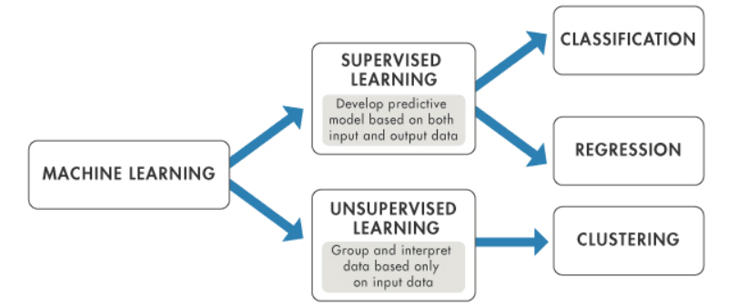
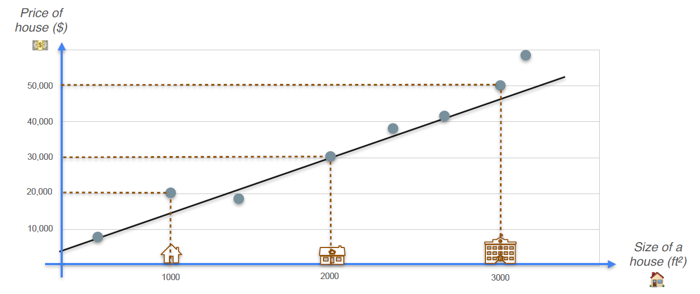
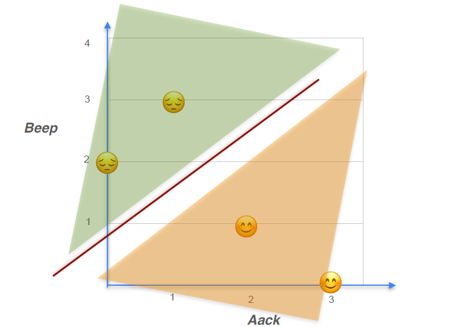
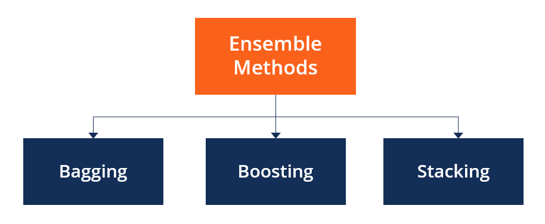
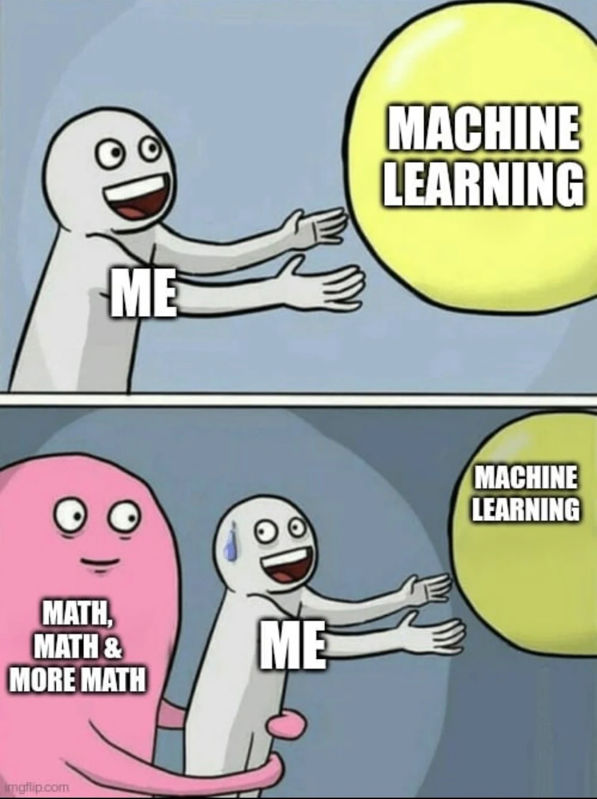

# Modul 1 - Supervised Learning, Metrics Evaluation of Supervised Learning, and Ensemble Methods

## <b>Daftar Isi</b>
- [Supervised Learning](#supervised-learning)
    1. [Regresi](#regresi)
    2. [Klasifikasi](#klasifikasi)
- [Metode](#metode)
    1. [Linear Models](#linear-models)
    2. [Tree-based Models](#tree-based-models)
- [Ensemble Methods](#ensemble-methods)
- [Referensi](#referensi)

## <b>Supervised Learning</b>

Supervised learning adalah salah satu bidang machine learning di mana model belajar dari data pelatihan berlabel. Selama training, pengguna memberikan data input kepada algoritma serta label output yang terkait. Berdasarkan data input, algoritma mempelajari pemetaan dari input ke output dan menghasilkan prediksi atau penilaian. Ada banyak penerapan yang menggunakan supervised learning, termasuk penyaringan spam, pengenalan suara, penerjemahan mesin, dan periklanan online.

Sebelum menggunakan model Supervised Learning, sebaiknya dilakukan eksplorasi data (Exploratory Data Analysis/EDA) terlebih dahulu untuk memahami karakteristik, pola, dan kualitas data yang digunakan. Seperti yang telah dilakukan pada [modul 0](../modul-0/Modul_0.ipynb)

    

## <b>Regresi</b>

Regresi adalah salah satu jenis metode Supervised Learning di mana variabel targetnya berupa nilai yang bersifat kontinu. Contoh penggunaannya termasuk memprediksi berat badan, usia, harga, dan sebagainya.

    

[Kode Implementasi Regresi](code/regresi.ipynb) 

## <b>Klasifikasi</b>

Klasifikasi adalah salah satu metode dalam Supervised Learning di mana algoritma belajar dari data berlabel untuk memprediksi kategori atau kelas dari data baru di masa mendatang. Metode ini digunakan untuk membedakan data ke dalam beberapa kelompok berdasarkan fitur-fitur tertentu.

    

[Kode Implementasi Klasifikasi](code/klasifikasi.ipynb)

## <b>Metode</b>

### <b>Linear Models</b>

Linear models adalah metode *supervised learning* yang membuat prediksi berdasarkan hubungan linear antar fitur. 
    
Di **regression**, model digunakan untuk memprediksi nilai numerik seperti harga atau jumlah, sedangkan pada **classification** model digunakan untuk memisahkan data ke dalam beberapa kelas menggunakan batas keputusan linear. 
    
Contohnya adalah Linear Regression dan Logistic Regression.

### <b>Tree-based Models</b>

Untuk Tree-based model, metode yang membuat prediksi lewat serangkaian aturan keputusan berbentuk pohon. 

Pada **regression**, model memprediksi nilai numerik dengan membagi data ke beberapa kelompok. Sedangkan di **classification** model, menentukan kelas berdasarkan kondisi tertentu dari fitur. 
    
Contohnya adalah Decision Tree, Random Forest, dan Gradient Boosting.

## <b>Ensemble Methods</b>

Dengan menggabungkan beberapa model sekaligus untuk menghasilkan prediksi yang lebih akurat. 
    
Ide dasarnya: daripada mengandalkan satu model yang bisa saja salah, kita menggabungkan banyak model supaya kesalahannya bisa saling menutupi. Ensemble biasanya dibangun dari model-model dasar seperti decision tree atau model lain yang sudah dipelajari sebelumnya. 
    
Contoh metode ensemble yang sering digunakan adalah Random Forest dan Gradient Boosting, yang dikenal punya performa bagus di banyak kasus.

    

[Kode Implementasi Ensemble Methods](code/ensemble.ipynb)

    

## <b>Referensi</b>

### Sumber Belajar yeuh

Supervised Learning:
- https://www.datacamp.com/blog/supervised-machine-learning
- https://www.geeksforgeeks.org/machine-learning/ml-classification-vs-regression/

Ensemble Methods:
- https://www.geeksforgeeks.org/machine-learning/a-comprehensive-guide-to-ensemble-learning/

Evaluation Metrics:
- https://www.geeksforgeeks.org/machine-learning/metrics-for-machine-learning-model/