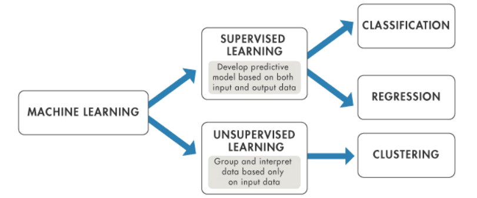
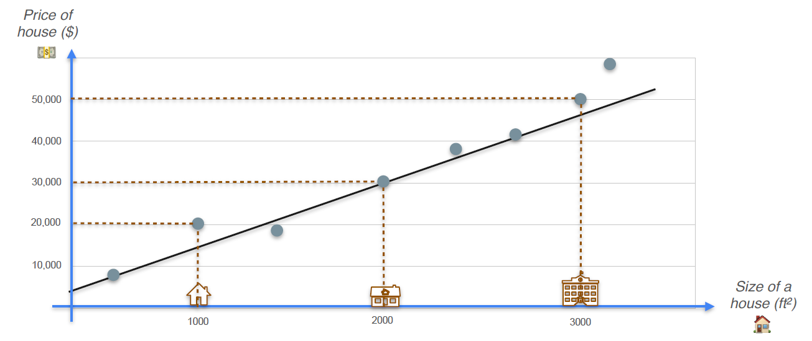
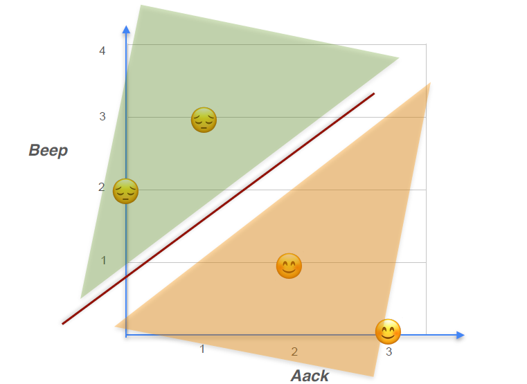
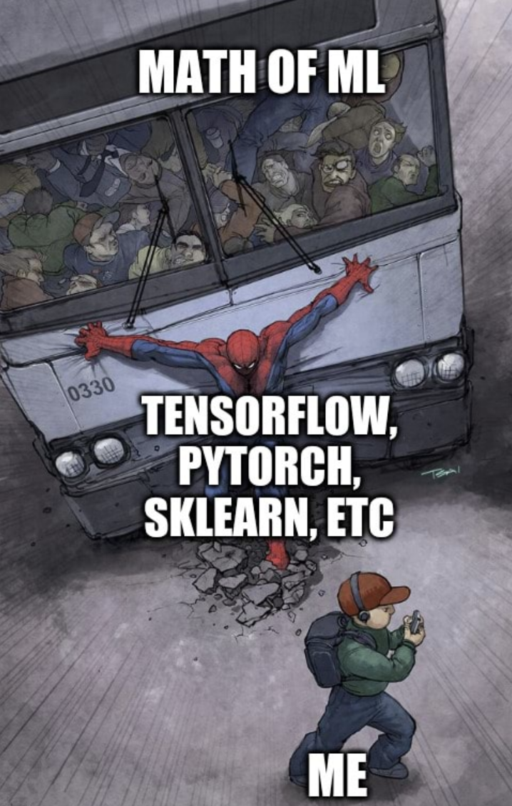

# <b>Supervised Learning</b>

Supervised learning adalah salah satu bidang machine learning di mana model belajar dari data pelatihan berlabel. Selama training, pengguna memberikan data input kepada algoritma serta label output yang terkait. Berdasarkan data input, algoritma mempelajari pemetaan dari input ke output dan menghasilkan prediksi atau penilaian. Ada banyak penerapan yang menggunakan supervised learning, termasuk penyaringan spam, pengenalan suara, penerjemahan mesin, dan periklanan online.

Sebelum menggunakan model Supervised Learning, sebaiknya dilakukan eksplorasi data (Exploratory Data Analysis/EDA) terlebih dahulu untuk memahami karakteristik, pola, dan kualitas data yang digunakan. Seperti yang telah dilakukan pada [modul 1](../modul-1/Modul_1.ipynb)

src: https://www.datacamp.com/blog/supervised-machine-learning

## <b>Daftar Isi</b>
- [Supervised Learning](#supervised-learning)
    1. [Regresi](#regresi)
    2. [Klasifikasi](#klasifikasi)
- [Evaluation Metrics (Supervised Learning)](#evaluation-metrics)

    

## <b>Regresi</b>

Regresi adalah salah satu jenis metode Supervised Learning di mana variabel targetnya berupa nilai yang bersifat kontinu. Contoh penggunaannya termasuk memprediksi berat badan, usia, harga, dan sebagainya.

    

[Kode Implementasi Regresi](code/regresi.ipynb) 

## <b>Klasifikasi</b>

Klasifikasi adalah salah satu metode dalam Supervised Learning di mana algoritma belajar dari data berlabel untuk memprediksi kategori atau kelas dari data baru di masa mendatang. Metode ini digunakan untuk membedakan data ke dalam beberapa kelompok berdasarkan fitur-fitur tertentu.

    

[Kode Implementasi Klasifikasi](code/klasifikasi.ipynb)

    