# Deep Learning (Image Data)

> Pada modul ini kita akan mempelajari seputar Deep Learning dan penerapannya pada computer vision. Kita juga akan mempelajari tentang bagaimana cara membuat model CNN untuk melakukan klasifikasi gambar.

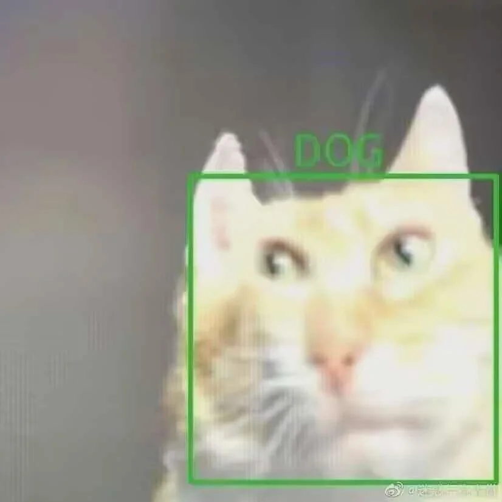

## Daftar Isi

- [Deep Learning (Image Data)](#deep-learning-image-data)
  - [Daftar Isi](#daftar-isi)
  - [1. Pendahuluan](#1-pendahuluan)
    - [Apa Itu Deep Learning??](#apa-itu-deep-learning)
    - [Computer Vision](#computer-vision)
    - [Neural Network](#neural-network)
  - [2. Preprocessing Data Gambar](#2-preprocessing-data-gambar)
    - [Teknik Preprocessing Gambar](#teknik-preprocessing-gambar)
    - [Data Augmentation](#data-augmentation)
  - [3. Convolutional Neural Network (CNN)](#3-convolutional-neural-network-cnn)
    - [Feature Learning / Feature Extraction Layers](#feature-learning--feature-extraction-layers)
      - [Convolutional Layer](#convolutional-layer)
      - [Pooling Layer](#pooling-layer)
    - [Classification / Dense Layers](#classification--dense-layers)
  - [4. Hyper parameter Tuning](#4-hyper-parameter-tuning)
  - [Referensi](#referensi)

---

## 1. Pendahuluan

### Apa Itu Deep Learning??

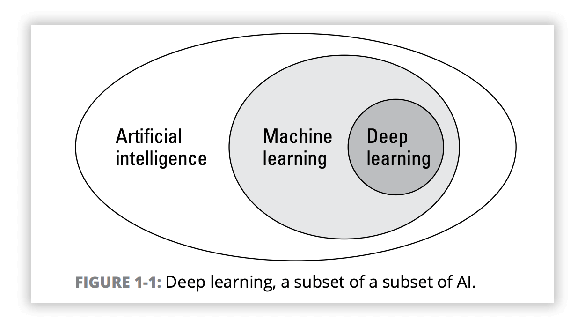

Deep learning adalah **sub-bidang dari machine learning** yang berfokus pada penggunaan algoritma yang terinspirasi oleh struktur dan fungsi otak manusia, yang dikenal sebagai **artificial neural networks**.

Ciri khas deep learning adalah penggunaan **multiple layers** (hidden layers) dalam neural network, memungkinkan model untuk mempelajari representasi data pada berbagai tingkat abstraksi.

> Semakin banyak lapisan (semakin dalam) network, semakin kompleks pula fitur yang dapat dipelajari.

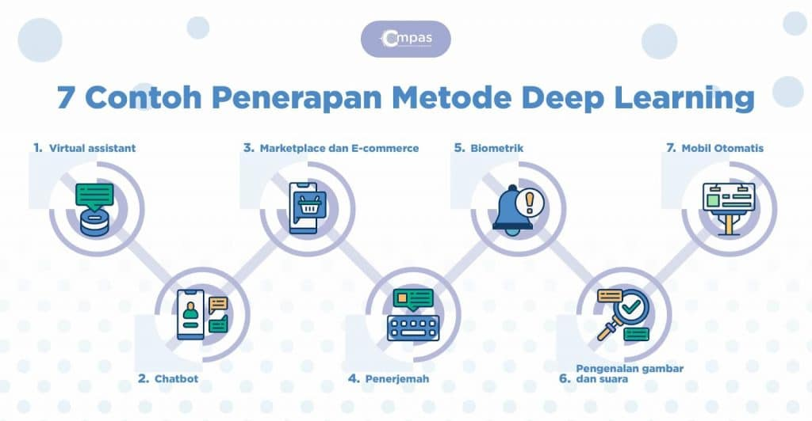

### Computer Vision

**Computer Vision** adalah bidang deep learning yang memungkinkan komputer untuk "melihat", mengidentifikasi, dan memproses gambar dan video **dengan cara yang mirip dengan penglihatan manusia**.

Ada beberapa tugas yang umumnya dilakukan olleh computer vision,

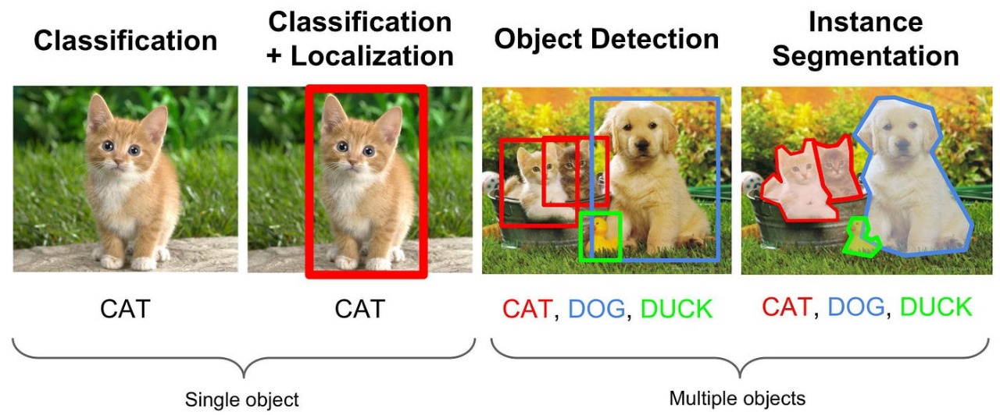

- **Classification**

> Gambar apa ini?

Menentukan kategori atau kelas dari objek utama (atau seluruh adegan) dalam sebuah gambar.

Output: Satu label kelas untuk keseluruhan gambar.

- **Classification + Localization**

> Objek apa yang ada di gambar ini? Dimana lokasinya?

Menentukan kategori atau kelas dari objek utama dalam sebuah gambar **dan menunjukkan lokasi** objek tersebut di dalam gambar.

Output: Satu label kelas untuk objek utama ditambah bounding box (kotak pembatas) yang mengelilingi objek tersebut.

- **Object Detection**

> Objek apa saja yang ada di gambar ini? Dimana saja lokasinya?

Menemukan dan menentukan lokasi **semua instance** dari kelas objek yang diminati di dalam sebuah gambar.

Output: Daftar bounding box untuk setiap objek yang terdeteksi, masing-masing dengan label kelas dan tingkat kepercayaan (confidence score).

- **Object Segmentation (Instance)**

> Objek apa saja yang ada? Dimana lokasinya? Bagaimana bentuknya?

Mengidentifikasi dan **menentukan bentuk piksel demi piksel** untuk setiap instance (individu) dari sebuah objek dalam gambar.

Output: Daftar mask piksel untuk setiap objek yang terdeteksi, masing-masing dengan label kelas dan confidence score.

### Neural Network

Neural Network (Jaringan Saraf Tiruan) adalah model komputasi yang terinspirasi oleh struktur jaringan saraf biologis.

Pembelajaran neural network melibatkan **penyesuaian bobot dan bias** untuk meminimalkan perbedaan antara prediksi model dan nilai sebenarnya.

Proses ini biasanya menggunakan **[Algoritma Backpropagation](https://www.geeksforgeeks.org/backpropagation-in-neural-network/)** bersama dengan Optimizer (misal: Gradient Descent, Adam, RMSprop).

Unit dasar penyusun Neural Network disebut dengan Neuron.

**Neuron** bekerja dengan menerima input, mengalikannya dengan bobot (weights), menambahkan bias (bias), dan menerapkan fungsi aktivasi (activation function) untuk menghasilkan output.

**Bobot dan Bias** merupakan parameter yang dipelajari selama training.

Bobot menentukan seberapa penting input yang masuk, sementara bias menggeser output dari neuron.

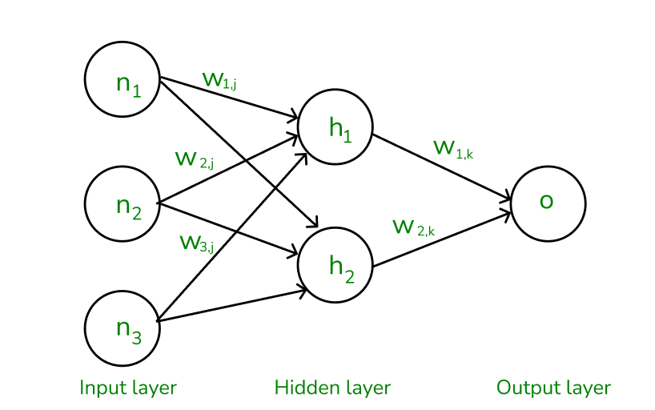

**Fungsi Aktivasi** Menambahkan non-linearitas ke dalam model, memungkinkan neural network mempelajari pola yang kompleks. Contoh: ReLU, Sigmoid, Tanh, Softmax.

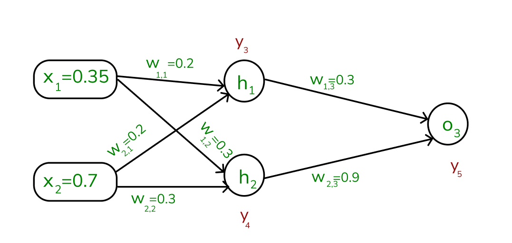

Neural Network tersusun atas **beberapa lapisan**,

- **Input Layer**

Menerima data mentah sebagai input. Jumlah neuron biasanya sama dengan dimensi data input.

- **Hidden Layer**

Lapisan di antara Input dan Output. Pada hidden layer ini bagian besar dari komputasi dan pembelajaran terjadi.

Neural network dengan satu atau lebih hidden layer disebut Deep Neural Network.

- **Output Layer**

Menghasilkan output prediksi model. Jumlah neuron tergantung pada tugas

> Regresi: 1 neuron.
> Klasifikasi: sesuai jumlah kelas.

---

## 2. Preprocessing Data Gambar

Pada modul 1 kemarin, kita telah mempelajari bagaimana cara melakukan preprocessing terhadap data gambar.

Untuk menyegarkan pikiran, mari kita mengingat kembali mengapa data gambar perlu dilakukan preprocessing.

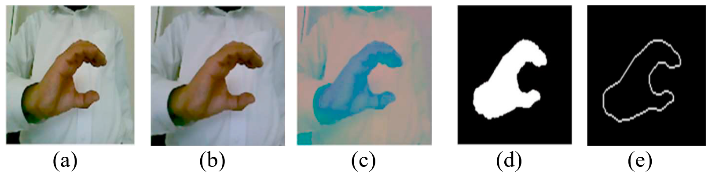

Pada layer Input, model biasanya menginginkan **input dengan dimensi yang identik**, sehingga apabila terdapat gamabr yang memiliki dimensi berbeda, maka perlu dilakukan **cropping atau resizing** terlebih dahulu.

Pada hidden layer, proses komputasi biasanya membutuhkan waktu yang sangat lama. **Normalisasi pixel** akan sangat membantu dalam **meningkatkan kecepatan komputasi**.

Selain itu, **menghilangkan noise dan meningkatkan kontras** gambar dapat membantu model dalam **mengambil fitur - fitur yang penting** pada gambar.

Pada dasarnya, **preprocessing gambar sama pentingnya dengan preprocessing data pada umumnya**.

> Kita tidak dapat hanya bergantung pada model untuk melakukan prediksi. Data yang bagus akan membantu model dalam mempelajari fitur - fitur penting dan meningkatkan performa pembelajaran.

### Teknik Preprocessing Gambar

- **Resizing**

Mengubah ukuran gambar dengan mempertahankan keutuhan seluruh gambar.

Saat melakukan resizing, kualitas gambar akan berubah. Ketika gambar diperbesar, maka gambar akan tampak semakin blur. Sementara sebaliknya, gambar akan tampak lebih *pixelated* saat dikecilkan.

Perlu diperhatikan juga bahwa ketika resolusi gambar diubah, maka bentuk gambar juga dapat berubah.

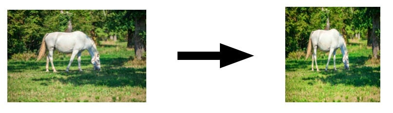

- **Cropping**

Mengubah ukuran gambar dengan mempertahankan kualitas gambar namun juga menghapus sebagian gambar.

Cropping yang tidak sesuai akan menyebabkan gambar kehilangan informasi pentingnya.

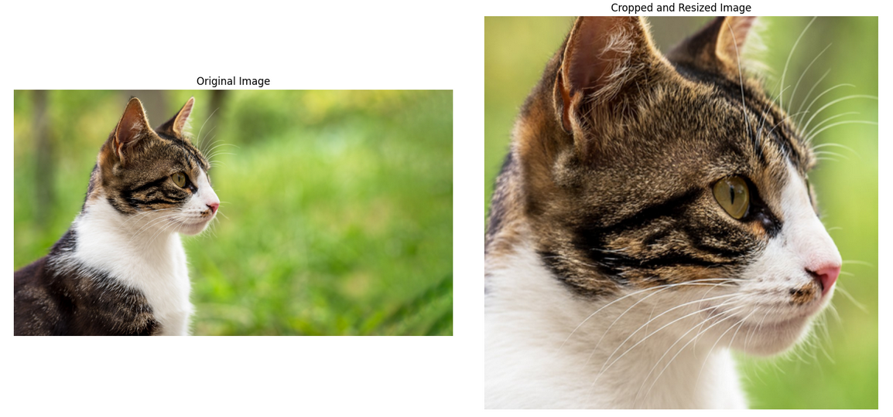

- **Grayscaling**

Mengurangi dimensi warna gambar sehingga gambar menjadi berwarna hitam-putih.

Pada umumnya, gambar memiliki 3 dimensi warna (Red, Green, Blue) dengan setiap dimensi memiliki rentang nilai dari 0 - 255. Mengubah gambar menjadi hitam-putih akan mengurangi dimensi warna menjadi 1 dimensi.

Hal ini cocok dilakukan apabila warna tidak berperan penting pada data yang ada.

- **Normalization**

Mengubah nilai pixel dari yang memiliki rentang 0 - 255 menjadi 0 - 1 (MinMax) atau mengubah data pixel menjadi berbentuk distribusi normal (Z-score).

Hal ini digunakan untuk meningkatkan performa training model.

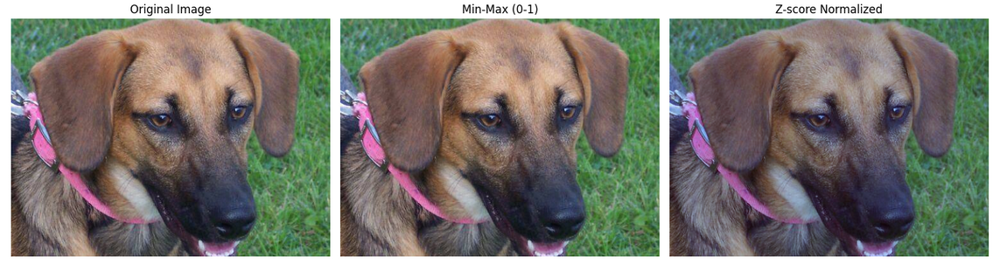

### Data Augmentation

Dalam klasifikasi gambar, seringkali ditemukan masalah berupa data training berjumlah terlalu sedikit dan kurang bervariasi sehingga menyebabkan training mengalami underfitting dan overfitting. Disinilah peran Data Augmentation diperlukan.

**Data augmentation** adalah teknik untuk secara artifisial **meningkatkan ukuran dan variasi** dataset training dengan membuat versi modifikasi dari gambar yang ada.

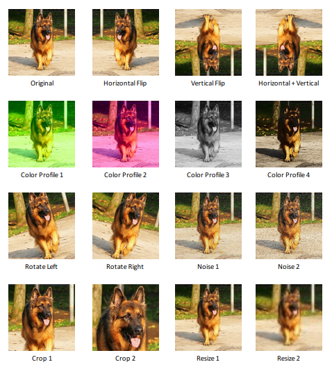

**Contoh Teknik Data Augmentation:**

- **Rotasi (Rotation):** Memutar gambar.
- **Translasi/Shifting:** Menggeser gambar secara horizontal atau vertikal.
- **Zooming:** Memperbesar atau memperkecil bagian gambar.
- **Flipping:** Membalik gambar secara horizontal atau vertikal (hati-hati, beberapa objek dapat berubah makna saat dilakukan flipping, misal: angka).
- **Shearing:** Menggeser satu bagian gambar sambil menahan bagian lain.
- **Perubahan Brightness/Contrast/Hue:** Mengubah properti warna gambar.
- **Adding Noise:** Menambahkan noise acak ke gambar.

---

## 3. Convolutional Neural Network (CNN)

**Convolutional Neural Network (CNN)** adalah arsitektur deep learning yang paling umum dan efektif untuk tugas computer vision, termasuk klasifikasi gambar.

CNN dirancang khusus untuk memproses data dengan topologi grid, seperti gambar.

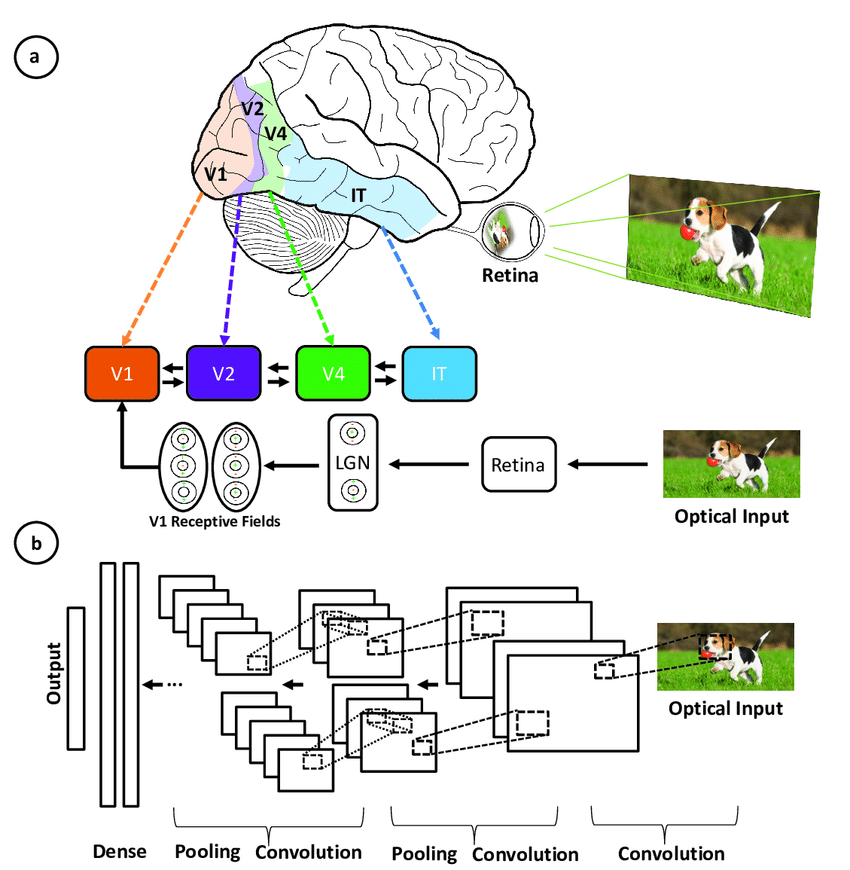

CNN memanfaatkan tiga ide utama yang cocok untuk data gambar:

1.	**Sparse Interaction:** Filter (kernel) konvolusi hanya terhubung ke area lokal kecil dari input, memanfaatkan fakta bahwa pola visual yang penting (seperti tepi) bersifat lokal.
2.	**Parameter Sharing:** Filter yang sama digunakan di seluruh area input. Memungkinkan pendeteksian pola yang sama di lokasi yang berbeda dalam gambar dan secara drastis mengurangi jumlah parameter model.
3.	**Equivariant Representation:** Jika input bergeser sedikit, output dari lapisan konvolusional juga akan bergeser dengan cara yang sama. Membantu model menjadi sedikit lebih kebal terhadap pergeseran objek.

Pada umumnya, **CNN dibagi menjadi 2 bagian**, Feature Learning dan Classification.

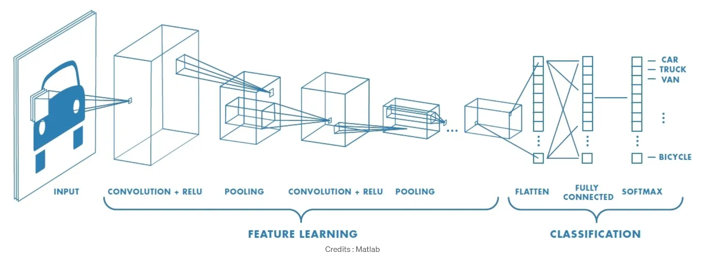

### Feature Learning / Feature Extraction Layers

Lapisan ini bertugas untuk **mengekstraksi fitur-fitur penting dari gambar input**.

Lapisan ini tersusun dari dua macam lapisan yang disusun sedemikian rupa sesuai dengan kondisi data dan fitur yang akan diekstrak, yaitu **Convolutional Layer** dan **Pooling Layer**.

$$
Convolutional Layer \rArr Activation \rArr Pooling Layer 
$$

> Semakin dalam bloknya, semakin kompleks fitur yang dipelajari.

#### Convolutional Layer

Convolutional Layer bekerja dengan menerapkan Filter (disebut juga kernel) kecil ke seluruh input gambar untuk melihat dan mengenali fitur-fitur tertentu.

Filter memiliki bentuk berupa matriks matematis berisi bobot yang akan dipelajari. Bobot yang berbeda berarti filter tersebut memiliki fungsi yang berbeda pula.

Beberapa contoh fungsi filter:

- **Basic Feature Extraction**
  - **Deteksi Tepi:** Menyoroti perubahan intensitas piksel, penting untuk mengenali tepi objek.
  - **Deteksi Sudut:** Mengenali perubahan arah signifikan dalam intensitas piksel.

- **Image Processing**
  - **Blurring:** Mengurangi noise dengan mengaburkan gambar.
  - **Sharpening:** Meningkatkan kontras tepi untuk memperjelas gambar.

- **Hierarchical Feature Learning**
  - **Fitur Rendah (Low-Level):** Seperti tepi dan sudut pada lapisan awal.
  - **Fitur Menengah (Mid-Level):** Seperti bentuk dan pola pada lapisan tengah.
  - **Fitur Tinggi (High-Level):** Seperti objek dan bagian wajah pada lapisan akhir.

Filter bekerja dengan sliding window, di mana filter melintasi gambar dan melakukan fungsi matematis pada setiap posisi.

1. **Element-wise Multiplication**

Setiap elemen filter dikalikan dengan elemen gambar, atau dalam matematika perhitungan ini disebut dengan fungsi dot matriks.

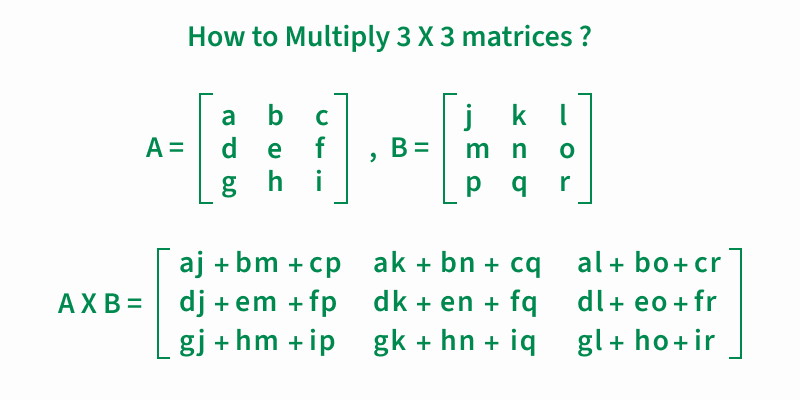

2. **Summation**

Hasil perkalian dijumlahkan untuk membentuk satu nilai dalam feature map.

3. **Stride**

Jarak perpindahan filter dari satu posisi ke posisi berikutnya. Pada contoh di atas, stride memiliki nilai 2, yang berarti filter akan bergerak sebanyak 2 pixel.

4. **Padding**

Penambahan piksel di tepi gambar untuk mempertahankan ukuran output tertentu. Pada contoh di atas tampak bahwa semua pixel di bagian paling luar memiliki nilai 0.

Apabila tidak ada padding, maka hasil pada contoh hanya akan memiliki ukuran matriks 2x2.

> Untuk contoh filter dapat dilihat kembali pada [modul 1](../modul-1/Modul_1.ipynb).

Setelah data melewati neuron convolutional dan sebelum data memasuki neuron selanjutnya, data akan memasuki **fungsi aktivasi** (activation function) terlebih dahulu.

Fungsi Aktivasi dilakukan setelah operasi konvolusi pada setiap elemen feature map, dengan tujuannya adalah untuk menambahkan non-linearitas sehingga memungkinkan jaringan mempelajari hubungan yang kompleks.

Contoh yang umum digunakan adalah fungsi **ReLU (Rectified Linear Unit)**

$$
{f(x)} = {max(0 , {x})}
$$

Fungsi RelU berfungsi untuk mengambil nilai maksimal setiap elemen matriks ketika dibandingkan dengan 0, sehingga tidak ada nilai negatif pada hasil matriks akhir.

#### Pooling Layer

**Pooling layer** juga dikenal sebagai **subsampling atau downsampling**. 

Digunakan untuk **mengurangi dimensi spasial** secara bertahap dengan tetap mempertahankan informasi penting. Hal ini mampu **mengontrol kompleksitas model**, mengurangi overfitting, dan meningkatkan efisiensi komputasi dengan mengurangi jumlah parameter dan komputasi yang diperlukan pada lapisan berikutnya.

Pooling layer berbeda dengan convolution layer di mana convolution layer mengekstrak fitur dari gambar sedangkan pooling layer berperan dalam penggabungan fitur.

Contoh di atas adalah 2 bentuk Pooling Layer yang sering digunakan, **Max Pooling** dan **Average Pooling**.

> Ada banyak contoh pooling lainnya, namun saat ini kita berfokus pada dua contoh terlebih dahulu.

- **Max Pooling**

Max pooling bekerja dengan memilih nilai maksimum dari setiap pool. 

Max Pooling mempertahankan fitur yang paling menonjol dari feature map, dan gambar yang dihasilkan lebih tajam daripada gambar aslinya.

- **Average Pooling**

Average pooling bekerja dengan mendapatkan rata-rata dari pool. 

Penggabungan rata-rata akan mempertahankan nilai rata-rata fitur. 

Average pooling memperhalus gambar sekaligus menjaga esensi fitur dalam gambar.

### Classification / Dense Layers

Dense layer adalah salah satu komponen utama dalam neural network yang menghubungkan setiap neuron di satu layer ke setiap neuron di layer berikutnya.

Layer ini sangat **penting dalam proses klasifikasi** karena memungkinkan jaringan untuk belajar pola kompleks dalam data.

Sebelum masuk ke fully connected layer, output dari pooling layer terakhir yang berbentuk multi-dimensi perlu **"diratakan"** (flattened) terlebih dahulu agar **menjadi vektor 1 dimensi** seperti ilustrasi berikut:

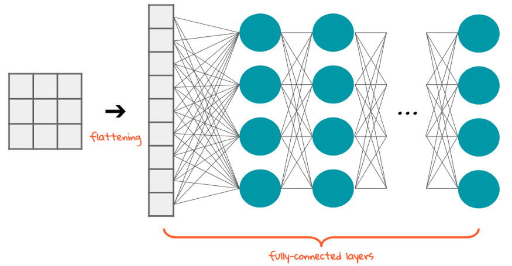

Output yang diratakan kemudian dapat diproses oleh fully connected layer, dan back propagation diterapkan pada setiap iterasi pelatihan untuk menghitung gradien kesalahan terhadap setiap bobot dalam jaringan.

Gradien ini kemudian digunakan untuk memperbarui bobot guna meminimalkan kesalahan pada iterasi berikutnya.

Selama serangkaian epoch, model dapat membedakan antara fitur dominan dan fitur tingkat rendah tertentu dalam gambar dan mengklasifikasikannya.

Lapisan ini menetapkan weight secara acak pada input dan memprediksi label yang sesuai.

Jumlah layer yang digunakan dapat bervariasi, tergantung pada seberapa dalam model akan mengklasifikasikan data. Hal ini tentunya juga bergantung pada seberapa banyak dataset training yang digunakan.

Pada layer ini, fungsi aktivasi yang biasa digunakan adalah fungsi ReLU karena modul ini berfokus pada computer vision.

Gambar di bawah adalah contoh arsitektur CNN lengkap mulai dari feature extraction hingga classification.

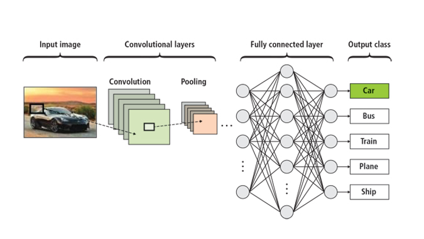

---

## 4. Hyper parameter Tuning

Penerapan hyper parameter tuning dapat membantu dalam menentukan parameter yang sesuai untuk training model.

Namun karena data gambar dapat membuat training berjalan sangat lama, perlu diperhatikan parameter apa saja yang akan dimasukkan dalam hyperparameter tuning agar tidak banyak membuang waktu.

**Contoh Hyperparameter pada CNN:**

- **Learning Rate:** Ukuran langkah yang diambil oleh optimizer saat memperbarui bobot. Terlalu besar bisa membuat training tidak stabil, terlalu kecil bisa sangat lambat.

- **Batch Size:** Jumlah sampel data yang digunakan dalam satu iterasi training sebelum bobot diperbarui.

- **Jumlah Conv. Layer:** Kedalaman dan lebar model.

- **Ukuran Filter:** Dimensi filter konvolusi (misal: 3x3, 5x5).

- **Stride:** Ukuran langkah filter saat bergeser di atas input.

- **Padding:** Menambahkan baris/kolom nol di sekitar batas input untuk mengontrol ukuran output.

- **Ukuran Pool Window:** Dimensi jendela pada lapisan pooling (misal: 2x2).

- **Dropout Rate:** Persentase neuron yang dinonaktifkan secara acak selama training untuk mencegah overfitting.

- **Optimizer:** Algoritma yang digunakan untuk memperbarui bobot (misal: Adam, RMSprop, SGD).

- **Jumlah Epoch:** Berapa kali seluruh dataset training dilewatkan melalui model.

> Untuk metode Hyper Parameter Tuning sama seperti pada machine learning. Kalian bisa menggunakan GridSearch, Optuna, Keras Tuner, dsb.

---

## Referensi

> [Tensorflow Playground](https://playground.tensorflow.org/) - Untuk mencoba arsitektur Neural Network

> [Contoh Klasifikasi Gambar menggunakan CNN](https://www.kaggle.com/code/natapelysynka/muffin-versus-chihuahua-cnn-model-accuracy-0-84)

- [Pengenalan Deep Learning Part 7 : Convolutional Neural Network (CNN)](https://medium.com/@samuelsena/pengenalan-deep-learning-part-7-convolutional-neural-network-cnn-b003b477dc94)
- [Backpropagation in Neural Network](https://www.geeksforgeeks.org/backpropagation-in-neural-network/)
- [Convolution Neural Network – Better Understanding](https://www.analyticsvidhya.com/blog/2021/07/convolution-neural-network-better-understanding/)
- [Fully Connected Layer vs. Convolutional Layer: Explained](https://builtin.com/machine-learning/fully-connected-layer)