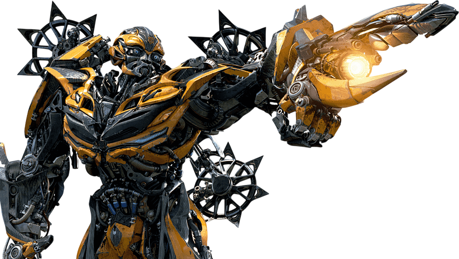
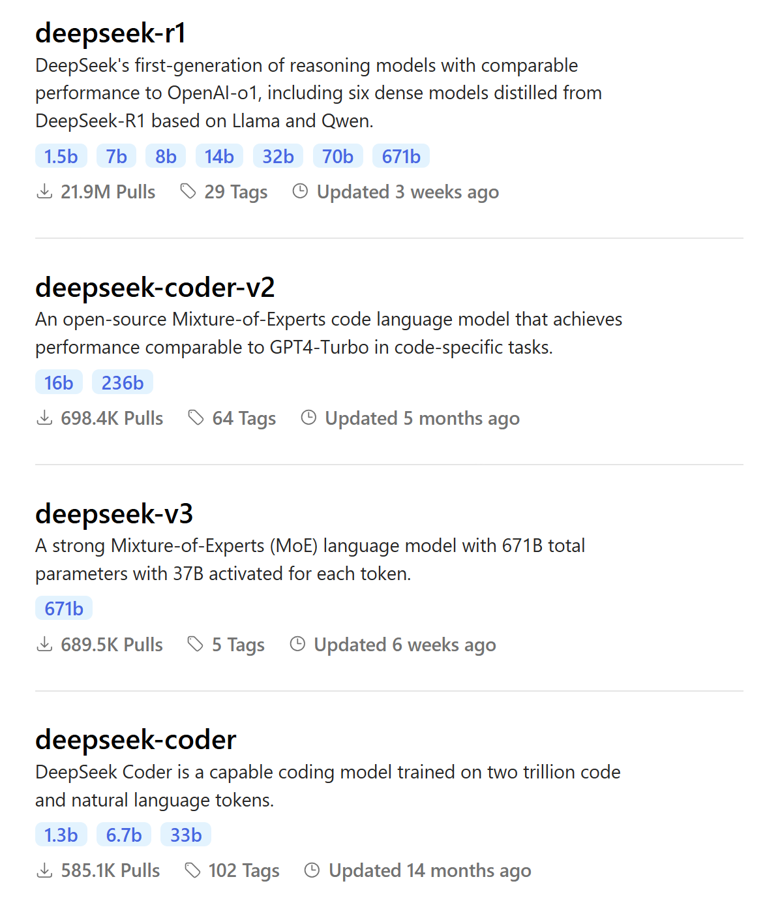
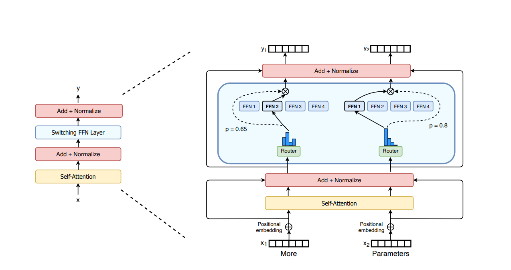
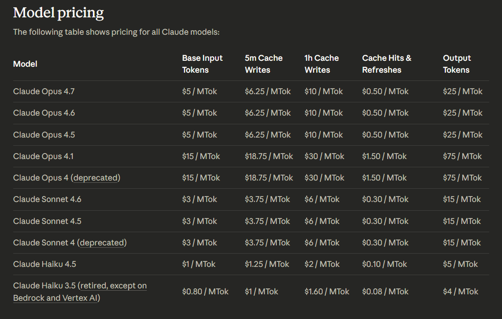

# 01. Dasar Transformers dan LLM

Bab ini menyatukan dua fondasi utama modul: **Transformer** dan **Large Language Model (LLM)**. 

Transformer menjelaskan cara model memproses hubungan antartoken. Sedangkan LLM menjelaskan apa yang terjadi ketika ide itu diperbesar ke skala data, parameter, dan komputasi yang sangat besar.

## Daftar Isi

- [Mengapa Mempelajari Ini Penting?](#mengapa-mempelajari-ini-penting)
- [Let's Imagine](#lets-imagine)
- [Transformer](#transformer)
- [1. Masalah yang Diselesaikan Transformer](#1-masalah-yang-diselesaikan-transformer)
- [2. Inti Transformer dalam 3 Poin](#2-inti-transformer-dalam-3-poin)
- [3. Self-Attention In-Depth](#3-self-attention-in-depth)
- [4. Positional Encoding In-Depth](#4-positional-encoding-in-depth)
- [5. Blok Arsitektur Transformer](#5-blok-arsitektur-transformer)
- [6. Encoder, Decoder, dan Decoder-Only](#6-encoder-decoder-dan-decoder-only)
- [LLM](#llm)
- [7. Apa Itu LLM?](#7-apa-itu-llm)
- [8. Istilah Dasar yang Wajib Dipahami](#8-istilah-dasar-yang-wajib-dipahami)
- [9. Bagaimana LLM Dilatih?](#9-bagaimana-llm-dilatih)
- [10. Mixture of Experts (MoE)](#10-mixture-of-experts-moe)
- [11. Mengapa LLM Terlihat Cerdas?](#11-mengapa-llm-terlihat-cerdas)
- [12. Kapan Prompting Cukup, Kapan Fine-Tuning Diperlukan?](#12-kapan-prompting-cukup-kapan-fine-tuning-diperlukan)
- [13. Notebook](#13-notebook)
- [15. Batasan LLM](#15-batasan-llm)

## Mengapa Mempelajari Ini Penting?

Sebelum era Transformer, pemrosesan teks banyak bergantung pada keluarga model sekuensial seperti **RNN**, **LSTM**, dan **GRU**. Model-model ini cukup berhasil untuk banyak tugas NLP dasar, tetapi punya keterbatasan yang jelas seperti:

- Teks dibaca langkah demi langkah, sehingga sulit diparalelkan
- Informasi dari token yang jauh sering melemah
- Hubungan antarkata yang berjauhan lebih sulit ditangkap secara stabil

Transformer muncul untuk menjawab kekurangan tersebut. Model tidak lagi membaca teks secara murni berurutan. Sebaliknya, model memproses seluruh token sekaligus dan menghitung token mana yang perlu diperhatikan untuk memahami token yang sedang diproses. Di atas fondasi inilah LLM modern dibangun.

## Let's Imagine

### Analogi 1: Rapat

Bayangkan satu kalimat sebagai rapat kecil yang anggota rapatnya adalah token. Saat sebuah token ingin memahami perannya, ia tidak perlu menunggu giliran token lain untuk berbicara satu per satu seperti pada model sekuensial. Ia bisa langsung melihat seluruh ruangan dan bertanya:

- Siapa yang paling relevan untuk saya dengarkan?
- Siapa yang membawa informasi penting?
- Siapa yang boleh saya abaikan?

Inilah intuisi paling dasar dari mekanisme **self-attention**.

### Analogi 2: Autocomplete yang Dibesarkan

LLM dapat dipahami sebagai mesin **prediksi token berikutnya** yang dibesarkan sampai skala ekstrem. Pada level inti, LLM tetap menjawab satu pertanyaan yang sama:

> Setelah token-token ini, token apa yang paling mungkin muncul berikutnya?

Yang membuat sebuah LLM terlihat "cerdas" adalah kombinasi beberapa hal berikut:

- Arsitektur yang kuat
- Data latih yang sangat besar
- Parameter yang sangat banyak
- Post-training yang membuat output lebih berguna
- Konteks yang memungkinkan model membaca instruksi pengguna

Jadi, LLM bukan "*some kind of magic*" yang sepenuhnya terpisah dari Transformer. LLM adalah perkembangan langsung dari Transformer.

## Transformer

### 1. Masalah yang Diselesaikan Transformer

Transformer dirancang untuk menjawab pertanyaan berikut:

> Bagaimana model dapat memahami hubungan antarkata dalam satu kalimat atau dokumen secara efisien?

Contoh sederhana:

`Kucing itu mengejar tikus karena ia lapar.`

Kata `ia` merujuk ke siapa? 

Nah, untuk menjawabnya model perlu menangkap hubungan antartoken, bukan hanya melihat token yang berdekatan secara lokal. 

Pada model lama, informasi seperti ini sering lebih sulit dipelajari ketika jarak token semakin jauh. Transformer didesain untuk membuat proses itu lebih langsung.

### 2. Inti Transformer dalam 3 Poin

#### a. Token direpresentasikan sebagai vektor

Komputer tidak bekerja langsung pada kata seperti layaknya manusia memahaminya. Sebuah kalimat akan terlebih dahulu dipecah menjadi token, lalu setiap token diubah menjadi representasi numerik yang disebut **embedding**.

> Kata --> Token --> Embedding (Vektor)

Embedding tidak sama dengan definisi kamus. Embedding adalah bentuk representasi vektor yang memungkinkan model belajar relasi makna dan fungsi token di dalam konteks.

#### b. Setiap token menghitung ATTENTION terhadap token lain

THIS IS THE HEART OF A TRANSFORMER. 

Setiap token memperoleh tiga representasi penting:

- **Query (Q)**: apa yang sedang dicari token ini
- **Key (K)**: identitas informasi yang dimiliki token lain
- **Value (V)**: isi informasi yang dibawa token lain

Secara matematis, bentuk dasarnya adalah:

$$
\text{Attention}(Q, K, V) = \text{softmax}\left(\frac{QK^T}{\sqrt{d_k}}\right)V
$$

Gambaran relevansi persamaan itu:

1. Query dari token saat ini dibandingkan dengan Key dari semua token lain.
2. Hasil perbandingan menghasilkan skor relevansi.
3. Skor dinormalisasi dengan fungsi `softmax` untuk dijadikan bobot **attention**.
4. Bobot itu dipakai untuk menggabungkan Value.

Dengan cara ini, satu token dapat "mengambil" informasi yang paling penting dari token lain.

#### c. Urutan token tetap harus dimasukkan secara eksplisit

Karena Transformer memproses token secara paralel, model tidak otomatis tahu urutan token. Tanpa mekanisme tambahan, kalimat dengan kata yang sama tetapi urutan berbeda bisa terlihat terlalu mirip.

Karena itu muncullah mekanisme **positional encoding** atau variasi modernnya seperti **RoPE (Rotary Positional Encoding)**.

### 3. Self-Attention In-Depth

#### Mengapa Q, K, dan V perlu dipisahkan?

Pemisahan ini akan memberi fleksibilitas. Sebuah token bisa:

- Mencari jenis informasi tertentu melalui Query
- Menawarkan ciri identitas melalui Key
- Membawa isi sebenarnya melalui Value

Analogi sederhananya:

- Query = pertanyaan
- Key = label map
- Value = isi berkas

Saat kita mencari dokumen di rak arsip, kita tidak memeriksa isi semua berkas secara penuh. Kita membandingkan labelnya dulu. Setelah label yang relevan ditemukan, baru isi berkasnya dipakai. Itulah tujuan utama dari Query (Q), Key (K), dan Value (V).

#### Mengapa ada pembagian dengan akar `d_k`?

Saat dimensi vektor membesar, hasil dot product bisa menjadi sangat besar. Jika dibiarkan, nilai masuk ke `softmax` bisa terlalu ekstrem sehingga training menjadi tidak stabil. Maka dilakukanlah pembagian dengan `sqrt(d_k)` membantu menjaga skala skor agar tidak ekstrim dan dapat membuat training menjadi lebih stabil.

#### Apa itu multi-head attention?

Transformer tidak hanya menghitung satu pola Attention. Model membagi Attention ke beberapa **head**. Setiap head dapat memelajari pola relasi yang berbeda.

Contoh ilustrasinya:

- Satu head mungkin lebih peka ke relasi subjek-predikat,
- Satu head mungkin lebih peka ke referensi kata ganti,
- Satu head mungkin lebih peka ke struktur posisi,
- Satu head mungkin menangkap asosiasi semantik.

Kita tidak perlu berasumsi bahwa setiap head selalu punya fungsi yang rapi dan mudah dijelaskan. Namun secara umum, multi-head attention memberi model lebih banyak sudut pandang sekaligus.

### 4. Positional Encoding In-Depth

#### Mengapa urutan penting?

Bandingkan dua kalimat berikut:

- `Budi memukul Iwan.`
- `Iwan memukul Budi.`

Token yang muncul sama, tetapi artinya berbeda total. Karena itu model butuh semacam "penanda posisi".

### Versi klasik: Sinusoidal Positional Encoding

Versi awal Transformer menambahkan sinyal berbasis fungsi sinus dan cosinus ke embedding token. Keuntungannya adalah model mendapatkan informasi posisi dengan pola matematis yang halus dan terstruktur.

### Versi modern: RoPE (Rotary Positional Encoding)

Banyak LLM modern memakai **Rotary Positional Encoding (RoPE)**. 

Ilustrasi sederhananya seperti berikut : 

"Posisi" tidak hanya ditambahkan sebagai angka tambahan, tetapi memengaruhi cara vektor berinteraksi saat attention dihitung. Ini penting karena banyak teknik long context modern yang berhubungan langsung dengan perluasan atau modifikasi skema posisi seperti ini.

### 5. Blok Arsitektur Transformer

Satu layer Transformer umumnya tersusun dari beberapa komponen berikut:

#### a. Input embedding

Mengubah token menjadi vektor awal.

#### b. Positional encoding

Menambahkan informasi urutan.

#### c. Multi-head attention

Menghitung relasi antartoken.

#### d. Add & Norm

Hasil sublayer ditambahkan kembali ke input melalui residual connection, lalu dinormalisasi. Ini digunakan untuk membantu stabilitas training dan aliran gradien.

#### e. Feed-forward network (FFN)

Setelah relasi antartoken diperhitungkan, setiap token diproses lagi secara individual oleh jaringan kecil non-linear. Jika Attention menentukan **siapa yang penting**, FFN membantu menentukan **bagaimana representasi token itu diperkaya**.

### 6. Encoder, Decoder, dan Decoder-Only

#### Transformer klasik

Paper awal Transformer memperkenalkan arsitektur **encoder-decoder**.

- **Encoder** membaca input dan menghasilkan representasi kontekstual.
- **Decoder** menghasilkan output secara bertahap.

Struktur seperti ini sangat cocok untuk tugas seperti melakukan penerjemahan bahasa.

#### Mengapa banyak LLM modern menggunakan arsitektur decoder-only?

Untuk model generatif yang umum, tugas utamanya adalah menghasilkan token berikutnya secara autoregressive (memprediksi nilai masa depan berdasarkan nilai masa lalu dalam urutan data yang sama). Karena itu banyak LLM modern cukup memakai **decoder-only Transformer**.

Ini lebih sederhana dan sangat cocok untuk objective pretraining berbasis next-token prediction.

## LLM

### 7. Apa Itu LLM?

Large Language Model (LLM) adalah model bahasa berbasis Transformer yang dilatih pada data teks dengan skala yang sangat besar. Secara inti, model ini belajar memprediksi token berikutnya. Namun dari objective yang tampak sederhana ini, model dapat mengembangkan banyak kemampuan yang berguna.

Contoh:

Jika prompt-nya adalah:

`Pagi ini saya minum ...`

maka model akan menghasilkan distribusi probabilitas untuk token berikutnya, misalnya `kopi`, `teh`, `air`, dan seterusnya.

PENTING UNTUK DIPAHAMI: Output akhir tidak langsung datang sebagai "pemahaman" seperti manusia. Model menghasilkan output dengan merangkai prediksi token demi token.

## 8. Istilah Dasar yang Wajib Dipahami

### a. Token

Token adalah unit teks yang diproses model. Satu kata bisa menjadi satu token, tetapi bisa juga dipecah menjadi beberapa token.

Akibatnya:

- Jumlah token tidak sama persis dengan jumlah kata
- Biaya inferensi dan batas konteks biasanya dihitung dalam token
- Panjang prompt yang terlihat pendek untuk manusia belum tentu pendek untuk model

### b. Parameter

Parameter adalah bobot yang dipelajari model selama training. Jumlah parameter sering dipakai sebagai indikator ukuran model, tetapi bukan satu-satunya indikator kualitas model tersebut.

Model dengan parameter lebih besar sering punya kapasitas representasi lebih tinggi, tetapi kualitas data dan post-training juga sangat menentukan dalam menentukan kapabilitas model.

### c. Context Window

Context window adalah jumlah token yang bisa dibaca model dalam satu inferensi. Semakin besar context window, semakin banyak instruksi, percakapan, dokumen, atau kode yang bisa dimasukkan sekaligus.

### d. Temperature dan Decoding

Setelah model menghasilkan distribusi probabilitas token, sistem masih harus memutuskan token mana yang dipilih. Di sinilah strategi decoding seperti temperature, top-k, atau top-p berperan.

- Temperature rendah membuat output lebih konservatif dan deterministik
- Temperature tinggi membuat output lebih kreatif
- Decoding yang lebih deterministik sering dipakai untuk tugas yang menuntut jawaban pasti (misalkan di bidang hukum)
- Sampling memberi variasi (bekerja layaknya roulette)

### 9. Bagaimana LLM Dilatih?

#### Tahap 1: Pretraining

Di tahap ini, model dilatih pada korpus teks skala besar untuk memprediksi token berikutnya. Tahap ini membangun pengetahuan umum tentang bahasa, pola, struktur, dan banyak keteraturan statistik dalam data. Setelah melalui proses ini, umumnya model akan diberi nama "Base" yang dimaksud sebagai Baseline yang cocok untuk digunakan dalam proses Post-Training.

#### Tahap 2: Post-Training

Setelah pretraining, model belum tentu nyaman dan "klop" jika dipakai untuk chat atau menuruti instruksi. Model bisa terlalu mentah, terlalu literal, atau kurang terarah. Karena itu dilakukan berbagai bentuk post-training, misalnya supervised fine-tuning dan preference optimization.

Tujuannya:

- Membuat model lebih patuh terhadap instruksi,
- Meningkatkan kegunaan dalam percakapan,
- Menyelaraskan keluaran dengan kebijakan tertentu,
- Memperbaiki perilaku pada tugas-tugas praktis.

Model yang telah melalui proses ini biasanya diberikan nama tambahan dibelakang seperti "it" yang berarti Instruct (di fine-tuning secara khusus untuk melakukan instruksi) atau "Chat" (di fine-tuning secara khusus agar dapat lebih "luwes" dalam tugas chatting).

#### Tahap 3: Inference

Saat dipakai, model akan menerima prompt, membaca konteks, lalu menghasilkan token demi token. Proses inilah yang disebut sebagai "Inferensi".

> Prompt Query --> Processing --> Output

Banyak kemampuan yang terlihat canggih sebenarnya muncul dari kombinasi:

- Apa yang dipelajari saat pretraining,
- Apa yang dibentuk saat post-training,
- Bagaimana prompt dirancang,
- Bagaimana decoding diatur.

### 10. Mixture of Experts (MoE)

Salah satu perkembangan penting dalam LLM modern adalah **Mixture of Experts**.

Ilustrasi sederhananya:

- Model memiliki banyak sub-jaringan atau "expert"
- Tidak semua expert aktif untuk setiap token
- Router memilih expert yang paling relevan

Keuntungan utama pendekatan ini adalah efisiensi. Model dapat memiliki kapasitas parameter asli yang besar tanpa selalu mengaktifkan seluruh parameter pada setiap langkah inferensinya.

Namun MoE juga membawa tantangan sendiri, misalnya routing, load balancing, dan stabilitas training. Karena bersifat sebagai proses efisiensi, MoE juga membuat model "ditahan" agar tidak memberikan proses daya komputasi yang besar.

### 11. Mengapa LLM Terlihat Cerdas?

Pertanyaan ini penting, karena sering muncul kesan bahwa LLM punya mekanisme pola pikir yang sama dengan manusia. Nah, sebenarnya hal tersebut tidak 100% benar.

LLM terlihat cerdas karena:

- Dapat memodelkan pola bahasa pada skala sangat besar
- Dapat menggabungkan banyak konteks dalam satu kali inferensi
- Telah diarahkan lewat post-training untuk menjawab pertanyaan dengan "gaya" yang khusus
- Dapat memanfaatkan prompt dan tools secara efektif.

Jadi, kecerdasan LLM adalah hasil dari **arsitektur + data + skala + post-training + inference design**.

### 12. Kapan Prompting Cukup, Kapan Fine-Tuning Diperlukan?

#### Prompting cukup jika:

- Task yang diberikan masih dekat dengan kemampuan umum model
- Format output tidak terlalu kaku
- Hanya perlu instruksi yang umum
- Perubahan perilaku tidak harus permanen

#### Fine-tuning atau PEFT (Parameter Efficient Fine Tuning) lebih masuk akal jika:

- Butuh gaya atau perilaku yang konsisten
- Pola tugasnya sangat spesifik dan berulang
- Prompt menjadi terlalu panjang jika semua aturan harus ditulis setiap kali percakapan dimulai
- Efisiensi operasional pada use case tertentu.

### 13. Notebook

Untuk bab ini, notebook yang paling relevan adalah:

- [Notebook Transformer dan Attention Basics](./code/transformer_attention_basics.ipynb)

### 15. Batasan LLM

#### Hallucination

LLM dapat menghasilkan jawaban yang terdengar meyakinkan padahal sebenarnya salah dan ini bukan "bug" kecil dan cenderung fatal. Ini adalah konsekuensi penting dari model generatif berbasis prediksi token.

#### Keterbatasan konteks

Model tidak punya memori permanen seperti manusia. Ia hanya bekerja pada konteks yang diberikan saat inferensi, kecuali jika sistem eksternal menambahkan mekanisme memori atau retrieval seperti pada konsep RAG.

#### Bigger parameters ≠ Smarter Model

Model besar cenderung terlihat lebih kuat, tetapi tidak otomatis lebih baik. Ukuran model hanyalah satu faktor. Terutama saat ini dimana perkembangan efisiensi komputasi dan penggunaan Mixture Of Experts (MoE) yang semakin masif dan mutakhir.

#### Biaya komputasi

Training model dengan parameter besar sangat mahal. Inferensi model besar juga bisa mahal dan lambat. Karena itu, efisiensi tetap menjadi isu sentral di dunia LLM.
