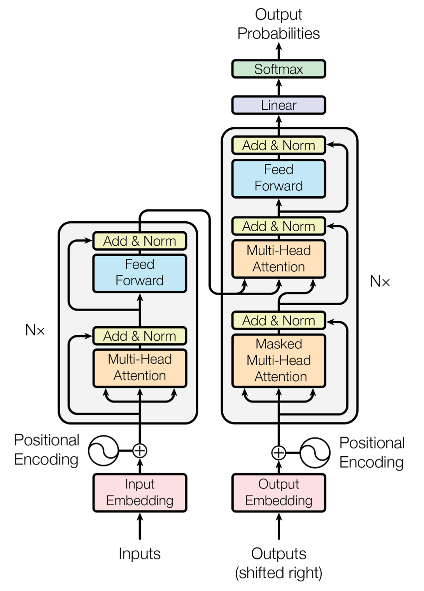

# 01. Transformers

## Konsep


Arsitektur **Transformer** adalah revolusi terbesar dalam AI dekade terakhir. Diperkenalkan pertama kali oleh Google pada tahun 2017 lewat *paper* **"Attention Is All You Need"**, arsitektur ini sepenuhnya menggantikan pendekatan RNN/LSTM yang mendominasi sebelumnya.

Jika RNN membaca teks kata demi kata (sekuensial), Transformer memiliki kemampuan murni untuk **memproses seluruh kata secara paralel sekaligus** dan "melihat" hubungan antar setiap kata di seluruh kalimat tanpa dihalangi oleh memori yang meluruh seiring panjangnya teks. Ini adalah dasar utama dari *semua* Large Language Models (LLM) modern saat ini, mulai dari ChatGPT hingga DeepSeek.

---

## Pilar Utama

Dua pilar teori matematis di balik Transformer adalah *Self-Attention* dan *Positional Encoding*.

### 1. Mekanisme Self-Attention

Inti dari Transformer adalah *Self-Attention*. Jika terdapat kalimat "Kucing itu mengejar tikus karena ia lapar", kata "ia" merujuk ke siapa? Mekanisme attention memberikan bobot komputasi agar "ia" lebih berfokus (memberi nilai *attention* tinggi) kepada kata "Kucing".

Secara matematis, setiap *token* diproyeksikan ke dalam tiga vektor: **Query (Q)**, **Key (K)**, dan **Value (V)**.
- **Query:** Apa yang sedang saya cari?
- **Key:** Apa identitas informasi yang saya punya?
- **Value:** Apa informasi aktual yang saya bawa?

Pusat komputasi dihitung dengan persamaan *Scaled Dot-Product Attention*:

$$ \text{Attention}(Q, K, V) = \text{softmax}\left(\frac{QK^T}{\sqrt{d_k}}\right)V $$

Perkalian *dot product* antara Query dari kata saat ini dengan Key dari semua kata lain pada kalimat ($QK^T$) menghasilkan "skor kecocokan" seberapa relevan antarkata. Nilai ini dibagi dengan $\sqrt{d_k}$ untuk menstabilkan gradien, sebelum dimasukkan ke dalam fungsi `softmax` agar nilainya berada antara 0 hingga 1. Terakhir, bobot tersebut digunakan untuk mengalikan Value aslinya.

### 2. Positional Encoding


Karena Transformer memproses semua kata secara paralel, model tersebut benar-benar **buta terhadap urutan posisi kata**. Kata "Iwan memukul Budi" akan terlihat sama probabilitasnya dengan "Budi memukul Iwan". 

Oleh karena itu, sebelum vektor kata masuk ke model, kita wajib "menyuntikkan" suatu sinyal tambahan yang menunjukkan urutan kata. Cara klasik adalah menggunakan **Sinusoidal Positional Encoding**, di mana disematkan gelombang sinus dan kosinus pada setiap vektor. Model-model modern saat ini banyak menggunakan varian lanjutan yang disebut **RoPE (Rotary Positional Embedding)**.

**Sinusoidal Positional Encoding**

$$\begin{aligned} PE(pos, 2i) &= \sin\left(\frac{pos}{10000^{2i/d_{model}}}\right) \\ PE(pos, 2i+1) &= \cos\left(\frac{pos}{10000^{2i/d_{model}}}\right) \end{aligned}$$

Keterangan:

* (pos) → posisi token dalam urutan (0,1,2,3,…)
* (i) → indeks dimensi embedding
* (d_{model}) → dimensi embedding model (misalnya 512 atau 1024)

Dimensi **genap** menggunakan fungsi **sin**, sedangkan dimensi **ganjil** menggunakan **cos**.

**Rotary Positional Encoding (RoPE)**

$$\mathbf{R}_{\Theta, m}^d \mathbf{x} = \begin{pmatrix} x_1 \\ x_2 \\ \vdots \\ x_{d-1} \\ x_d \end{pmatrix} \otimes \begin{pmatrix} \cos(m\theta_1) \\ \cos(m\theta_1) \\ \vdots \\ \cos(m\theta_{d/2}) \\ \cos(m\theta_{d/2}) \end{pmatrix} + \begin{pmatrix} -x_2 \\ x_1 \\ \vdots \\ -x_d \\ x_{d-1} \end{pmatrix} \otimes \begin{pmatrix} \sin(m\theta_1) \\ \sin(m\theta_1) \\ \vdots \\ \sin(m\theta_{d/2}) \\ \sin(m\theta_{d/2}) \end{pmatrix}$$

---

## Arsitektur



Secara historis, arsitektur penuh Transformer terdiri dari dua sisi yang bekerja sama: **Encoder** (kiri) dan **Decoder** (kanan). Di dalam sisian ini, teori-teori matematis di atas dirakit membentuk pipeline komponen berikut:

### A. Sisi Encoder 

Bertugas membaca input teks mentah, memroses relasi seluruh kata, dan merangkumnya menjadi representasi vektor yang kaya makna kontekstual.

#### 1. Input Embedding

Langkah pertama adalah mengubah data teks mentah (token) menjadi angka representasi matriks. Hal ini dilakukan agar data teks bisa diolah secara relasional oleh algoritma komputer. Setiap kata diubah menjadi deretan angka yang menangkap makna dasarnya.

#### 2. Positional Encoding

Menjalankan rumusan *Positional Encoding*. Matriks gelombang matematis ditambahkan ke matriks kata agar komputer tahu di mana letak urutan sintaksnya (misal: "makan" adalah subjek yang muncul di urutan-2).

#### 3. Multi-Head Attention

Mengeksekusi rumusan matematis *Self-Attention*. Daripada menjalankan perkalian *attention (Q,K,V)* satu kali lurus, prosesnya dipecah jadi banyak "kepala paralel" (*multiple heads*) secara bersamaan. Masing-masing kepala menyelidiki aspek yang berbeda (Satu head fokus ke konteks tenses waktu, head lain berfokus ke sentimen relasi emosi bahasanya dan lain-lain).

#### 4. Add & Norm (Residual + Layer Normalization)

Mekanisme yang menambahkan kembali input asli ke hasil layer lalu menormalkan nilainya sehingga informasi tetap terjaga dan training model yang sangat dalam tetap stabil.

Fungsinya:
- **Residual (Add):** Menambahkan kembali input asli ke output layer sehingga informasi tetap terjaga dan gradien dapat mengalir lebih mudah saat proses *backpropagation*. Mekanisme ini membantu mengurangi masalah *vanishing gradient* pada jaringan yang sangat dalam.

- **LayerNorm (Norm):** Menormalkan nilai aktivasi neuron pada layer tersebut sehingga distribusi nilainya tetap stabil. Hal ini membantu proses training menjadi lebih stabil dan mempercepat konvergensi model.

#### 5. Feed Forward Network (FFN)

Jaringan neural kecil yang memproses setiap token secara terpisah setelah melewati *attention*. FFN melakukan transformasi non-linear pada setiap token secara individual. Fungsinya adalah untuk memperkaya dan mentransformasikan representasi maknanya sehingga model bisa mempelajari fungsi yang lebih kompleks.

*Notes:* 

Peran *Attention* dan FFN berbeda, gambaran dapat dicek melalui berikut ini:
- **Attention** → menentukan hubungan antar kata
- **FFN** → mengolah makna setiap kata setelah hubungan itu diketahui

### B. Sisi Decoder

Decoder bertugas **menghasilkan teks secara bertahap (*autoregressive*)**, yaitu memprediksi satu token pada satu waktu berdasarkan token-token yang telah dihasilkan sebelumnya. Struktur dasar Decoder mirip dengan Encoder, tetapi memiliki beberapa mekanisme tambahan agar proses generasi teks berjalan dengan benar.

#### 6. Masked Multi-Head Attention

Lapisan ini mirip dengan *multi-head attention* pada Encoder, tetapi menggunakan **causal mask**. Masking dilakukan dengan menambahkan nilai matematis **−∞** pada posisi token masa depan di matriks skor attention sebelum fungsi `softmax` dihitung.

Akibatnya:
- Token hanya dapat melihat **token sebelumnya**
- Token **tidak dapat melihat token yang belum dihasilkan**

Contoh:
```text
Kalimat target: "Saya makan nasi"
```

Saat memprediksi kata **"makan"**, model hanya boleh melihat kata **"Saya"**.

Hal ini memastikan proses generasi tetap **autoregressive** dan mencegah model "mencontek" *future tokens*.

#### 7. Encoder–Decoder Attention (Cross-Attention)

Lapisan ini menjadi **jembatan antara Encoder dan Decoder**.

Pada mekanisme ini:
- **Query (Q)** berasal dari representasi internal Decoder
- **Key (K)** dan **Value (V)** berasal dari output Encoder

Dengan cara ini, Decoder dapat mengakses informasi dari kalimat input untuk menentukan bagian mana yang relevan ketika menghasilkan token berikutnya.

Contoh pada tugas *machine translation*:
```text
Input  (Encoder): "I like ice cream"
Output (Decoder): "Saya suka es krim"
```

Saat menghasilkan kata **"es krim"**, Decoder dapat memperhatikan bagian **"ice cream"** pada output Encoder untuk menjaga kesesuaian makna.

#### 8. Feed Forward Network (FFN)

Setelah dua mekanisme attention selesai, setiap token diproses oleh **Feed Forward Network (FFN)**.

Fungsinya adalah:
- Memperkaya representasi setiap token
- Melakukan transformasi non-linear pada informasi yang telah dikumpulkan dari proses attention

Seperti pada Encoder, setiap sublayer juga diikuti oleh **Add & Norm (Residual + Layer Normalization)** untuk menjaga stabilitas training.

#### 9. Linear + Softmax Output

Setelah seluruh proses pada decoder selesai, representasi vektor terakhir diproyeksikan kembali ke ruang kosakata menggunakan layer **Linear**.

Jika ukuran kosakata model adalah **V**, maka layer ini menghasilkan vektor skor:
```text
[score_token_1, score_token_2, ..., score_token_V]
```

Fungsi **Softmax** kemudian mengubah skor tersebut menjadi **probabilitas token**.

Contoh:
```text
"Pagi ini saya minum ____"

kopi : 0.62
teh  : 0.24
air  : 0.08
jus  : 0.06
```

Token dengan probabilitas tertinggi dipilih sebagai **token berikutnya**, lalu proses decoding diulang untuk menghasilkan token selanjutnya.

> Note: Banyak model LLM saat ini melepaskan komponen Encoder sama sekali dan hanya murni menyusun lapisan **Decoder-only**.

---

## Model Modern

Perkembangan mutakhir tidak mengubah banyak logika dasar *attention*, melainkan mengoptimalkan efisiensi komputasi dan penskalaannya. 

Beberapa wujud *frontier* arsitektur Transformer saat ini (2026):
*   **GPT-5 / Claude-4 / Gemini-3:** Implementasi sistem Transformer masif.
*   **Qwen3.5 / DeepSeek-V3:** Mulai banyak memakai arsitektur **Mixture-of-Experts (MoE)** yang dinamis di dalam *Feed Forward Network*-nya. Artinya, tidak semua miliaran parameter diforward secara pasif di tiap lapisan, melainkan dirutekan secara hemat hanya kepada "Expert" sub-network kecil yang relevan, meningkatkan efisiensi komputasi secara masif.
*   Riset terbaru juga secara masif memperbarui mekanisme optimalisasi dasar, seperti ditemukannya efisiensi tinggi pada penggunaan **Muon/MuonClip Optimizer** guna menjaga kelangsungan model stabil berskala triliunan parameter tanpa jeda *crash* *training*. (Cek [technical report Kimi K2](https://arxiv.org/abs/2507.20534) untuk contoh implementasinya).

---

## Notebook

Cara kerja logis *attention* dan komponen pembangun sistem Transformer ini dapat dilihat melalui notebook berikut: 

1. [Notebook Implementasi Arsitektur Transformer Dasar](./code/transformer.ipynb)
2. [Notebook Deep-Dive: Self-Attention Mechanism](./code/attention_mechanism.ipynb)

---

## Informasi Tambahan

Sebuah kerangka pikir arsitektur yang sangat superior juga tak luput dari kelemahan mendadak. Berikut adalah *trade-off* yang harus dihadapi:

1.  **Quadratic Complexities $O(n^2)$**: Rumus *self-attention* mengharuskan perkalian antara semua token terhadap semua token di seluruh dokumen. Jika panjang teks menjadi $2x$ lipat, beban *memory* & kalkulasi komputasional naik menjadi $4x$ lipat. Inilah tantangan fundamental yang menjegal Transformer saat memproses sangat banyak data historis, melahirkan bidang spesifik yang memelajari optimisasi konteks (*Long Context Models*).
2.  **Beban Data & Compute**: Model dengan arsitektur ini secara harfiah "pintar" jika difasilitasi dengan volume data teks yang teramat masif. Hal tersebut menyebabkan *training cost* membengkak dan dapat mencapai ratusan triliun rupiah.