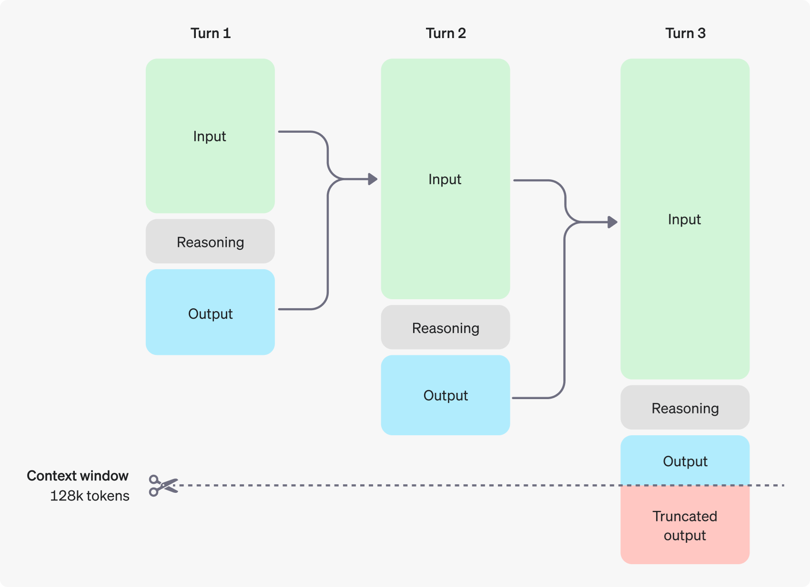
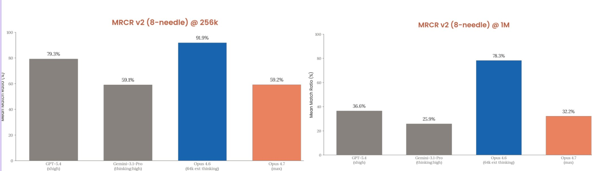
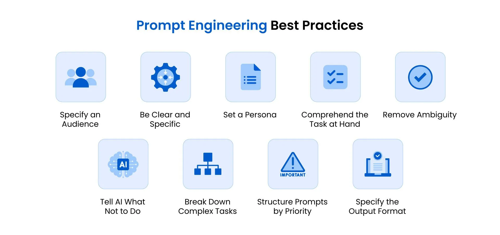

# 02. Reasoning dan Long Context

Bab ini menggabungkan dua topik yang sangat dekat dalam perkembangan LLM modern: **reasoning** dan **long context**. Keduanya sama-sama berbicara tentang peningkatan kemampuan model, tetapi dari sudut yang berbeda.

- **Reasoning** berfokus pada bagaimana model menyusun jawaban yang memerlukan langkah berpikir lebih baik.
- **Long context** berfokus pada seberapa banyak informasi yang bisa dibaca model dalam satu kali inferensi.

Dua topik ini sering muncul bersamaan karena aplikasi nyata modern hampir selalu menghadapi dua tuntutan sekaligus: model harus **berpikir lebih baik** dan **membaca lebih banyak**.

## Daftar Isi

- [Why?](#why)
- [Let's Imagine](#lets-imagine)
- [A. Reasoning](#a-reasoning)
- [1. Apa yang Dimaksud Reasoning Model?](#1-apa-yang-dimaksud-reasoning-model)
- [2. Reasoning ≠ Longer Output](#2-reasoning--longer-output)
- [3. Chain of Thought vs Reasoning Model](#3-chain-of-thought-vs-reasoning-model)
- [4. Mengapa Reasoning Menjadi "Penting"?](#4-mengapa-reasoning-menjadi-penting)
- [5. Evolusi Teknik yang Sering Dibahas](#5-evolusi-teknik-yang-sering-dibahas)
- [6. Inference-Time Compute](#6-inference-time-compute)
- [7. Kapan Reasoning Layak Dipakai?](#7-kapan-reasoning-layak-dipakai)
- [B. Long Context](#b-long-context)
- [8. Apa Itu Context Window?](#8-apa-itu-context-window)
- [9. Mengapa Long Context Sulit?](#9-mengapa-long-context-sulit)
- [10. Teknik yang Sering Dibahas](#10-teknik-yang-sering-dibahas)
- [11. Long Context ≠ Perfect Memory](#11-long-context--perfect-memory)
- [12. Lost in the Middle](#12-lost-in-the-middle)
- [13. Long Context vs RAG](#13-long-context-vs-rag)
- [14. Perkembangan Singkat Saat Ini](#14-perkembangan-singkat-saat-ini)
- [15. Praktikum](#15-praktikum)
- [16. Batasan dan Diskusi](#16-batasan-dan-diskusi)

## Why?

Setelah memahami dasar Transformer dan LLM, pertanyaan berikutnya adalah:

1. Mengapa ada model yang tampak lebih baik untuk matematika, logika, atau coding?
2. Mengapa ada model yang bisa membaca dokumen sangat panjang, tetapi tetap sering salah menemukan informasi penting?

Jawaban atas dua pertanyaan itu tidak cukup hanya dengan mengatakan "modelnya lebih besar". Banyak perkembangan modern justru datang dari:

- post-training yang lebih canggih
- inference design yang lebih matang
- teknik efisiensi attention
- perluasan cara model menangani posisi dan konteks

## Let's Imagine

### Analogi 1

Bayangkan dua siswa mengerjakan soal matematika.

- Siswa pertama langsung menulis jawaban.
- Siswa kedua membuat coretan, memeriksa langkah, mencoba alternatif, lalu baru menulis jawaban akhir.

Reasoning model lebih dekat ke siswa kedua. Model diberi kemampuan atau kebiasaan untuk menempuh proses yang lebih hati-hati sebelum jawaban akhir keluar.

### Analogi 2

Bayangkan dua peneliti membaca dokumen.

- Peneliti pertama hanya punya meja kecil, sehingga sebagian dokumen harus ditumpuk atau disingkirkan.
- Peneliti kedua punya meja besar dan dapat membuka lebih banyak berkas sekaligus.

Long-context model seperti peneliti dengan meja kerja lebih besar. Namun meja besar tidak otomatis membuat orangnya lebih teliti. Ia hanya mengurangi salah satu hambatan kerja.

## A. Reasoning

## 1. Apa yang Dimaksud Reasoning Model?

Dalam konteks LLM modern, reasoning model adalah model yang dirancang atau diarahkan agar lebih kuat dalam tugas yang membutuhkan:

- pemecahan masalah multi-step
- verifikasi langkah
- eksplorasi strategi
- pengurangan kesalahan pada soal yang tidak cukup dijawab dengan quick answer

Penting untuk dipahami: reasoning **bukan** berarti model memiliki kesadaran pola pikir seperti manusia. Di level praktis, reasoning lebih tepat dipahami sebagai kemampuan model untuk menghasilkan proses penyelesaian yang lebih baik pada tugas yang lebih kompleks.

## 2. Reasoning ≠ Longer Output

Ini titik yang sering disalahpahami.

Jawaban yang panjang belum tentu menunjukkan reasoning yang baik. Sebaliknya, jawaban yang ringkas juga belum tentu dangkal. Yang penting adalah **struktur pemecahan masalah**.

Model reasoning yang baik cenderung:

- tidak terlalu cepat mengunci jawaban,
- lebih baik memeriksa konsistensi langkah,
- lebih tangguh terhadap soal yang butuh beberapa tahap.

## 3. Chain of Thought vs Reasoning Model

### Chain of Thought sebagai teknik prompt

Chain of Thought (CoT) adalah teknik prompting. Kita meminta model untuk menjelaskan step by step. Ini berguna sebagai alat bantu belajar dan sering meningkatkan kualitas jawaban pada soal tertentu.

### Reasoning model sebagai perilaku model yang lebih deep

Model reasoning modern tidak sama dengan sekadar model biasa yang diminta "berpikir step by step". Di banyak kasus, kemampuan itu juga didukung oleh post-training dan desain inferensi yang membuat model lebih baik dalam memilih langkah penyelesaian.

Cara paling aman memahaminya:

- **CoT** = strategi interaksi,
- **reasoning model** = model yang memang "lebih siap" untuk tugas multi-step.

## 4. Mengapa Reasoning Menjadi "Penting"?

Tidak semua pertanyaan butuh reasoning kuat. Pertanyaan seperti `ibu kota Jepang apa?` tidak memerlukan eksplorasi multiple step. Tetapi banyak tugas modern justru memerlukannya, misalnya:

- agentic workflow
- soal matematika
- debugging kode

Pada tugas seperti ini, model yang "terlalu cepat" menjawab sering membuat kesalahan di tengah jalan.

## 5. Evolusi Teknik yang Sering Dibahas

Tiga istilah yang sering muncul dalam pembahasan reasoning modern adalah:

### a. RLHF

**Reinforcement Learning from Human Feedback (RLHF)** membantu model belajar preferensi manusia terhadap jawaban yang dianggap lebih baik.

Konsep dasarnya:

- manusia memberi sinyal mana jawaban yang lebih disukai (Human in the loop)
- model diarahkan agar lebih sering menghasilkan pola jawaban seperti preferensi manusia

### b. DPO

**Direct Preference Optimization (DPO)** menyederhanakan pendekatan ini. Tujuannya tetap sama: membuat model lebih dekat ke jawaban yang lebih disukai, tetapi dengan optimasi yang lebih sederhana dibanding pipeline RL yang lebih berat.

### c. GRPO

**Group Relative Policy Optimization (GRPO)** sering dibahas dalam konteks reasoning model yang lebih baru. 

Konsep sederhananya: model membandingkan beberapa kandidat jawaban dalam satu kelompok dan belajar dari perbandingan relatif tersebut.

Yang penting dipahami adalah the bigger picture-nya: model modern bukan hanya diperbesar skalanya, tetapi juga **diarahkan untuk memilih proses jawaban yang lebih baik**.

## 6. Inference-Time Compute

Ini salah satu ide penting dalam perkembangan terbaru LLM.

Dulu, banyak orang berasumsi bahwa peningkatan performa datang terutama dari training compute --> more data, more GPU, bigger model.

Sekarang, ada penekanan yang lebih kuat pada **inference-time compute**, yakni seberapa banyak waktu dan langkah reasoning yang diizinkan saat model sedang mengerjakan soal.

Konsepnya:

- soal mudah tidak butuh proses lama
- soal sulit sering diuntungkan jika model diberi ruang untuk mengeksplorasi langkah lebih dulu

Ini sebabnya mode thinking atau reasoning khusus sering relevan untuk tugas yang memang kompleks.

## 7. Kapan Reasoning Layak Dipakai?

Gunakan mode reasoning atau pendekatan bertahap jika tugasnya:

- memerlukan beberapa langkah
- sensitif terhadap kesalahan perantara
- melibatkan kode, matematika, atau constraint
- lebih penting akurasi daripada kecepatan

Sebaliknya, untuk tugas sederhana seperti ringkasan singkat atau klasifikasi ringan, mode reasoning mendalam seringkali tidak diperlukan.

## B. Long Context

## 8. Apa Itu Context Window?

Context window adalah jumlah token yang bisa dibaca model dalam satu inferensi.

Jika model memiliki context window lebih besar, maka kita bisa memberikan:

- percakapan lebih panjang
- dokumen lebih besar
- lebih banyak potongan kode
- instruksi yang lebih rinci

Namun, `bisa dibaca` tidak sama dengan `dipahami sempurna`.

## 9. Mengapa Long Context Sulit?

Masalah utamanya berasal dari attention. Secara konsep, semakin banyak token yang dimasukkan, semakin banyak hubungan token-ke-token yang harus dihitung.

More Tokens --> More Computation & Memory.

Karena itu, ketika konteks membesar, sistem menghadapi beberapa tantangan:

- kebutuhan memori meningkat
- biaya komputasi meningkat
- latensi meningkat
- kualitas penggunaan konteks tidak selalu stabil

Di titik ini, long context bukan hanya masalah model, tetapi juga masalah sistem dan efisiensi komputasi.

## 10. Teknik yang Sering Dibahas

### a. FlashAttention

FlashAttention berfokus pada efisiensi komputasi attention. Intinya bukan mengubah tujuan attention, tetapi membuat implementasinya lebih hemat dan lebih cepat di hardware modern.

### b. RoPE extension dan teknik serupa

Karena banyak model modern memakai RoPE, berbagai teknik perluasan konteks sering berhubungan dengan cara posisi token diekstrapolasi atau diskalakan.

Contoh nama yang sering muncul adalah **position interpolation** dan **YaRN**.

### c. Optimasi tingkat sistem

Long context juga dibantu oleh desain sistem, bukan hanya modifikasi rumus. Misalnya:

- pengelolaan memori
- pembagian beban antardware
- pengaturan cache
- desain serving yang lebih hemat

## 11. Long Context ≠ Perfect Memory

Banyak orang mengira bahwa jika model dapat menerima 1 juta token, berarti ia otomatis bisa menggunakan semua informasi itu dengan kualitas yang sama. Kenyataannya tidak sesederhana itu.

Beberapa masalah yang masih muncul:

- model lebih mudah memakai informasi di awal atau akhir konteks
- detail di tengah dokumen bisa terlewat
- dokumen yang sangat panjang bisa membuat prompt mahal dan lambat
- kualitas pengambilan informasi tidak selalu sebanding dengan panjang konteks

## 12. Lost in the Middle

Fenomena ini sering dipakai untuk menjelaskan kelemahan long context. Model kadang cukup baik mengingat informasi di bagian awal dan akhir, tetapi lebih lemah saat informasi penting berada di tengah konteks yang sangat panjang.

Akibatnya, sekadar memperbesar context window belum tentu menyelesaikan semua masalah retrieval internal.

## 13. Long Context vs RAG

Pertanyaan praktis yang penting adalah:

> Jika saya punya dokumen panjang, is it better using long context atau RAG?

Jawaban ringkasnya:

### Pilih long context jika:

- dokumen masih cukup masuk akal untuk dimasukkan langsung
- perlu analisis menyeluruh atas urutan dokumen
- struktur konteks penting dipertahankan utuh.
- tidak untuk database dokumen

### Pilih RAG jika:

- menggunakan database dokumen
- biaya token dan latensi menjadi perhatian besar
- basis pengetahuan terus berubah

Dalam praktik, banyak sistem modern justru menggabungkan keduanya: retrieval dulu, lalu hasilnya dimasukkan ke model yang tetap punya context window besar.

## 14. Perkembangan Singkat Saat Ini

Per **Mei 2026**, dua tren besar yang terlihat adalah:

- model frontier makin sering menawarkan mode reasoning atau thinking,
- context window besar makin umum, tetapi kualitas pemakaian konteks tetap menjadi tantangan yang aktif diteliti.

## 15. Praktikum

Untuk memahami reasoning secara praktis, mulai dari hal yang paling sederhana:

- [Notebook Reasoning dan Long Context Demo](./code/reasoning_and_context_demo.ipynb)
- [Catatan Prompt Engineering](./code/prompt-eng.md)

Untuk long context, yang penting adalah menguji kebiasaan berikut:

- jangan masukkan dokumen panjang tanpa tujuan yang jelas
- tandai bagian penting dalam prompt
- pertimbangkan apakah masalahnya sebenarnya lebih cocok untuk RAG

## 16. Batasan dan Diskusi

### Reasoning vs memorization

Salah satu debat besar adalah apakah model benar-benar bernalar atau hanya sangat pandai menggabungkan pola yang pernah dilihat. 

### Reward hacking

Dalam setting optimasi tertentu, model bisa belajar mengejar sinyal penilaian tanpa benar-benar memperbaiki proses berpikir yang kita inginkan. Inilah sebabnya desain objective dan evaluasi sangat penting.

### Latensi

Reasoning dan long context sama-sama punya harga yang harus dibayar:

- reasoning menambah waktu berpikir,
- long context menambah waktu membaca dan biaya komputasi.

### Trade-off kecepatan vs ketelitian

Tidak semua tugas butuh mode reasoning paling tinggi. Sistem yang baik biasanya tahu kapan harus cepat dan kapan harus lebih hati-hati.
