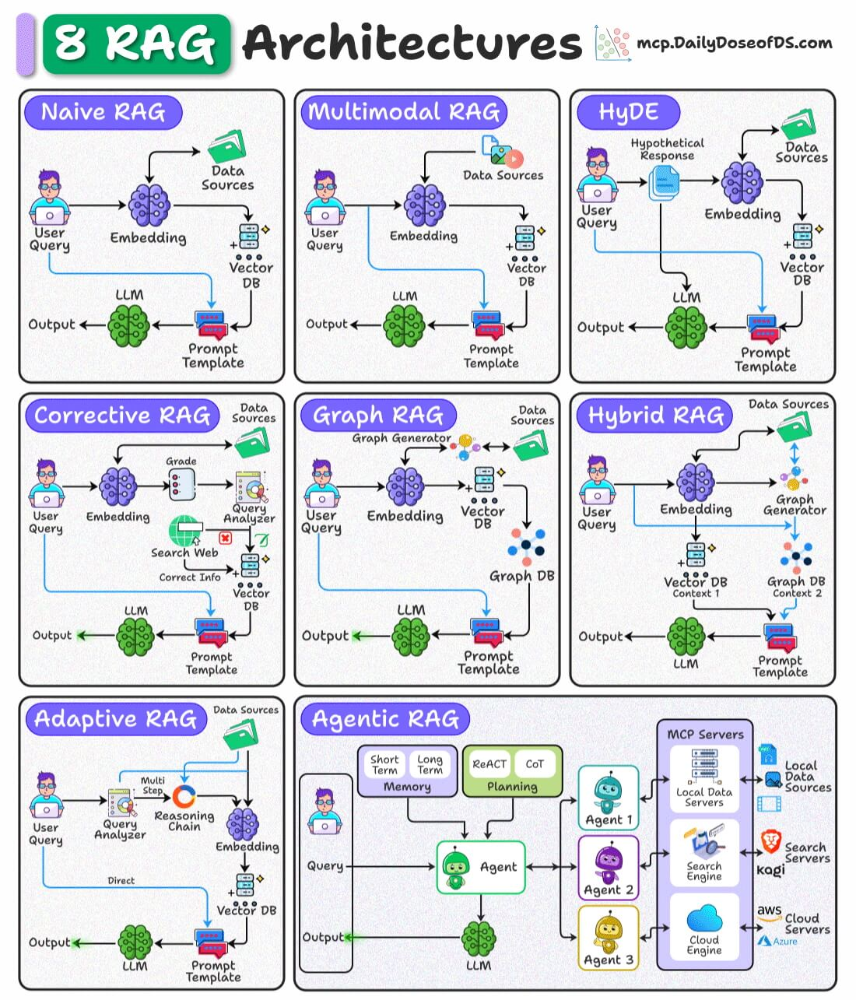
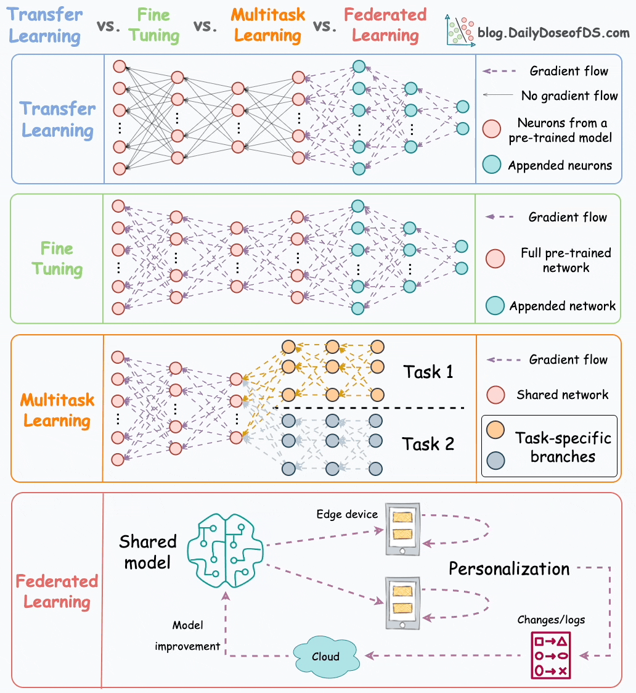
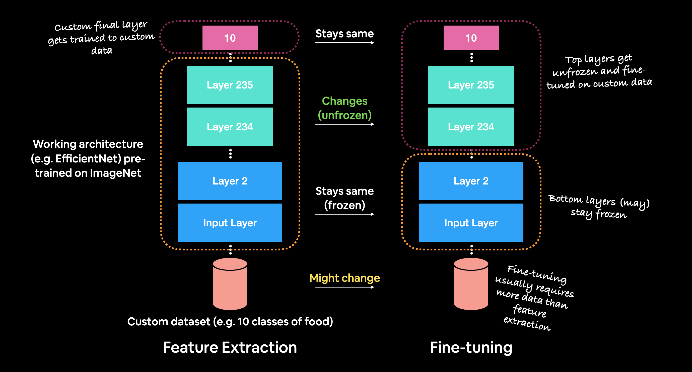
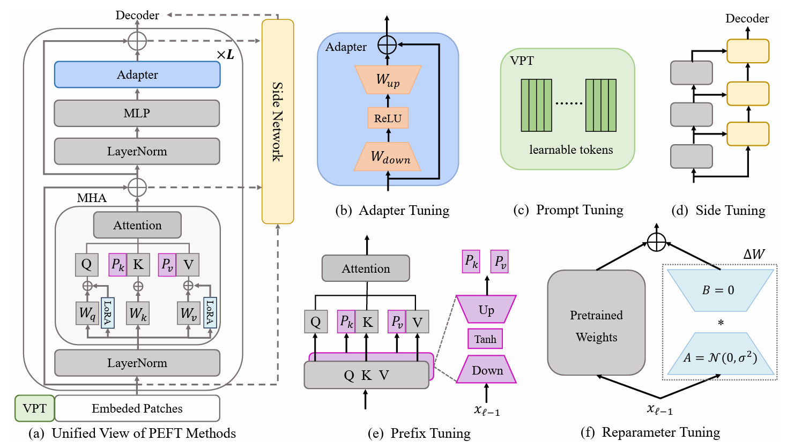
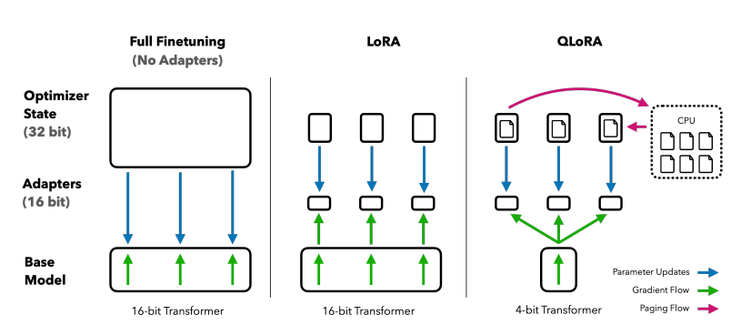

# 03. Multimodal dan RAG

Bab ini menggabungkan dua mekanisme penting yang memperluas kemampuan LLM modern.

- **Multimodal** membuat model tidak hanya memahami teks, tetapi juga gambar, audio, atau video.
- **RAG** membuat model bisa memakai sumber pengetahuan eksternal yang relevan saat menjawab tanpa perlu melakukan Fine-Tuning dan menghemat biaya komputasi.

Keduanya sama-sama memperluas kemampuan model, tetapi melalui jalur yang berbeda. Multimodal memperluas **jenis input** yang bisa diproses. RAG memperluas **base knowledege** dari model LLM.

## Daftar Isi

- [Why Learning This?](#why-learning-this)
- [Let's Imagine](#lets-imagine)
- [A. Multimodal](#a-multimodal)
- [1. Apa Itu Multimodal?](#1-apa-itu-multimodal)
- [2. Masalah Dasar Multimodal](#2-masalah-dasar-multimodal)
- [3. Multimodal in 3 steps](#3-multimodal-in-3-steps)
- [4. Contrastive Learning secara Intuitif](#4-contrastive-learning-secara-intuitif)
- [5. Arsitektur Umum Multimodal](#5-arsitektur-umum-multimodal)
- [6. Use Case Multimodal](#6-use-case-multimodal)
- [7. Multimodal Limitation](#7-multimodal-limitation)
- [B. RAG](#b-rag)
- [8. Apa Itu RAG?](#8-apa-itu-rag)
- [9. Mengapa RAG Diperlukan?](#9-mengapa-rag-diperlukan)
- [10. RAG Pipeline Dasar](#10-rag-pipeline-dasar)
- [11. Embedding dan Cosine Similarity](#11-embedding-dan-cosine-similarity)
- [12. Kualitas RAG Tidak Ditentukan oleh Model LLM saja](#12-kualitas-rag-tidak-ditentukan-oleh-model-llm-saja)
- [13. Arsitektur RAG](#13-arsitektur-rag)
- [14. Keputusan Desain dalam RAG](#14-keputusan-desain-dalam-rag)
- [15. RAG vs Fine-Tuning](#15-rag-vs-fine-tuning)
- [16. Prompting vs RAG vs Multimodal vs Fine-Tuning](#16-prompting-vs-rag-vs-multimodal-vs-fine-tuning)
- [17. Perkembangan Singkat Saat Ini](#17-perkembangan-singkat-saat-ini)
- [18. Praktikum](#18-praktikum)
- [19. Limitation](#19-limitation)

## Why Learning This?

LLM murni berbasis teks punya dua keterbatasan yang mudah terlihat:

1. model tidak otomatis memahami konten audio atau visual.
2. model tidak selalu memiliki pengetahuan yang paling baru atau paling spesifik.

Contoh nyata:

- jika Anda mengunggah sebuah gambar, model teks murni tidak bisa membacanya.
- jika Anda bertanya isi SOP internal perusahaan yang hanya bisa diakses oleh karyawan perusahaan itu, model umum belum tentu tahu.

Multimodal menjawab keterbatasan pertama. RAG menjawab keterbatasan kedua.

## Let's Imagine

### Analogi 1: Bahasa Koordinat yang Sama

Bayangkan teks dan gambar berasal dari dua bahasa yang berbeda. Agar model bisa memahaminya bersama, keduanya harus diterjemahkan dulu ke satu "bahasa koordinat" yang sama. Setelah itu, model dapat menghubungkan kata `kucing` dengan fitur visual yang memang merepresentasikan kucing.

Itulah konsep dasar dari multimodal alignment.

### Analogi 2: Pustakawan

Bayangkan Anda bertanya pada pustakawan. Pustakawan yang baik tidak harus menghafal seluruh isi perpustakaan. Ia cukup tahu:

- buku mana yang perlu dicari
- bagian mana yang relevan
- bagaimana cara menjelaskan bagian tersebut secara efektif.

Itulah konsep dasar dari RAG.

## A. Multimodal

## 1. Apa Itu Multimodal?

Multimodal berarti model dapat bekerja dengan lebih dari satu jenis data, misalnya:

- teks,
- gambar,
- audio,
- video,
- dokumen visual seperti PDF hasil scan.

## 2. Masalah Dasar Multimodal

Komputer melihat teks dan gambar dengan bentuk yang berbeda.

- Teks masuk sebagai token diskret.
- Gambar masuk sebagai array piksel.

Karena bentuk datanya berbeda, model butuh cara untuk membuat keduanya bisa dibandingkan atau digabungkan agar model dapat memahami kedua input yang berbeda tersebut.

Inilah asal pentingnya **embedding alignment**.

## 3. Multimodal in 3 steps

### a. Modalitas non-teks biasanya masuk lewat encoder khusus

Gambar, misalnya, tidak langsung masuk ke LLM dalam bentuk piksel mentah. Biasanya gambar diproses dulu oleh encoder visual, misalnya keluarga **Vision Transformer (ViT)** atau encoder lain yang sejenis. Model yang seperti ini juga dapat disebut sebagai **Visual Language Model (VLM)**.

Encoder ini mengubah gambar menjadi representasi vektor.

### b. Representasi itu diproyeksikan agar kompatibel dengan Language Model

Setelah gambar diubah menjadi embedding, hasilnya perlu diselaraskan agar bisa diproses bersama token teks. Dengan kata lain, model perlu punya "ruang representasi" yang membuat teks dan gambar dapat "bertemu".

### c. Language Model tetap sering menjadi reasoning engine-nya

Dalam banyak arsitektur modern, bagian visual bertugas mengekstrak representasi. LLM tetap menjadi pusat yang:

- menggabungkan konteks
- menghubungkan input visual dengan instruksi teks
- menghasilkan jawaban akhir

## 4. Contrastive Learning secara Intuitif

Salah satu ide penting dalam multimodal adalah **contrastive learning**.

Intuisinya sederhana:

- pasangan yang cocok harus didekatkan
- pasangan yang tidak cocok harus dijauhkan

~tapi ini bukan tentang pasangan~

Contoh:

- gambar kucing + teks `seekor kucing` harus dekat
- gambar kucing + teks `kereta api` harus jauh

Dengan pendekatan ini, model belajar bahwa teks dan gambar dapat mewakili konsep yang sama dalam ruang representasi bersama.

## 5. Arsitektur Umum Multimodal

Secara garis besar, sistem multimodal modern sering mengikuti pola berikut:

1. **Input non-teks** masuk ke encoder yang sesuai.
2. Encoder menghasilkan embedding.
3. Embedding diproyeksikan ke ruang representasi yang cocok untuk language model.
4. Language Model menerima embedding itu bersama teks.
5. Language Model menghasilkan output.

Dalam praktik, variasinya banyak. Namun pola besarnya tetap sama: ada tahap **encode**, **align**, lalu **reason/generate**.

## 6. Use Case Multimodal

Beberapa contoh yang paling mudah ditemui:

- menjelaskan isi gambar
- menjawab pertanyaan dari diagram
- membaca dokumen visual
- membantu analisis nota, formulir, atau slide presentasi.

Di titik ini, multimodal bukan lagi fitur tambahan yang aneh. Dalam banyak model terkini, multimodal mulai menjadi baseline.

## 7. Multimodal Limitation

### a. Multimodal hallucination

Model bisa salah membaca gambar dan tetap pede menjelaskan. Jika gambar ambigu, buram, atau sangat padat, kesalahan interpretasi bisa meningkat.

### b. OCR is not perfect (yet)

Untuk dokumen visual, kualitas jawaban sangat dipengaruhi kualitas pembacaan teks pada gambar atau PDF. Jika input visual buruk, hasil akhirnya juga bisa turun.

### c. Visual bias

Jika data train visual tidak merata secara budaya, geografi, atau sosial, model dapat salah menafsirkan pada konteks tertentu.

## B. RAG

## 8. Apa Itu RAG?

**Retrieval-Augmented Generation** adalah pendekatan yang memberi model akses ke dokumen eksternal yang relevan saat menjawab.

Alih-alih berharap model menghafal semua pengetahuan spesifik, sistem RAG biasanya bekerja seperti ini:

1. cari potongan dokumen yang paling relevan,
2. masukkan potongan itu ke konteks model,
3. minta model menjawab berdasarkan konteks tersebut.

Jadi, RAG bukan pengganti model bahasa. RAG adalah cara **memperkuat** language model dengan retrieval.

## 9. Mengapa RAG Diperlukan?

Ada beberapa situasi di mana prompting biasa tidak cukup:

- dokumen perusahaan terlalu banyak dan bersifat High Confidential
- informasi sering berubah
- jawaban harus merujuk ke sumber yang spesifik
- domainnya terlalu khusus untuk diandalkan dari baseline knowledge model

Di kondisi seperti ini, RAG sering lebih masuk akal daripada langsung melakukan fine-tuning.

## 10. RAG Pipeline Dasar

Pipeline RAG paling dasar biasanya punya langkah-langkah berikut.

### a. Chunking

Dokumen panjang dipecah menjadi potongan-potongan kecil. Ini penting karena retrieval biasanya bekerja pada potongan, bukan pada seluruh dokumen sekaligus.

### b. Embedding

Setiap potongan diubah menjadi vektor menggunakan embedding model.

### c. Indexing

Vektor disimpan di vector database atau struktur pencarian yang sesuai.

### d. Retrieval

Saat ada pertanyaan, pertanyaan itu juga diubah menjadi embedding, lalu sistem mencari potongan yang paling relevan.

### e. Generation

Potongan yang terpilih dimasukkan ke prompt LLM, lalu model menjawab berdasarkan konteks tersebut.

## 11. Embedding dan Cosine Similarity

Inti semantic retrieval adalah representasi vektor. Kalimat atau paragraf yang secara makna mirip diharapkan berada dekat dalam ruang embedding.

Dengan pendekatan ini, pertanyaan dan dokumen tidak harus cocok kata-per-kata. Yang dicari adalah **kedekatan makna/kontekstual**, bukan sekadar kecocokan literal.

Di tingkat dasar, kemiripan ini sering diukur dengan **cosine similarity**.

## 12. Kualitas RAG Tidak Ditentukan oleh Model LLM saja

Ini salah satu pelajaran terpenting pada konsep RAG.

RAG yang baik bukan hanya soal memilih LLM yang bagus. Hasil akhir dipengaruhi oleh seluruh pipeline:

- kualitas chunking
- kualitas embedding model
- kualitas retriever
- kualitas indexing
- jumlah top-k yang diambil
- cara prompt augmentation dilakukan
- arsitektur RAG yang digunakan

Jika retrieval jelek, LLM yang bagus sekalipun bisa memberi jawaban yang tetap salah atau tidak relevan.

## 13. Arsitektur RAG

Setelah memahami pipeline dasar, penting juga untuk melihat bahwa RAG tidak selalu berbentuk satu pola yang sama. Dalam implementasi nyata, arsitektur RAG dapat berkembang sesuai jenis data, kualitas retrieval yang dibutuhkan, dan tingkat kompleksitas pertanyaan pengguna.

Beberapa arsitektur RAG yang umum ditemui:

1. **Naive RAG**

   Ini bentuk paling dasar dari RAG. Pertanyaan pengguna diubah menjadi embedding, lalu sistem mengambil dokumen paling mirip dari vector database. Dokumen tersebut dimasukkan ke prompt template, kemudian LLM menghasilkan jawaban.

   Pola ini cocok untuk pembelajaran awal dan use case sederhana, tetapi sangat bergantung pada kualitas chunking, embedding, dan retrieval awal.

2. **Multimodal RAG**

   Multimodal RAG memperluas sumber data RAG dari teks saja menjadi gambar, audio, video, atau dokumen visual. Data non-teks biasanya diproses dulu oleh encoder khusus, lalu hasil representasinya dipakai dalam proses retrieval.

   Contohnya adalah sistem yang menjawab pertanyaan dari slide, gambar produk, hasil scan dokumen, atau diagram teknis.

3. **HyDE**

   **Hypothetical Document Embeddings (HyDE)** tidak langsung mencari dokumen dari pertanyaan asli. Sistem lebih dulu meminta LLM membuat jawaban atau dokumen hipotetis yang kira-kira relevan, lalu embedding dibuat dari teks hipotetis tersebut.

   Tujuannya adalah membuat query retrieval menjadi lebih kaya secara semantik. Teknik ini berguna ketika pertanyaan pengguna terlalu pendek, ambigu, atau miskin konteks.

4. **Corrective RAG**

   Corrective RAG menambahkan tahap evaluasi terhadap hasil retrieval. Sistem tidak langsung percaya bahwa dokumen yang ditemukan sudah benar. Hasil retrieval dapat dinilai, disaring, atau diperbaiki dengan pencarian tambahan seperti web search atau sumber data lain.

   Arsitektur ini membantu saat vector database berisi informasi yang tidak lengkap, usang, atau terlalu noisy.

5. **Graph RAG**

   Graph RAG memakai struktur graph untuk menangkap hubungan antar-entitas, bukan hanya kedekatan vektor. Sistem dapat membangun atau memakai graph database yang berisi node dan relasi, misalnya hubungan antara orang, organisasi, dokumen, produk, dan kejadian.

   Pendekatan ini kuat untuk pertanyaan yang membutuhkan relasi bertingkat, seperti "siapa yang terhubung dengan proyek ini lewat vendor tertentu?" atau "dokumen mana yang menjelaskan dampak kebijakan ini ke unit lain?".

6. **Hybrid RAG**

   Hybrid RAG menggabungkan lebih dari satu strategi retrieval. Misalnya, sistem memakai vector database untuk konteks semantik dan graph database untuk relasi antar-entitas. Hasil dari beberapa sumber kemudian digabungkan ke prompt template.

   Pola ini cocok ketika satu jenis retrieval tidak cukup. Semantic search baik untuk makna, sedangkan graph search baik untuk hubungan eksplisit.

7. **Adaptive RAG**

   Adaptive RAG menambahkan query analyzer atau reasoning chain untuk menentukan jalur retrieval yang paling sesuai. Tidak semua pertanyaan harus melewati proses retrieval yang sama. Pertanyaan sederhana bisa dijawab langsung, sedangkan pertanyaan kompleks dapat diarahkan ke multi-step retrieval.

   Dengan pendekatan ini, sistem bisa lebih hemat biaya dan lebih tepat sasaran karena retrieval disesuaikan dengan tingkat kesulitan pertanyaan.

8. **Agentic RAG**

   Agentic RAG memakai agent sebagai pengatur proses retrieval dan reasoning. Agent dapat merencanakan langkah, memilih tools, memanggil search engine, mengambil data lokal, memakai MCP server, membaca cloud source, atau meminta agent lain membantu sub-tugas tertentu.

   Arsitektur ini cocok untuk workflow kompleks yang membutuhkan banyak langkah dan banyak sumber data. Trade-off-nya adalah latensi, biaya, dan evaluasi sistem menjadi lebih sulit.

## 14. Keputusan Desain dalam RAG

### a. Ukuran chunk

Jika chunk terlalu kecil:

- konteks bisa terpotong,
- jawaban kehilangan detail.

Jika chunk terlalu besar:

- retrieval bisa kurang presisi
- prompt jadi mahal

### b. Jumlah dokumen yang diambil

Jika terlalu sedikit, informasi penting bisa terlewat. Jika terlalu banyak, prompt menjadi noise dan mahal.

### c. Perlu atau tidak re-ranking

Retrieval awal sering menghasilkan kandidat retrieval yang cukup baik tetapi belum optimal. Re-ranking membantu menyusun ulang kandidat retrieval tersebut agar yang paling relevan benar-benar naik ke atas dan dijadikan sumber rujukan.

### d. Perlu atau tidak metadata filtering

Kadang retrieval perlu dibatasi ke dokumen, tanggal, produk, atau unit tertentu. When you guys meet with Enterprise Database, this concept is very important.

## 15. RAG vs Fine-Tuning

Pertanyaan yang sangat penting adalah:

> Kapan saya sebaiknya memakai RAG, dan kapan fine-tuning lebih cocok?

### Gunakan RAG jika:

- masalah utamanya adalah **akses ke pengetahuan eksternal** yang tidak dapat diakses secara umum
- dokumen sering berubah
- perlu sumber yang dapat ditelusuri
- Ingin melakukan cost efficiency (dibanding melatih ulang model)

### Gunakan fine-tuning jika:

- masalah utamanya adalah **perilaku model**, bukan knowledge
- butuh gaya jawaban atau format yang konsisten
- pola tugasnya sangat berulang
- perlu hal lebih dari prompting

### Gunakan kombinasi jika perlu

Dalam real casenya, sangat umum memakai kombinasi:

- model di-fine-tune agar lebih patuh pada gaya instruksi atau tugas yang diberikan
- RAG dipakai agar pengetahuan tetap relevan dan terbaru.

## 16. Prompting vs RAG vs Multimodal vs Fine-Tuning

Panduan cepatnya seperti ini:

### Prompting

Pakai jika model umum sudah cukup tahu dan Anda hanya butuh arahan.

### Multimodal

Pakai jika input penting Anda bukan hanya teks, tetapi juga gambar atau dokumen visual.

### RAG

Pakai jika jawaban harus berasal dari dokumen eksternal yang spesifik atau terbaru.

### Fine-tuning

Pakai jika yang perlu diubah adalah perilaku model secara lebih konsisten, bukan sekadar akses pengetahuan.

## 17. Perkembangan Singkat Saat Ini

Per **Mei 2026**, ada dua tren yang sangat jelas:

- kemampuan multimodal semakin dianggap sebagai fitur dasar model frontier,
- sistem RAG berkembang dari pencarian vektor sederhana menuju pipeline yang lebih cerdas, misalnya re-ranking, retrieval bertingkat, dan kombinasi struktur data yang lebih kaya.

Artinya, masa depan LLM bukan hanya soal model yang lebih besar, tetapi juga soal bagaimana model dihubungkan dengan dunia luar: gambar, dokumen, alat, dan basis pengetahuan.

## 18. Praktikum

Untuk multimodal dan RAG:

- [Notebook Multimodal, RAG, dan Fine-Tuning](./code/multimodal_rag_and_finetuning.ipynb)

## 19. Limitation

### Multimodal bukan jaminan paham visual sempurna

Model bisa gagal menangkap detail kecil, relasi spasial, atau konteks visual yang kompleks.

### RAG tidak kebal halusinasi

RAG mengurangi risiko halusinasi, tetapi tidak menghapusnya. Jika dokumen yang diambil salah, tidak lengkap, atau tidak relevan, jawaban akhir juga bisa tetap salah.

### Biaya sistem bertambah

RAG menambah retrieval dan orchestration. Multimodal menambah beban encoding input non-teks. Kemampuan lebih luas hampir selalu datang dengan trade-off biaya dan latensi.

### Evaluasi menjadi lebih sulit

Untuk sistem gabungan seperti multimodal + RAG, kita tidak cukup hanya mengevaluasi jawaban akhir. Kita juga perlu mengevaluasi:

- apakah input visual dibaca dengan benar
- apakah retrieval menemukan konteks yang tepat
- apakah model menggunakan konteks itu dengan benar
