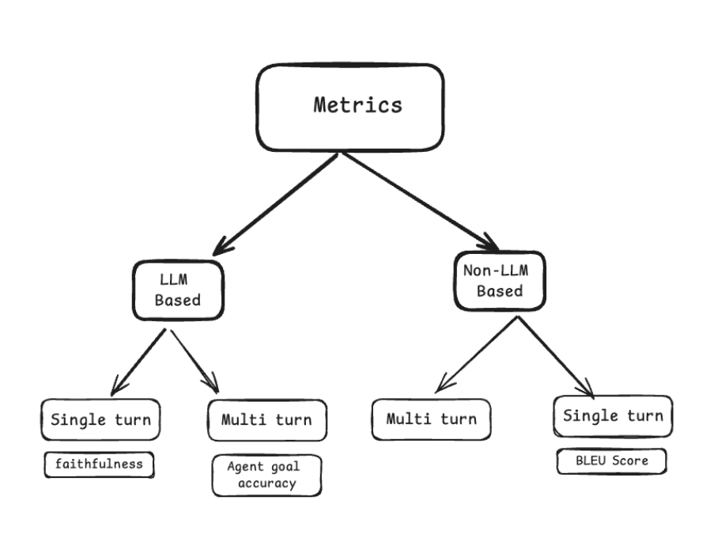
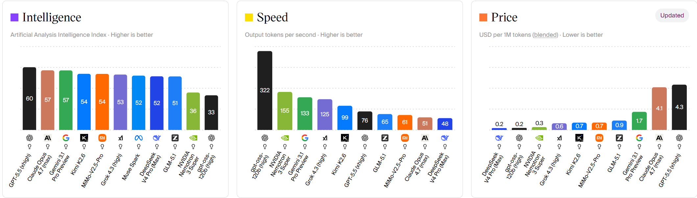
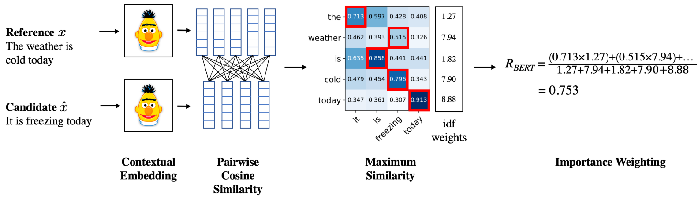
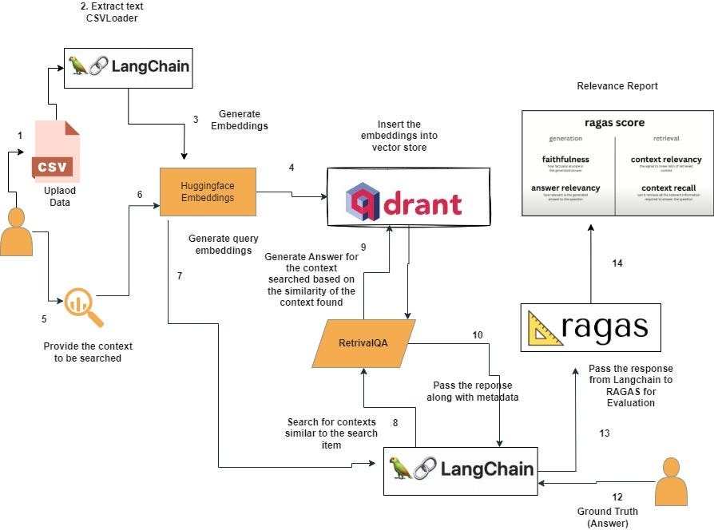

# 04. Evaluasi dan metrik

Bab ini membahas cara mengukur kualitas sistem berbasis LLM. Di bab-bab sebelumnya, kita sudah belajar tentang arsitektur Transformer, reasoning, multimodal, dan RAG. Namun, ada satu pertanyaan penting yang belum kita jawab: bagaimana kita tahu kalau sistem yang kita buat itu sudah bagus?

Tanpa metrik evaluasi, kita hanya bisa menebak-nebak dan bilang "sepertinya sudah benar" tanpa bukti kuat. Bab ini akan membantu kita memahami cara mengukurnya secara objektif.



## Daftar isi
- [1. Evaluasi model LLM](#1-evaluasi-model-llm)
- [2. Benchmark dan leaderboard](#2-benchmark-dan-leaderboard)
- [3. Metrik evaluasi teks generatif](#3-metrik-evaluasi-teks-generatif)
- [4. BLEU](#4-bleu)
- [5. ROUGE](#5-rouge)
- [6. BERTScore](#6-bertscore)
- [7. Kenapa metrik pencocokan string sering tidak cukup untuk LLM](#7-kenapa-metrik-pencocokan-string-sering-tidak-cukup-untuk-llm)
- [8. Evaluasi retrieval pada RAG](#8-evaluasi-retrieval-pada-rag)
- [9. Evaluasi generation pada RAG](#9-evaluasi-generation-pada-rag)
- [10. RAGAS sebagai framework evaluasi RAG](#10-ragas-sebagai-framework-evaluasi-rag)
- [11. LLM-as-a-Judge](#11-llm-as-a-judge)
- [12. Evaluasi oleh manusia dan batas metrik otomatis](#12-evaluasi-oleh-manusia-dan-batas-metrik-otomatis)
- [13. Praktikum](#13-praktikum)
- [14. Batasan](#14-batasan)

## Mengapa evaluasi itu penting?

Bayangkan ketika kita membangun sistem RAG untuk menjawab pertanyaan dari dokumen internal. Jalurnya sudah berfungsi, jawaban bisa keluar, dan sekilas terlihat masuk akal. Namun, ada beberapa pertanyaan yang harus bisa dijawab:

- Apakah jawabannya benar-benar berdasarkan dokumen, atau model hanya mengarang bebas (halusinasi)?
- Apakah dokumen yang diambil oleh retriever memang relevan?
- Jika strategi chunking diganti, apakah hasilnya jadi lebih baik atau malah memburuk?

Evaluasi membantu kita mengambil keputusan teknis berdasarkan data, bukan sekadar intuisi.

### Tiga lapisan evaluasi

Sistem LLM memiliki beberapa lapisan berbeda yang memerlukan pendekatan evaluasi yang berbeda pula:

1. **Evaluasi model:** Mengukur seberapa baik model itu sendiri dalam memprediksi dan memahami bahasa.
2. **Evaluasi teks:** Mengukur kemiripan teks hasil generasi model dengan teks acuan (ground truth).
3. **Evaluasi pipeline:** Mengukur performa sistem secara utuh (misalnya alur retrieval + generation pada RAG).

Bab ini disusun berurutan dari yang paling umum hingga yang paling spesifik.

## 1. Evaluasi model LLM

Tugas dasar LLM adalah memprediksi kata berikutnya (*next-token prediction*). Oleh karena itu, metrik evaluasi model (sering disebut *intrinsic evaluation*) berfokus pada seberapa akurat model menebak token selanjutnya berdasarkan konteks kalimat sebelumnya.

Ada tiga metrik utama di tingkat ini:

### A. Cross-entropy loss
Ini adalah fungsi kerugian (*loss function*) utama yang diminimalkan selama proses latihan model (*pretraining*). Metrik ini mengukur selisih antara distribusi probabilitas tebakan model dengan distribusi token asli pada data latihan.
* Semakin kecil nilai loss, semakin dekat tebakan model dengan teks target.
* Perubahan nilai loss menjadi indikator utama apakah model sedang mengalami *underfitting*, *overfitting*, atau sudah konvergen.

### B. Perplexity (PPL)
Perplexity adalah metrik turunan langsung dari Cross-entropy loss. Secara matematis, Perplexity didefinisikan sebagai eksponensial dari loss:

$$\text{PPL} = e^{\text{Loss}}$$

*(Catatan: Basis eksponensialnya menyesuaikan basis logaritma yang digunakan saat menghitung loss).*

Secara sederhana, Perplexity menggambarkan seberapa banyak pilihan kata yang membuat model "bingung" saat memprediksi token berikutnya:
* Jika model memiliki **PPL = 10**, artinya model tersebut bingung memilih kata berikutnya seperti sedang memilih secara acak dari 10 kata alternatif dengan probabilitas yang sama.
* Semakin kecil nilai PPL, tebakan model semakin fokus dan percaya diri.
* **Keterbatasan:** PPL sangat sensitif terhadap kosakata (*vocabulary*) dan tokenizer yang digunakan. Kita tidak bisa membandingkan nilai PPL dari dua model yang menggunakan tokenizer berbeda.

### C. Next-token accuracy (Top-k accuracy)
Metrik ini mengukur seberapa sering kata yang benar masuk dalam daftar tebakan teratas model.
* **Top-1 accuracy:** Seberapa sering kata yang benar menjadi tebakan pertama model (probabilitas tertinggi).
* **Top-5 accuracy:** Seberapa sering kata yang benar masuk dalam 5 besar tebakan model.

Metrik ini jauh lebih mudah dipahami secara intuitif dibanding PPL atau loss.

---

## 2. Benchmark dan leaderboard

Cara lain mengevaluasi model adalah menggunakan *benchmark*, yaitu kumpulan soal standar untuk membandingkan kemampuan berbagai model secara langsung.

Beberapa benchmark yang umum digunakan:

| Benchmark | Hal yang diuji | Contoh tugas / soal |
|-----------|----------------|---------------------|
| MMLU | Pengetahuan umum di 57 subjek | Pilihan ganda tentang biologi, sejarah, hukum, dll |
| GSM8K | Kemampuan matematika dasar | Soal cerita matematika tingkat SD-SMP |
| HumanEval | Kemampuan menulis kode | Menulis fungsi Python berdasarkan deskripsi |
| TruthfulQA | Resistensi terhadap miskonsepsi umum | Pertanyaan yang sering dijawab salah oleh manusia |
| MRCR | Kemampuan memahami konteks panjang | Mencari informasi spesifik di dalam dokumen panjang |

Leaderboard seperti Open LLM Leaderboard di Hugging Face atau Chatbot Arena mengumpulkan skor benchmark dari berbagai model untuk memudahkan perbandingan.

Perlu diingat: skor benchmark yang tinggi tidak menjamin model tersebut lebih baik untuk kebutuhan spesifik yang dihadapi. Model yang unggul di MMLU belum tentu cocok untuk menjawab pertanyaan dari dokumen SOP tertentu. Benchmark hanya memberikan gambaran umum.



## 3. Metrik evaluasi teks generatif

Setelah melihat evaluasi model secara umum, mari kita fokus ke tingkat yang lebih detail: bagaimana mengukur kualitas teks hasil generasi model?

Misalnya, jika model diminta menjawab sebuah pertanyaan dan kita memiliki jawaban acuan (referensi), bagaimana kita mengukur seberapa "dekat" jawaban model dengan referensi tersebut?

Ada beberapa metrik yang umum digunakan, masing-masing dengan kelebihan dan batasannya.

## 4. BLEU

**Bilingual Evaluation Understudy (BLEU)** awalnya dibuat untuk mengevaluasi hasil terjemahan mesin. Metrik ini menghitung seberapa banyak n-gram (potongan kata berurutan) dari output model yang cocok dengan teks referensi.

Contoh sederhana:
- Referensi: `Kucing duduk di atas tikar`
- Output model: `Kucing duduk di tikar`

BLEU menghitung kecocokan unigram, bigram, trigram, dan seterusnya. Output di atas kehilangan kata "atas", sehingga skor BLEU-nya tidak sempurna tetapi tetap tinggi karena sebagian besar kata lainnya cocok.

Skor BLEU berkisar antara 0 hingga 1 (atau 0-100%). Semakin tinggi nilainya, semakin banyak kata yang tumpang tindih (*overlap*).

BLEU lebih berfokus pada **precision**: dari kata-kata yang dihasilkan model, berapa banyak yang juga ada di teks referensi?

## 5. ROUGE

**Recall-Oriented Understudy for Gisting Evaluation (ROUGE)** biasanya digunakan untuk tugas peringkasan teks (*summarization*) dan tanya jawab. Berbeda dengan BLEU, ROUGE lebih menekankan pada **recall**.

Tiga varian yang paling sering digunakan:

| Varian | Cara kerja |
|--------|-----------|
| ROUGE-1 | Menghitung overlap unigram (kata tunggal) |
| ROUGE-2 | Menghitung overlap bigram (pasangan kata berurutan) |
| ROUGE-L | Menghitung urutan kata terpanjang yang sama (longest common subsequence) |

Contoh:
- Referensi: `Model bahasa besar mampu memahami konteks panjang`
- Output: `Model bahasa besar bisa memahami konteks yang panjang`

ROUGE-1 akan menangkap kecocokan kata meskipun ada perbedaan kata ("mampu" vs "bisa", dan tambahan "yang"). ROUGE-L akan mencari urutan kata terpanjang yang sama.

Secara singkat, ROUGE mengukur: dari seluruh informasi penting pada referensi, seberapa banyak yang berhasil ditulis oleh model?

## 6. BERTScore

BLEU dan ROUGE bekerja dengan mencocokkan kata secara literal. Pendekatan ini bermasalah jika model menggunakan sinonim atau parafrase yang artinya sama tetapi menggunakan kata yang berbeda.

BERTScore mengatasi masalah ini dengan mengukur kemiripan pada tingkat **embedding**, bukan kata literal. Setiap token di output dan referensi diubah menjadi vektor (menggunakan model BERT atau sejenisnya), lalu kemiripan antar-vektor dihitung.

Contoh kegunaannya:
- Referensi: `Anjing itu berlari cepat`
- Output: `Seekor anjing melaju kencang`

BLEU dan ROUGE akan memberikan skor rendah karena sedikit kata yang cocok secara harfiah. BERTScore akan memberikan skor tinggi karena secara semantik "berlari" dekat dengan "melaju", dan "cepat" dekat dengan "kencang".

Ini sejalan dengan konsep embedding dan cosine similarity yang sudah kita bahas pada bab sebelumnya.



## 7. Kenapa metrik pencocokan string sering tidak cukup untuk LLM

BLEU dan ROUGE dirancang sebelum era LLM modern, ketika output terjemahan atau ringkasan cenderung pendek dan strukturnya mirip dengan teks referensi.

LLM modern sering menghasilkan jawaban yang benar tetapi ditulis dengan struktur yang sangat berbeda dari referensi. Contoh:
- Referensi: `Jakarta adalah ibu kota Indonesia`
- Output LLM: `Ibu kota dari negara Indonesia terletak di Jakarta`

Secara makna keduanya sama persis, tetapi skor BLEU/ROUGE bisa rendah karena urutan dan struktur kalimatnya berbeda.

Oleh karena itu, evaluasi LLM modern lebih banyak menggunakan pendekatan semantik (seperti BERTScore) atau menggunakan LLM lain sebagai penilai (LLM-as-a-Judge).

## 8. Evaluasi retrieval pada RAG

Sekarang kita masuk ke bagian praktikum: evaluasi jalur RAG.

Pipeline RAG memiliki dua komponen utama: **retrieval** (mencari dokumen pendukung) dan **generation** (menulis jawaban). Keduanya harus dievaluasi secara terpisah karena masalah pada salah satu komponen akan merusak hasil akhir.

Evaluasi retrieval bertujuan menjawab: apakah sistem berhasil mengambil dokumen yang relevan?

Metrik utamanya adalah:

### Precision@k
Dari k dokumen yang diambil, berapa banyak yang relevan?
```
Precision@k = jumlah dokumen relevan di top-k / k
```
Contoh: sistem mengambil 5 dokumen, dan 3 di antaranya relevan.
Precision@5 = 3/5 = 0.6

### Recall@k
Dari seluruh dokumen relevan yang ada di database, berapa banyak yang berhasil diambil?
```
Recall@k = jumlah dokumen relevan di top-k / total dokumen relevan di database
```
Contoh: database memiliki 4 dokumen relevan. Sistem mengambil 5 dokumen, dan 3 di antaranya relevan.
Recall@5 = 3/4 = 0.75

### Hit rate (Hit@k)
Apakah setidaknya ada satu dokumen relevan yang masuk dalam top-k?
```
Hit@k = 1 jika ada dokumen relevan di top-k, 0 jika tidak ada
```
Metrik ini cocok digunakan jika kita hanya membutuhkan satu sumber yang tepat untuk menjawab pertanyaan.

### MRR (Mean Reciprocal Rank)
MRR mengukur posisi dokumen relevan pertama dalam daftar hasil pencarian, lalu mengambil kebalikannya (reciprocal).
```
RR = 1 / posisi dokumen relevan pertama
MRR = rata-rata RR dari seluruh query
```
Contoh: dokumen relevan pertama muncul di urutan ke-3.
RR = 1/3 ≈ 0.33

MRR memberi tahu kita seberapa cepat sistem menemukan dokumen relevan di daftar teratas secara rata-rata.

## 9. Evaluasi generation pada RAG

Meskipun komponen retrieval mengambil dokumen yang tepat, model bahasa masih bisa mengalami masalah seperti:
- Mengarang informasi yang tidak ada di dokumen (halusinasi).
- Menjawab hal lain yang tidak ditanyakan.
- Mengabaikan informasi penting dari dokumen yang diberikan.

Berikut adalah tiga metrik utama untuk mengevaluasi hasil generasi RAG:

### Faithfulness
Apakah semua klaim pada jawaban didukung oleh dokumen yang diberikan?
Ini adalah metrik terpenting untuk RAG guna menekan halusinasi. Skor faithfulness yang rendah berarti model mulai mengarang jawaban sendiri meskipun dokumen acuannya sudah benar.

### Answer relevancy
Apakah jawaban yang dihasilkan benar-benar menjawab pertanyaan pengguna?
Model bisa saja menghasilkan jawaban yang sesuai dengan dokumen (faithful) tetapi tidak menjawab inti pertanyaan. Contoh:
- Pertanyaan: `Kapan batas waktu pengumpulan tugas?`
- Dokumen: Berisi info batas waktu dan format pengumpulan.
- Jawaban: `Tugas dikumpulkan dalam format PDF.`

Jawaban ini faithful (sesuai dokumen) tetapi tidak relevan karena tidak menjawab pertanyaan tentang waktu.

### Context relevancy
Apakah dokumen yang diambil oleh retriever memang relevan dengan pertanyaan?
Metrik ini mengukur kualitas retrieval dari sudut pandang hasil generasi. Jika dokumen yang diambil tidak relevan, model akan kesulitan memberikan jawaban yang baik.

## 10. RAGAS sebagai framework evaluasi RAG

**RAGAS (Retrieval Augmented Generation Assessment)** adalah framework open-source untuk mengotomatiskan metrik-metrik di atas dalam satu alur evaluasi.

RAGAS menghitung empat metrik utama:

| Metrik RAGAS | Hal yang diukur | Skor ideal |
|-------------|----------------|-----------|
| Faithfulness | Kesesuaian jawaban dengan dokumen acuan | Mendekati 1.0 |
| Answer Relevancy | Kesesuaian jawaban dengan pertanyaan | Mendekati 1.0 |
| Context Precision | Posisi dokumen relevan di daftar teratas | Mendekati 1.0 |
| Context Recall | Kelengkapan dokumen relevan yang diambil | Mendekati 1.0 |

Evaluasi pada RAGAS dijalankan dengan menggunakan LLM lain sebagai penilai (evaluator).



## 11. LLM-as-a-Judge

Menggunakan LLM sebagai evaluator kini menjadi standar baru untuk mengukur kualitas jawaban model lain.

Pendekatan ini muncul karena metrik berbasis string (seperti BLEU dan ROUGE) tidak fleksibel terhadap parafrase, sedangkan evaluasi oleh manusia memerlukan biaya mahal dan waktu yang lama jika dilakukan berulang kali.

Cara kerjanya: model evaluator diberikan pertanyaan, dokumen pendukung, jawaban dari model yang diuji, dan kriteria penilaian. Model tersebut kemudian diminta memberikan skor beserta alasannya.

Contoh prompt LLM-as-a-Judge:
```
Nilailah apakah jawaban berikut benar dan relevan berdasarkan pertanyaan dan konteks yang diberikan. Berikan skor 1-5 dan sertakan alasannya.

Pertanyaan: {question}
Jawaban: {answer}
Konteks: {context}
```

Batas metode ini: LLM evaluator juga bisa melakukan kesalahan. Terdapat bias posisi (cenderung menyukai jawaban pertama) dan bias panjang (cenderung menilai lebih tinggi jawaban yang panjang). Oleh karena itu, LLM-as-a-Judge sebaiknya digunakan untuk mendampingi, bukan menggantikan evaluasi manusia sepenuhnya.

## 12. Evaluasi oleh manusia dan batas metrik otomatis

Metrik otomatis sangat membantu untuk pengujian cepat selama pengembangan, tetapi evaluasi langsung oleh manusia tetap dibutuhkan untuk:
- Mendeteksi jawaban yang secara teknis benar tetapi menyesatkan atau bermakna ganda.
- Menilai kelancaran bahasa dan kejelasan penyampaian.
- Menilai hal-hal yang bersifat subjektif (misalnya panjang ringkasan yang ideal).
- Melakukan validasi akhir sebelum sistem dirilis ke pengguna umum.

Dalam praktikum, demo langsung di depan asisten praktikum adalah bentuk evaluasi oleh manusia. Asisten dapat menilai hal-hal kualitatif yang tidak terbaca oleh metrik otomatis, seperti kelayakan jawaban sistem, ketepatan kutipan sumber, dan pemahaman mahasiswa terhadap sistem yang mereka rancang.

## 13. Praktikum

Untuk bab ini, evaluasi dapat dipraktikkan secara mandiri dengan menambahkan metrik evaluasi pada pipeline RAG yang telah dibangun di bagian sebelumnya (menggunakan *library* seperti Ragas, Hugging Face evaluate, atau BERTScore).

Hal yang bisa dicoba untuk eksplorasi:

- Menghitung ROUGE antara jawaban RAG dan jawaban referensi.
- Menghitung BERTScore untuk melihat kemiripan semantik.
- Menjalankan evaluasi RAGAS pada pipeline RAG yang sudah dibangun.
- Membandingkan skor *faithfulness* antara strategi chunking yang berbeda.
- Bereksperimen dengan jumlah top-k yang berbeda dan melihat dampaknya terhadap *context precision* dan *recall*.

## 14. Batasan

### Tidak ada metrik tunggal yang sempurna
Setiap metrik hanya mengukur aspek tertentu. BLEU baik untuk precision tetapi kaku terhadap parafrase. RAGAS mempermudah evaluasi otomatis tetapi kualitasnya bergantung pada LLM evaluator yang digunakan. Sistem evaluasi yang kokoh biasanya menggabungkan beberapa metrik sekaligus.

### Ground truth tidak selalu tersedia
Beberapa metrik (seperti BLEU, ROUGE, dan metrik retrieval) membutuhkan dokumen referensi atau label relevansi yang valid. Pembuatan data acuan yang berkualitas memerlukan waktu dan tenaga, yang sering kali menjadi hambatan utama dalam pengembangan sistem di dunia nyata.

### Skor metrik yang tinggi tidak menjamin kepuasan pengguna
Sistem bisa saja mendapatkan skor sempurna pada seluruh metrik otomatis tetapi tetap terasa kurang natural atau kurang membantu bagi pengguna nyata. Evaluasi kuantitatif harus selalu didukung oleh pemeriksaan kualitatif secara berkala.
