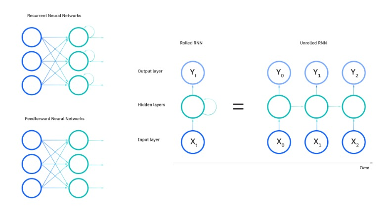
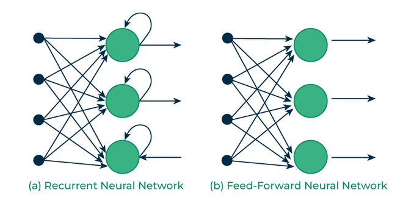
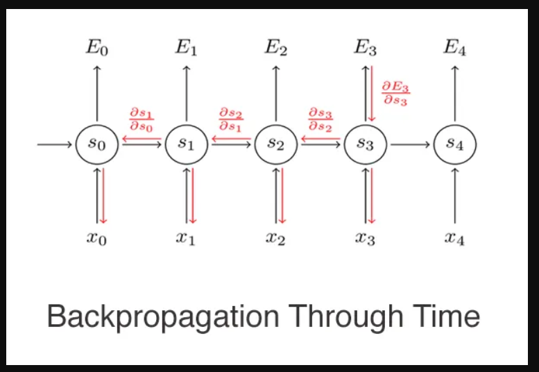
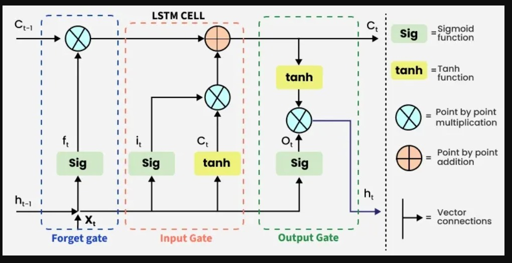
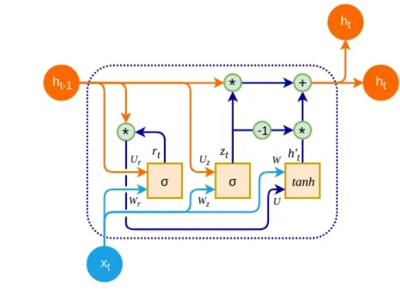

# Deep Learning for Text Classification

> Pada modul kelima, kita akan mempelajari deep learning part 2 untuk text classification. Kita akan mempelajari langkah demi langkah gimana caranya melakukan text classifiation. So let's get started, shall we?

## Daftar Isi

- [Deep Learning (Text)](#deep-learning-text-classification)
  - [Daftar Isi](#daftar-isi)
  - [1. Pendahuluan](#1-pendahuluan)
    - [Apa Itu Text Classification](#apa-itu-text-classification)
    - [Penggunaan](#penggunaan)
  - [2. Preprocessing Text](#2-preprocessing-text)
    - [Tokenization and Text Normalization](#tokenization-normalization)
    - [Padding and Truncation](#padding-truncate)
    - [One Hot Encoding vs Word Embeddings](#Encoding-Embeding)
  - [3. Recurrent Neural Network (RNN)](#3-recurrent-neural-network-rnn)
    - [Basic RNN Structure and Workflow](#basic-rnn)
    - [Forward pass and backpropagation through time (BPTT)](#BPTT)
    - [LSTM](#lstm)
    - [GRU](#gru)
  - [Referensi](#referensi)

## 1. Pendahuluan
### Apa itu text classification?
Text Classification atau klasifikasi teks merupakan salah satu bidang dari 
Natural Language Processing yang mengotomasikan pengklasifikasian teks ke satu 
atau lebih kategori yang tepat berdasarkan isinya dengan membangun model 
menggunakan data latih. Ada beberapa strategi umum dalam penggunaan klasifikasi teks, yaitu text preprocessing, feature extraction, modeling menggunakan teknik pembelajaran mesin yang sesuai, serta training dan testing pada classifier

### Penggunaan

Klasifikasi teks diterapkan dalam berbagai konteks contohnya:
1. Analisis Sentimen: Apakah sentimen atau review dari suatu produk itu positif atau negatif
2. Klasifikasi Topik: Untuk mengetahui topik tersebut merupakan topik Olahraga, Sinema atau Teknologi
3. Spam detection: Apakah email ini merupakan email spam atau tidak

---
## 2. Preprocessing Text
Merupakan tahap awal dalam metode NLP untuk dokumen yang berupa teks (NLP for Text). Text Preprocessing mempersiapkan teks yang tidak terstruktur menjadi data yang baik dan siap untuk diolah. Ada berbagai proses yang dapat digunakan dalam tahap Text Preprocessing. Tidak ada aturan yang baku mengenai proses apa saja serta urutan yang digunakan dalam tahap Text Preprocessing. Semua tergantung dari output yang kita inginkan dari data tersebut. Kali ini, kita akan mencoba melakukan Text Preprocessing menggunakan bahasa pemrograman Python dengan library Natural Language Toolkit (NLTK). Contoh kalimat yang akan digunakan adalah **"Barangnya oke, penjualnya juga ramah dan respon cepat. Mantaplah pokoknya, very good!"**
### Tokenization 
Tokenizing atau disebut juga tahap Lexical Analysis adalah proses pemotongan teks menjadi bagian-bagian yang lebih kecil, yang disebut token. Pada proses ini juga dilakukan penghilangan angka, tanda baca dan karakter lain yang dianggap tidak memiliki pengaruh terhadap pemrosesan teks. Contoh outputnya adalah ['barangnya','oke', 'penjualnya', 'juga', 'ramah', 'dan', 'respon', 'cepat', 'mantaplah', 'pokoknya', 'very', 'good']
### Case Folding
Case Folding merupakan proses untuk mengkonversi teks ke dalam format huruf kecil (lowercase). Hal ini bertujuan untuk memberikan bentuk standar pada teks. Contoh outputnya adalah: **"barangnya oke, penjualnya juga ramah dan respon cepat. mantaplah pokoknya, very good!"**
### Stemming
Stemming adalah proses pengubahan bentuk kata menjadi kata dasar atau tahap mencari root dari tiap kata. Outputnya adalah: **"barang oke jual juga ramah dan respon cepat mantap pokok very good"**
### Filtering

Tahap Filtering atau Stopword Removal adalah tahap pemilihan kata-kata yang dianggap penting. Terdapat dua metode yang dapat digunakan dalam tahap ini, yaitu: 
1. Stoplist:
Pada metode ini, kita menyiapkan kumpulan kata yang tidak deskriptif (tidak penting) yang disebut stoplist/stopword. Kata yang termasuk ke dalam stoplist akan dibuang dan tidak digunakan pada proses selanjutnya.
2. Wordlist:
Kebalikan dari stoplist, pada metode ini kita menyiapkan kumpulan kata yang deskriptif (penting) yang disebut wordlist. Hanya kata yang termasuk ke dalam wordlist yang akan digunakan pada proses selanjutnya, sementara kata lainnya akan dibuang.

---
## 3. Recurrent Neural Network (RNN)
Recurrent neural network (RNN) adalah sistem algoritma tertua yang telah dikembangkan sejak tahun 1980-an. Sebagai sebuah sistem algoritma, Recurrent neural network dapat mengingat input dan selanjutnya memberikan output sesuai dengan yang diinginkan. Memori internal menjadi poin penting dalam Recurrent neural networkkarena dapat memprediksi hal berikutnya. Sehingga, Recurrent neural network sangat cocok untuk diaplikasikan pada deret waktu, mesin pencarian, teks, audio, video, bahkan mesin keuangan.

### Basic RNN vs FNN

Feedforward Neural Networks (FNN) memproses data dalam satu arah dari input ke output tanpa menyimpan informasi dari input sebelumnya. Hal ini membuat mereka cocok untuk tugas-tugas dengan input independen seperti klasifikasi gambar. Namun, FNN tidak cocok untuk data berurutan karena kekurangan memori.

Recurrent Neural Networks (RNNs) mengatasi hal ini dengan memasukkan loop yang memungkinkan informasi dari langkah sebelumnya untuk diumpankan kembali ke dalam jaringan. Umpan balik ini memungkinkan RNN untuk mengingat input sebelumnya sehingga ideal untuk tugas-tugas yang membutuhkan konteks.

### Forward pass and backpropragation through time (BPTT)

Backpropagation through time (BPTT) adalah metode yang digunakan Recurrent Neural Network (RNN) untuk melatih jaringan dengan merambatkan kesalahan melalui waktu. Dalam FNN, data mengalir melalui jaringan dalam satu arah, dari lapisan input melalui lapisan tersembunyi ke lapisan output. Namun, dalam RNN, ada koneksi antara node dalam langkah waktu yang berbeda, yang berarti bahwa output dari jaringan pada satu langkah waktu tergantung pada input pada langkah waktu tersebut dan juga langkah waktu sebelumnya.

### LSTM
Long Short-Term Memory (LSTM) adalah versi pengembangan dari Recurrent Neural Network (RNN) yang dirancang oleh Hochreiter & Schmidhuber. LSTM mampu menangkap dependensi jangka panjang dalam data sekuensial, menjadikannya ideal untuk tugas-tugas seperti terjemahan bahasa, pengenalan suara, dan peramalan time series.

Tidak seperti RNN tradisional yang menggunakan hidden state tunggal yang dilewatkan seiring waktu, LSTM memperkenalkan memory cell yang menyimpan informasi selama periode yang lebih lama, mengatasi tantangan dalam mempelajari dependensi jangka panjang.

### GRU
GRU adalah singkatan dari Gated Recurrent Unit, yaitu jenis arsitektur recurrent neural network (RNN) yang mirip dengan LSTM (Long Short-Term Memory).

Seperti LSTM, GRU dirancang untuk memodelkan data sekuensial dengan memungkinkan informasi diingat atau dilupakan secara selektif seiring waktu. Namun, GRU memiliki arsitektur yang lebih sederhana daripada LSTM, dengan lebih sedikit parameter, yang membuatnya lebih mudah dilatih dan lebih efisien secara komputasi.

Perbedaan utama antara GRU dan LSTM adalah cara mereka menangani memory cell state. Dalam LSTM, memory cell state dipertahankan secara terpisah dari hidden state dan diperbarui menggunakan tiga gate: input gate, output gate, dan forget gate. Dalam GRU, memory cell state digantikan dengan "candidate activation vector", yang diperbarui menggunakan dua gate: reset gate dan update gate.

Reset gate menentukan seberapa banyak hidden state sebelumnya untuk dilupakan, sedangkan update gate menentukan seberapa banyak candidate activation vector untuk digabungkan ke dalam hidden state yang baru.

---
### Referensi