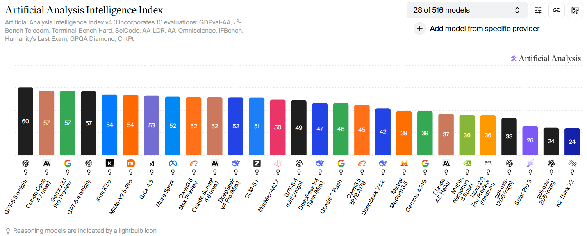

# Generative AI

Pada modul ini, kita beralih dari model yang tugasnya **memprediksi label** ke model yang mampu **menghasilkan konten baru**. Fokus utamanya adalah memahami bagaimana Transformer melahirkan LLM modern, lalu melihat bagaimana ide yang sama berkembang ke reasoning, long context, multimodal, dan RAG. Struktur modul ini sengaja **dibuat lebih ringkas**.

## A Little Brief Description

Secara umum, model AI dapat dibagi menjadi dua cara kerja:

1. **Discriminative model**
   Model belajar memetakan input ke dalam label, misalnya `Gambar -> Manusia` atau `Ulasan -> Positif`.
2. **Generative model**
   Model belajar pola data itu sendiri, lalu menghasilkan output baru yang masih masuk akal, misalnya `prompt -> paragraf`, `prompt -> gambar`, `prompt -> video` atau `pertanyaan + konteks -> jawaban`.

Jika model discriminative mirip seperti dosen yang memeriksa jawaban kemudian memberi nilai, maka model generative lebih mirip dosen yang diminta untuk **menulis contoh jawaban baru** berdasarkan pola yang sudah ia pelajari (*paraphrasing*).

## Module Information

Modul ini dibagi menjadi tiga bagian yakni:

1. **Dasar Transformers dan LLM**
2. **Reasoning dan Long Context**
3. **Multimodal dan RAG**

## Perkembangan LLM Terbaru

Modul ini terakhir di update pada **per 5 April 2026**. Nama model bisa berubah cepat, tetapi tren besarnya relatif stabil.

### 1. LLM bergerak ke arah *agentic workflow*

Model terbaru tidak hanya sekedar berperan sebagai penjawab untuk diberi pertanyaan, tetapi juga mulai memilih *tools* yang tepat untuk menyelesaikan tugas. Contohnya adalah model yang dapat menggabungkan *reasoning*, *browsing*, analisis file, dan *coding* dalam bagian kapabilitasnya.

### 2. Reasoning menjadi fitur utama

Semakin banyak model memiliki mode *thinking* untuk dijadikan jawaban terhadap soal yang lebih kompleks dimana butuh lebih dari sekedar *straight answer* (membutuhkan *step by step*) untuk menjawabnya. Ini menunjukkan bahwa kemajuan LLM tidak lagi hanya datang dari besaran parameter yang digunakan, tetapi juga dari cara model menggunakan waktu berpikir saat proses inferensi.

### 3. Open-weight model makin kompetitif

Jika dulu model *frontier* hampir selalu identik dengan *closed model* yang tidak di-"*opensource*", sekarang model *open-weight* juga bergerak sangat cepat dan cenderung bersifat eksponensial. Perkembangan ini penting utamanya untuk dunia akademik karena lebih realistis untuk digunakan dalam eksperimen, deployment lokal, dan praktikum karena fleksibilitas mekanisme hukumnya.

### 4. Context window membesar, tetapi tidak otomatis lebih paham

Model sekarang dapat membaca konteks yang jauh lebih panjang. Namun, konteks besar tetap memiliki batas dalam pengaplikasiannya dimana biaya komputasi lebih mahal, latensi lebih tinggi, dan performa model cenderung menurun seiring dengan semakin banyaknya konteks.

### 5. Multimodal mulai menjadi baseline

LLM modern tidak lagi hanya berurusan dengan teks. Banyak model terbaru sudah dirancang dan dikembangkan untuk memproses teks, gambar, dan dokumen visual dalam satu model.

### Contoh Model yang Sering Dibahas Saat Ini

- **OpenAI**: GPT-5 series, o series dan gpt-oss
- **Anthropic**: Claude Opus & Sonnet
- **Google**: Gemini & Gemma Family
- **Alibaba / Qwen**: Qwen3.6

---

## Daftar Isi

1. **[01. Dasar Transformers dan LLM](01-dasar-transformers-dan-llm.md)**

2. **[02. Reasoning dan Long Context](02-reasoning-dan-long-context.md)**

3. **[03. Multimodal dan RAG](03-multimodal-dan-rag.md)**

---

**Catatan Penting**

*Pseudocode* ada di [direktori code/](./code).
