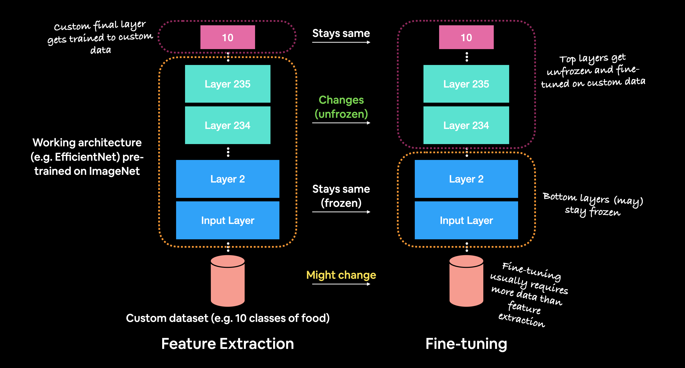

# Pre-trained Model & LLM

## Pre-trained Model

*Pre-trained model,* seperti namanya 
adalah model yang telah dilatih sebelumnya menggunakan kumpulan data yang sangat besar. Model ini sudah memiliki bobot (*weights*) dan bias yang telah disesuaikan untuk menyelesaikan tugas tertentu, sehingga dapat digunakan kembali untuk berbagai keperluan tanpa harus melatih model dari nol.

Dengan memanfaatkan *pre-trained model*, kita dapat:

- Menghemat waktu dan sumber daya komputasi karena tidak perlu melatih model dari awal.
- Mendapatkan performa yang lebih baik dengan bobot yang sudah dioptimalkan dari data dalam skala besar.
- Menerapkan teknik *transfer learning* untuk menyesuaikan model dengan tugas baru menggunakan dataset yang lebih kecil.

Banyak *pre-trained* *model* yang bisa kita gunakan dalam berbagai bidang, seperti teks (NLP) dengan model seperti BERT dan GPT, serta data image (Computer Vision) dengan model seperti ResNet dan VGG.

## Transfer Learning vs Fine Tuning

Fine tuning dan Transfer learning merupakan metode untuk memodifikasi pre-trained model untuk meningkatkan kemampuannya di bidang yang lebih spesifik. Keduanya berfungsi untuk membuat model dengan performa tinggi tanpa melakukan training ulang dari awal yang bisa memakan waktu cukup lama. Fine tuning dan Transfer Learning mungkin terlihat mirip namun terdapat perbedaan diantara keduanya.

### Perbedaan Transfer Learning & Fine Tuning

| | Transfer Learning | Fine Tuning |
|-----|-----|-----|
| Scope | Menggunakan pre-trained model sebagai feature extractor. Layer terakhir dari pre-trained model akan digganti dengan layer baru yang spesifik untuk suatu task. Parameter pre-trained model dibekukan (frozen), dan hanya parameter layer terakhir yang akan dilatih. | Menggunakan pre-trained model sebagai feature extractor. Parameter dari beberapa layer hingga keseluruhan layer dari pre-trained model akan di latih ulang. |
| Data Requirements | Karena hanya melatih ulang layer terakhir, maka akan bekerja dengan baik pada dataset yang berukuran kecil. | Memerlukan dataset yang lebih banyak karena melatih ulang keseluruhan layer. |
| Computational Cost | Komputasi training lebih ringan karena hanya melatih ulang layer terakhir.  | Komputasi training lebih berat karena melatih ulang seluruh layer. |
| Adaptability | Karena hanya mengubah layer terakhir, hanya baik dilakukan untuk memenuhi task spesifik. | Lebih mudah beradaptasi dengan task baru karena dengan dilatihnya keseluruhan layer, ekstraksi fitur menjadi lebih baik. |
| Risk of Overfitting | Risiko overfitting menjadi lebih rendah jika memiliki dataset yang kecil karena hanya melatih layer akhir. | Risiko overfitting menjadilebih tinggi, terutama dengan dataset kecil karena parameter dan layer yang dilatih adalah keseluruhan. |

### Kapan harus memilih Transfer Learning & Fine Tuning?

- Fine Tuning: Jika dataset berukuran besar, daya komputasi yang besar dan model *pre-trained* belum bisa mengekstraksi fitur fitur tertentu dengan baik. Contohnya, *pre-trained* model yang sebelumnya dilatih dengan menggunakan `Dataset Hewan Ternak` akan kesulitan untuk mengekstraksi fitur dalam `Dataset Kanker`.
- Transfer Learning: Jika dataset kecil, komputasi minim, dan *task* yang jelas. Contohnya klasifikasi image pada `Dataset Hewan Ternak`.

## Transformer & Large Language Model

Transformer, arsitektur *Neural Network* yang mengubah NLP hingga bagaimana dunia bekerja dalam 1 dekade terakhir. Arsitektur Transformer pertama kali diperkenalkan oleh Vaswani et al. pada tahun 2017 melalui paper `Attention is All You Need`. Arsitektur ini merupakan dasar dari berbagai Large Language Model seperti BERT, GPT, hingga model model terbaru seperti Deepseek-R1.

### Transformer

Arsitektur Transformer terdiri dari 2 pilar penting yaitu `Encoder` dan `Decoder`. Encoder bertugas untuk membaca dan memproses input dan mengubahnya ke dalam format yang dipahami oleh model. Lebih mudahnya, encoder bertugas untuk merangkum input menjadi inti sari yang lebih mudah diproses oleh model. Sedangkan Decoder bertugas untuk memproses informasi dan menyusun informasi tersebut untuk menjadi output. Dalam arti lain, Decoder bertugas seperti seorang pembicara yang menggunakan pemahaman dari encoder untuk menyusun kembali informasi tersebut menjadi kalimat yang baru. Berikut adalah contoh penggunaan transformer dalam konteks translator bahasa:

> Encoder mendengar sebuah cerita dalam bahasa asing, memahami maknanya tanpa perlu mengingat kata demi kata secara harfiah, lalu decoder menyampaikan kembali cerita tersebut dalam bahasa yang berbeda dengan tetap mempertahankan makna aslinya.

#### Attention Mechanism    

#### Positional Encoding

#### Matrix KQV

#### Encoder & Decoder

### Large Language Model

#### Parameter

#### Token

#### Prompt Engineering

#### Reasoning Model

### Fine Tuning LLM

#### Parameter Efficient Fine Tuning

#### Low Rank Adaptation

#### Quantized-Aware Low Rank Adaptation

### Retrieval Augmented Generation

#### Embedding Model

#### Vector Database

#### Retriever & Generator

### Fine Tuning vs RAG

## Referensi

### Paper

#### Transformer

- https://arxiv.org/abs/1706.03762

### Artikel

#### Pre-trained Model & Fine Tuning

- https://www.geeksforgeeks.org/what-is-the-difference-between-fine-tuning-and-transfer-learning/
- https://dev.to/luxdevhq/understanding-the-differences-fine-tuning-vs-transfer-learning-370
- https://encord.com/glossary/pre-trained-model-definition/#:~:text=A%20pre%2Dtrained%20model%20is,tuned%20for%20a%20specific%20task.

#### Transformers

- https://www.datacamp.com/tutorial/how-transformers-work
- https://huggingface.co/learn/nlp-course/en/chapter1/4
- https://www.truefoundry.com/blog/transformer-architecture

#### Large Language Models

- https://www.nvidia.com/en-us/glossary/large-language-models/

