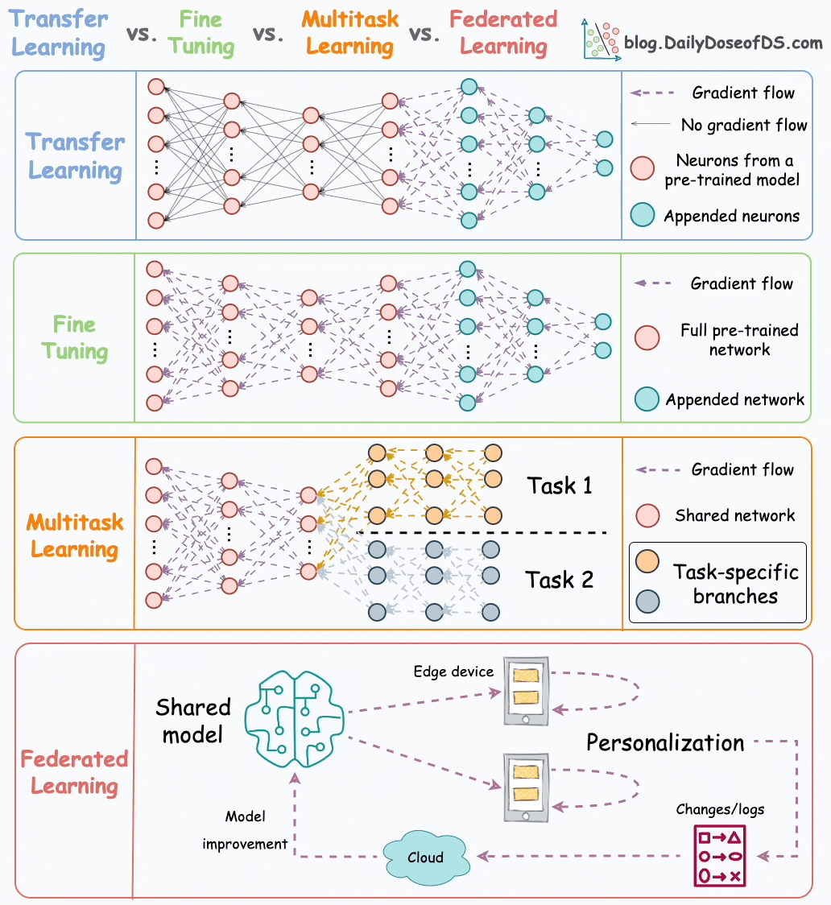
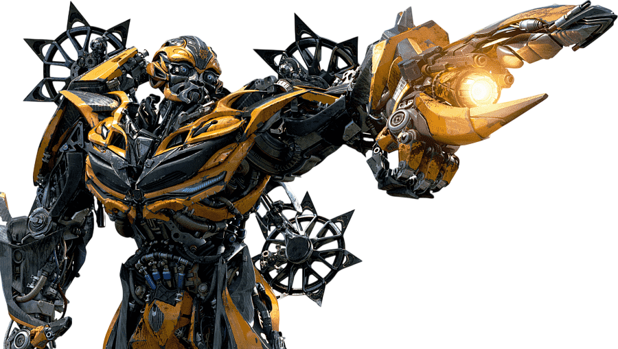
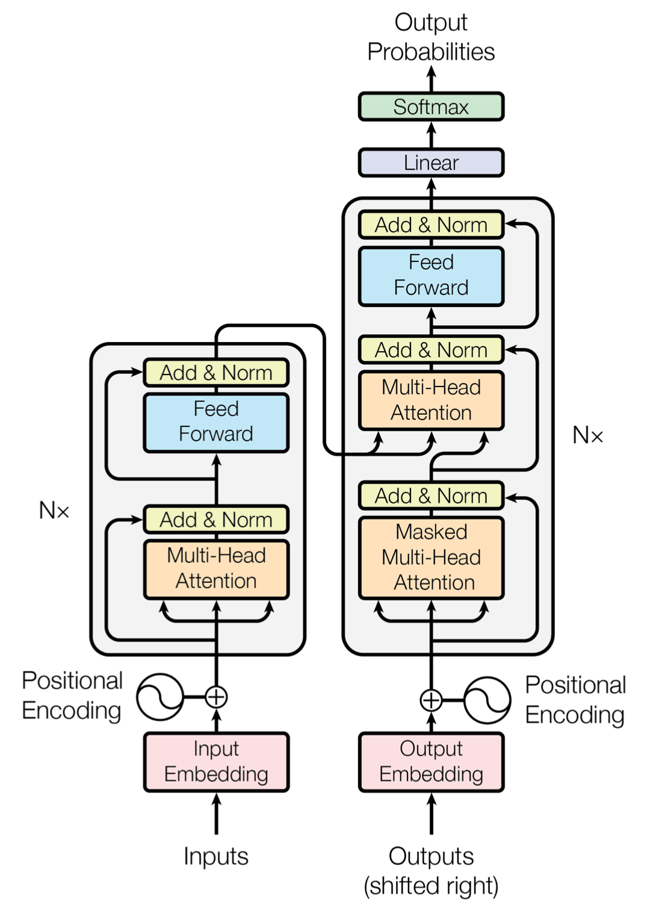
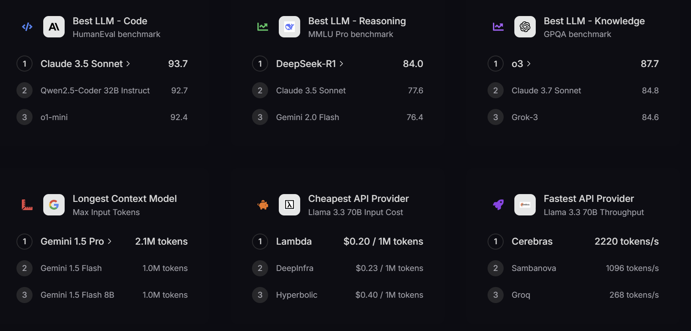
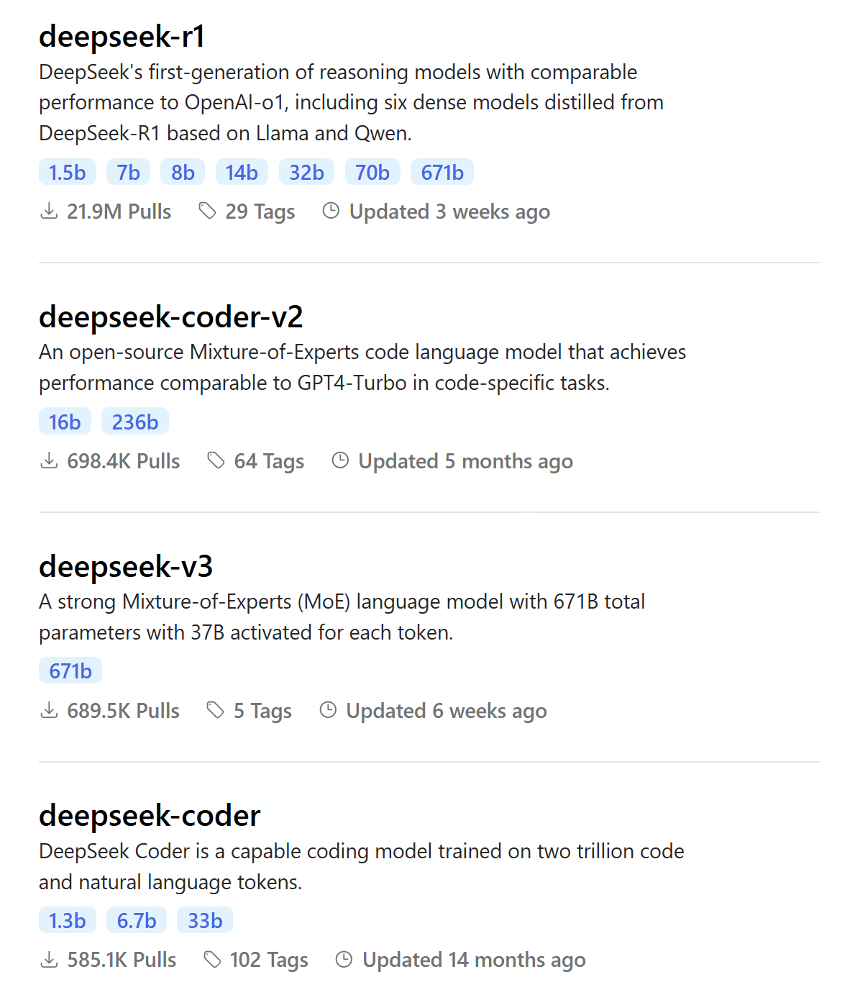
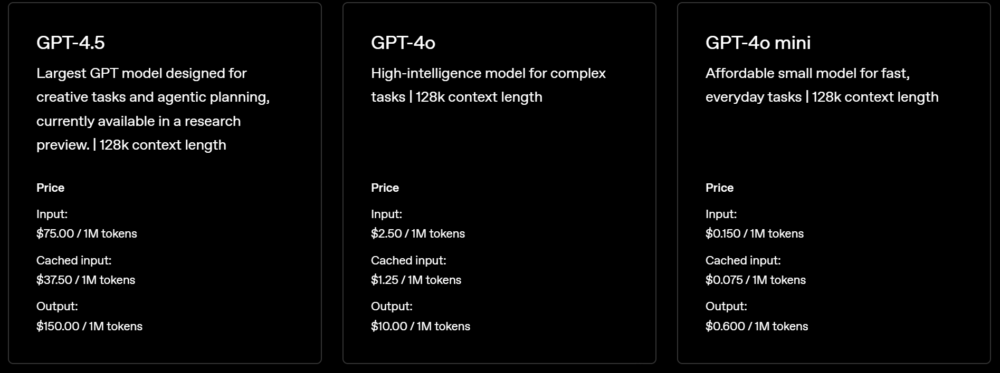
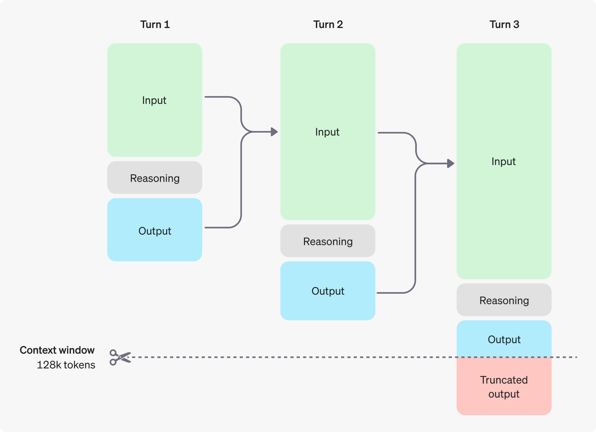

# Pre-trained Model & LLM

## Pre-trained Model

*Pre-trained model,* seperti namanya 
adalah model yang telah dilatih sebelumnya menggunakan kumpulan data yang sangat besar. Model ini sudah memiliki bobot (*weights*) dan bias yang telah disesuaikan untuk menyelesaikan tugas tertentu, sehingga dapat digunakan kembali untuk berbagai keperluan tanpa harus melatih model dari nol.

Dengan memanfaatkan *pre-trained model*, kita dapat:

- Menghemat waktu dan sumber daya komputasi karena tidak perlu melatih model dari awal.
- Mendapatkan performa yang lebih baik dengan bobot yang sudah dioptimalkan dari data dalam skala besar.
- Menerapkan teknik *transfer learning* untuk menyesuaikan model dengan tugas baru menggunakan dataset yang lebih kecil.

Banyak *pre-trained* *model* yang bisa kita gunakan dalam berbagai bidang, seperti teks (NLP) dengan model seperti BERT dan GPT, serta data image (Computer Vision) dengan model seperti ResNet dan VGG.

## Transfer Learning vs Fine Tuning

Fine tuning dan Transfer learning merupakan metode untuk memodifikasi pre-trained model untuk meningkatkan kemampuannya di bidang yang lebih spesifik. Keduanya berfungsi untuk membuat model dengan performa tinggi tanpa melakukan training ulang dari awal yang bisa memakan waktu cukup lama. Fine tuning dan Transfer Learning mungkin terlihat mirip namun terdapat perbedaan diantara keduanya.

### Perbedaan Transfer Learning & Fine Tuning

| | Transfer Learning | Fine Tuning |
|-----|-----|-----|
| Scope | Menggunakan pre-trained model sebagai feature extractor. Layer terakhir dari pre-trained model akan digganti dengan layer baru yang spesifik untuk suatu task. Parameter pre-trained model dibekukan (frozen), dan hanya parameter layer terakhir yang akan dilatih. | Menggunakan pre-trained model sebagai feature extractor. Parameter dari beberapa layer hingga keseluruhan layer dari pre-trained model akan di latih ulang. |
| Data Requirements | Karena hanya melatih ulang layer terakhir, maka akan bekerja dengan baik pada dataset yang berukuran kecil. | Memerlukan dataset yang lebih banyak karena melatih ulang keseluruhan layer. |
| Computational Cost | Komputasi training lebih ringan karena hanya melatih ulang layer terakhir.  | Komputasi training lebih berat karena melatih ulang seluruh layer. |
| Adaptability | Karena hanya mengubah layer terakhir, hanya baik dilakukan untuk memenuhi task spesifik. | Lebih mudah beradaptasi dengan task baru karena dengan dilatihnya keseluruhan layer, ekstraksi fitur menjadi lebih baik. |
| Risk of Overfitting | Risiko overfitting menjadi lebih rendah jika memiliki dataset yang kecil karena hanya melatih layer akhir. | Risiko overfitting menjadilebih tinggi, terutama dengan dataset kecil karena parameter dan layer yang dilatih adalah keseluruhan. |

### Kapan harus memilih Transfer Learning & Fine Tuning?

- Fine Tuning: Jika dataset berukuran besar, daya komputasi yang besar dan model *pre-trained* belum bisa mengekstraksi fitur fitur tertentu dengan baik. Contohnya, *pre-trained* model yang sebelumnya dilatih dengan menggunakan `Dataset Hewan Ternak` akan kesulitan untuk mengekstraksi fitur dalam `Dataset Kanker`.
- Transfer Learning: Jika dataset kecil, komputasi minim, dan *task* yang jelas. Contohnya klasifikasi image pada `Dataset Hewan Ternak`.

## Transformer & Large Language Model

Transformer, arsitektur *Neural Network* yang mengubah NLP hingga bagaimana dunia bekerja dalam 1 dekade terakhir. Arsitektur Transformer pertama kali diperkenalkan oleh Vaswani et al. pada tahun 2017 melalui paper `Attention is All You Need`. Arsitektur ini merupakan dasar dari berbagai Large Language Model seperti BERT, GPT, hingga model model terbaru seperti Deepseek-R1.

### Transformer

Arsitektur Transformer terdiri dari 2 pilar penting yaitu `Encoder` dan `Decoder`. Encoder bertugas untuk membaca dan memproses input dan mengubahnya ke dalam format yang dipahami oleh model. Lebih mudahnya, encoder bertugas untuk merangkum input menjadi inti sari yang lebih mudah diproses oleh model. Sedangkan Decoder bertugas untuk memproses informasi dan menyusun informasi tersebut untuk menjadi output. Dalam arti lain, Decoder bertugas seperti seorang pembicara yang menggunakan pemahaman dari encoder untuk menyusun kembali informasi tersebut menjadi kalimat yang baru. Berikut adalah contoh penggunaan transformer dalam konteks translator bahasa:

> Encoder mendengar sebuah cerita dalam bahasa asing, memahami maknanya tanpa perlu mengingat kata demi kata secara harfiah, lalu decoder menyampaikan kembali cerita tersebut dalam bahasa yang berbeda dengan tetap mempertahankan makna aslinya.

#### Encoder

Encoder dalam Transformer berfungsi untuk mengubah input mentah (misalnya, kalimat yang sudah di-token) menjadi representasi yang lebih mendalam. Setiap encoder layer umumnya terdiri dari dua sub-lapisan utama:

- Multi-Head Attention: Di sini, mekanisme attention dijalankan secara paralel dalam beberapa “kepala” (heads), sehingga model dapat menangkap informasi dari berbagai sub-ruang representasi.
- Feed-Forward Neural Network (FFNN): Setelah proses attention, data dilewatkan ke jaringan saraf feed-forward yang sederhana untuk memproses informasi lebih lanjut.

Setiap sub-lapisan tersebut biasanya disertai dengan mekanisme residual connection dan layer normalization agar proses pelatihan menjadi lebih stabil.

#### Decoder

Decoder menggunakan representasi yang dihasilkan oleh encoder untuk menghasilkan output, misalnya, terjemahan kalimat atau teks yang diprediksi. Setiap decoder layer terdiri dari tiga sub-lapisan:

- Masked Multi-Head Attention: Lapisan ini mirip dengan multi-head attention di encoder, namun dengan masking untuk mencegah informasi “masa depan” bocor selama pelatihan.
- Encoder-Decoder Attention: Lapisan ini melakukan attention antara output decoder dan representasi dari encoder, sehingga model dapat fokus pada bagian input yang relevan saat menghasilkan output.
- Feed-Forward Neural Network: Sama seperti pada encoder, setelah proses attention, data diolah lebih lanjut melalui jaringan feed-forward.

Proses masking pada decoder sangat penting untuk tugas-tugas generatif karena memastikan bahwa prediksi pada posisi tertentu hanya bergantung pada informasi sebelumnya, bukan yang akan datang.

#### Positional Encoding

Karena Transformer tidak mengandalkan urutan alami dari data (seperti urutan waktu pada RNN), informasi posisi token ditambahkan secara eksplisit melalui positional encoding. Vektor ini menggunakan fungsi sinus dan cosinus untuk memberikan “koordinat” yang unik pada tiap token sehingga model dapat memahami urutan kata dalam kalimat. Tanpa Positional Encoding, model tidak akan bisa membedakan kalimat "Sigra makan ayam" dengan "Ayam makan Sigra" atau "Makan ayam Sigra". 

#### Attention Mechanism

Attention Mechanism membantu model untuk memahami konteks dari kalimat. Secara matematis, mekanisme ini menghitung scores antara query (Q) dan key (K) untuk menentukan seberapa besar `attention` yang diberikan ke setiap kata, kemudian mengalikan scores tersebut dengan value (V) untuk menghasilkan representasi baru. Cara kerja Attention Mechanism mirip seperti saat kita membaca sebuah teks dan dengan cepat menangkap kata-kata kunci dalam membantu untuk memahami konteks.

#### Feed Forward Network

Setiap Encoder dan Decoder dalam Transformer memiliki Feed Forward Network (FFN) setelah Attention Mechanism. Meskipun Attention membantu model mengambil informasi dari berbagai kata dalam kalimat, FFN bertugas untuk memproses dan menyempurnakan informasi yang telah dikumpulkan.

FFN bisa dianalogikan seperti seorang koki yang sedang menyempurnakan masakan setelah mengumpulkan bahan-bahan melalui Attention Mechanism. Jika Attention memilih bahan terbaik dari berbagai sumber, maka FFN berperan dalam mengolah bahan tersebut agar lebih lezat dan siap disajikan.

#### Layer Normalization & Residual Connections

Untuk mengatasi `Vanishing Gradient` dan menjaga stabilitas selama training, setiap sub-layer (misalnya, Attention dan Feed Forward Network) disertai dengan residual connection yang kemudian dinormalisasi dengan Normalization Layer. Memastikan bahwa informasi penting tidak hilang seiring bertambahnya layer.

[Klik untuk penjelasan lebih lanjut mengenai Transformer Layer.](code/transformer.ipynb) 

### Large Language Model

Large Language Model atau yang biasa disingkat dengann LLM adalah Aplikasi dari arsitektur Transformer dan dilatih dengan data yang sangat banyak . 

#### Parameter

Parameter adalah komponen utama dalam sebuah Large Language Model. Secara sederhana, parameter merupakan bobot (weights) dan bias yang dipelajari selama proses pelatihan. Mereka adalah nilai-nilai numerik yang mengatur cara model memproses dan menginterpretasi data. Semakin banyak parameter yang dimiliki model, semakin besar kapasitasnya untuk menangkap pola dan kompleksitas bahasa. Misalnya, model Deepseek-R1 memiliki sekitar 671 miliar parameter, sehingga mampu memahami dan menghasilkan teks dengan tingkat kompleksitas tinggi.

#### Token

Token adalah unit dasar teks yang digunakan oleh model untuk memproses bahasa. Tokenisasi merupakan proses pemecahan teks menjadi potongan-potongan yang lebih kecil, yang bisa berupa kata, sub-kata, atau bahkan karakter, tergantung pada pendekatan yang digunakan. Dengan mengubah teks menjadi token, model dapat mengelola input secara efisien dan mengenali pola dalam urutan token tersebut. Kalimat "Saya makan nasi" dapat dipecah menjadi token seperti ["Saya", "makan", "nasi"] atau dalam bentuk sub-word seperti ["Sa", "ya", "ma", "kan", "na", "si"].

Token juga menjadi acuan dalam menentukan batas maksimal input yang dapat diproses oleh model, karena setiap model memiliki limitasi jumlah token per input. Selain itu, token juga menjadi salah satu pengukuran bagaimana provider LLM menentukan harga model mereka.

#### Context Window

Context Window adalah rentang atau jumlah token yang dapat “dilihat” atau diingat oleh model dalam 1 kali inferensi. Jika sebuah LLM memiliki context window sebesar 2048 token, itu berarti model dapat mempertimbangkan hingga 2048 token teks sebelumnya. Context window yang lebih panjang membantu model memahami dokumen yang lebih panjang dan mempertahankan koherensi pada percakapan yang lebih panjang.

#### Prompt Engineering

Prompt Engineering adalah teknik pengoptimalan input (“prompt”) yang diberikan kepada LLM untuk mendapatkan respons terbaik. Perubahan kecil pada prompt dapat menyebabkan perbedaan yang signifikan pada respons dari LLM. Teknik dasar dari Prompt Engineering adalah sebagai berikut:

- Konteks yang Jelas: Menyediakan latar belakang atau informasi pendukung yang cukup.
- Instruksi Spesifik: Menggunakan perintah yang eksplisit sehingga model tahu apa yang harus dilakukan.
- Contoh Prompt: Kadang memberikan contoh atau format jawaban yang diharapkan dapat membantu model menghasilkan respons yang lebih baik.

#### Reasoning Model

Reasoning Model merujuk pada mekanisme di dalam Large Language Model yang memungkinkan model untuk melakukan penalaran atau reasoning. Dengan kemampuan ini, model tidak hanya mengeluarkan jawaban berdasarkan kecocokan pola, tetapi juga dapat menyusun logika dan alur pemikiran yang mendalam untuk menyelesaikan suatu permasalahan.

- Fungsi Reasoning: Model menggunakan proses reasoning untuk mengaitkan berbagai informasi dan menghasilkan jawaban yang koheren, terutama untuk tugas-tugas yang memerlukan penalaran lebih.
- Chain-of-Thought: Teknik seperti chain-of-thought prompting mendorong model untuk menjelaskan langkah-langkah atau proses berpikirnya sebelum memberikan jawaban akhir. Hal ini membantu meningkatkan transparansi dan akurasi hasil yang dihasilkan.

### Fine Tuning LLM

#### Parameter Efficient Fine Tuning

#### Low Rank Adaptation

#### Quantized-Aware Low Rank Adaptation

### Retrieval Augmented Generation

#### Embedding Model

#### Vector Database

#### Retriever & Generator

### Fine Tuning vs RAG

## Referensi

### Paper

#### Transformer

- https://arxiv.org/abs/1706.03762

### Artikel

#### Pre-trained Model & Fine Tuning

- https://www.geeksforgeeks.org/what-is-the-difference-between-fine-tuning-and-transfer-learning/
- https://dev.to/luxdevhq/understanding-the-differences-fine-tuning-vs-transfer-learning-370
- https://encord.com/glossary/pre-trained-model-definition/#:~:text=A%20pre%2Dtrained%20model%20is,tuned%20for%20a%20specific%20task.

#### Transformers

- https://www.datacamp.com/tutorial/how-transformers-work
- https://huggingface.co/learn/nlp-course/en/chapter1/4
- https://www.truefoundry.com/blog/transformer-architecture

#### Large Language Models

- https://www.nvidia.com/en-us/glossary/large-language-models/

