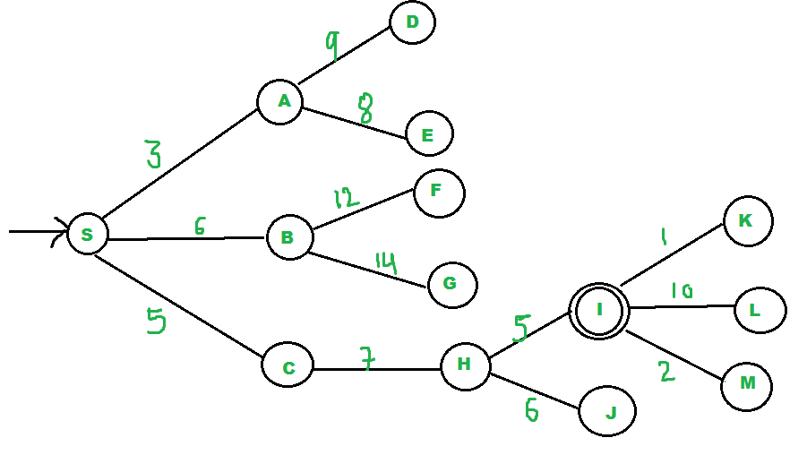

# Algoritma Searching

## Algoritma Searching

Algoritma pencarian, dalam konteks komputasi dan ilmu komputer, adalah serangkaian instruksi atau prosedur yang dirancang untuk menemukan elemen atau informasi tertentu dalam suatu set data. Algoritma pencarian digunakan untuk mencari data yang sesuai dengan kriteria atau nilai yang diinginkan dalam struktur data seperti array, daftar, graf, pohon, atau database.

## Pengertian Uniformed Search

Uniformed Search atau yang sering disebut blind search, merupakan metode pencarian yang tidak terdapat informasi tambahan mengenai kondisi di luar dari yang disediakan oleh masalah yang diberikan untuk membantu memecahkan permasalahan yang ada. Algoritma pencarian buta ini tidak memiliki heuristik khusus dalam domain atau pengetahuan sebelumnya tentang masalah tersebut.

Contoh studi kasus penerapan uninformed search (pencarian tanpa informasi) dapat memberikan gambaran tentang bagaimana algoritma pencarian tanpa heuristik digunakan dalam situasi dunia nyata. Berikut adalah contoh kasus studi penerapan uninformed search:

**Studi Kasus: Pencarian Jalan Terpendek dalam Peta Kota**

**Deskripsi**: Misalkan Anda bekerja di departemen transportasi kota dan Anda bertanggung jawab untuk mengembangkan sistem navigasi untuk membantu pengguna menemukan jalur terpendek antara dua titik di kota Anda. Anda memiliki data berupa peta kota yang berisi jalan-jalan dan simpul-simpul yang mewakili persimpangan atau titik penting di kota Anda.

## Breadth First Search

### Pengertian

Algoritma pencarian graf lain dalam kecerdasan buatan yang menjelajahi ruang pencarian secara lebar untuk mencari tujuan dalam sebuah graph. Algoritma ini memulai pencarian dari simpul akar (root node) dan mengembangkan simpul penerus sebelum terus menjelajahi lebih jauh secara lebar dan menelusuri simpul-simpul tersebut daripada mencari secara mendalam.

### Prinsip Kerja

1. Menginisiasi array visited dan queue dalam keadaan kosong 


2. Push node 0 ke dalam queue dan tandai sebagai node yang telah dikunjungi


3. Hapus node 0 dari bagian depan queue dan kunjungi tetangga yang belum dikunjungi, kemudian masukkan mereka ke dalam queue


4. Hapus node 1 dari bagian depan queue dan kunjungi tetangga yang belum dikunjungi, kemudian masukkan mereka ke dalam queue.


5. Hapus node 2 dari bagian depan queue dan kunjungi tetangga yang belum dikunjungi, kemudian masukkan mereka ke dalam queue.


6. Hapus node 3 dari bagian depan queue dan kunjungi tetangga yang belum dikunjungi, kemudian masukkan mereka ke dalam queue. Namun, karena semua tetangga dari node 3 sudah dikunjungi, maka lanjutkan ke node berikutnya yang ada di depan queue.


7. Hapus node 4 dari bagian depan queue dan kunjungi tetangga yang belum dikunjungi, kemudian masukkan mereka ke dalam queue. Namun, karena semua tetangga dari node 4 sudah dikunjungi, maka lanjutkan ke simpul berikutnya yang ada di depan queue.


### Kelebihan dan Kekurangan

******************Kelebihan******************

- Tidak akan menemui jalan buntu
- Akan menemukan solusi yang minimum apabila terdapat lebih dari satu solusi

********************Kekurangan********************

- Membutuhkan memori yang lebih banyak karena menyimpan semua node dalam satu pohon
- Membutuhkan waktu yang cukup lama karena menguji n level sebelum menemukan solusi di level ke-n+1

### Penerapan dalam code

```python
from collections import deque

# Membuat kelas untuk merepresentasikan graf
class Graph:
    def __init__(self):
        self.graph = {}

    # Menambahkan edge ke graf
    def add_edge(self, node, neighbor):
        if node in self.graph:
            self.graph[node].append(neighbor)
        else:
            self.graph[node] = [neighbor]

    # Melakukan BFS pada graf
    def bfs(self, start_node):
        visited = set()
        queue = deque()

        # Menambahkan node awal ke antrian dan tanda sebagai sudah dikunjungi
        queue.append(start_node)
        visited.add(start_node)

        while queue:
            # Mengambil node dari antrian
            current_node = queue.popleft()
            print(current_node, end=' ')

            # Menelusuri tetangga-tetangga yang belum dikunjungi
            if current_node in self.graph:
                for neighbor in self.graph[current_node]:
                    if neighbor not in visited:
                        queue.append(neighbor)
                        visited.add(neighbor)

# Membuat objek graf
g = Graph()

# Menambahkan edge-edge ke graf
g.add_edge(1, 2)
g.add_edge(1, 3)
g.add_edge(2, 4)
g.add_edge(2, 5)
g.add_edge(3, 6)
g.add_edge(3, 7)

# Memulai BFS dari node 1
print("Hasil BFS:")
g.bfs(1)
```

## Depth First Search

### Pengertian

Depth-First Search (DFS) adalah algoritma pencarian yang bertujuan untuk mengeksplorasi semua node dalam sebuah struktur data graf atau pohon secara vertikal (kedalaman) sebelum menjelajahi cabang-cabang yang lain. Ini seperti mengikuti satu cabang dari pohon, mencapai ujungnya, lalu kembali untuk menjelajahi cabang lain jika masih ada yang belum dijelajahi.

### Prinsip Kerja

1. Menginisialisasi array untuk visited dan stack dalam keadaan kosong


2. Kunjungi node 0 dan masukkan node-node yang bersebelahan dengan node 0 yang belum dikunjungi ke dalam stack


3. Sekarang, node 1 berada di bagian atas tumpukan (stack), jadi kunjungi node 1, keluarkan node tersebut dari stack, dan masukkan semua node yang bersebelahan dengan node 1 yang belum dikunjungi ke dalam stack


4. Sekarang, node 2 berada di bagian atas tumpukan (stack), jadi kunjungi node 2, keluarkan node tersebut dari stack, dan masukkan semua node yang bersebelahan dengan node 2 yang belum dikunjungi ke dalam stack (yaitu, node 3 dan 4)


5. Sekarang, node 4 berada di bagian atas tumpukan (stack), jadi kunjungi node 4, keluarkan node tersebut dari tumpukan, dan masukkan semua node yang bersebelahan dengan node 4 yang belum dikunjungi ke dalam stack


6. Sekarang, node 3 berada di bagian atas tumpukan (stack), jadi kunjungi node 3, keluarkan simpul tersebut dari stack, dan masukkan semua node yang bersebelahan dengan node 3 yang belum dikunjungi ke dalam stack.


### Kelebihan dan Kekurangan

******************Kelebihan******************

- Meminimalkan penggunaan memori dibandingkan dengan algoritma BFS.
- Dapat diimplementasikan baik secara rekursif maupun dengan menggunakan tumpukan (stack)

********************Kekurangan********************

- Tidak selalu menemukan jalur terpendek dalam graf berbobot
- Bisa mengalami masalah stack overflow jika graf sangat dalam (bercabang dalam)

### Penerapan dalam code

```python
class Graph:
    def __init__(self):
        self.graph = {}

    def add_edge(self, node, neighbor):
        if node in self.graph:
            self.graph[node].append(neighbor)
        else:
            self.graph[node] = [neighbor]

    def dfs(self, start_node):
        visited = set()

        def dfs_recursive(node):
            if node not in visited:
                visited.add(node)
                print(node, end=' ')

                if node in self.graph:
                    for neighbor in self.graph[node]:
                        dfs_recursive(neighbor)

        dfs_recursive(start_node)

# Membuat objek graf
g = Graph()

# Menambahkan edge-edge ke graf
g.add_edge(1, 2)
g.add_edge(1, 3)
g.add_edge(2, 4)
g.add_edge(2, 5)
g.add_edge(3, 6)
g.add_edge(3, 7)

# Memulai DFS dari node 1
print("Hasil DFS:")
g.dfs(1)
```

## Depth Limited Search

### Pengertian

Depth Limited Search (DLS) adalah variasi dari algoritma Depth-First Search (DFS) yang memiliki batasan kedalaman atau "kedalaman terbatas". DLS digunakan untuk menjelajahi atau mencari informasi dalam sebuah graf atau pohon dengan membatasi kedalaman maksimum yang akan dijelajahi dari node awal.

### Prinsip Kerja

1. Mulai dari node awal (biasanya disebut sebagai node sumber).
2. Jika node saat ini belum dikunjungi dan kedalaman belum mencapai batasan yang ditentukan, tandai sebagai sudah dikunjungi.
3. Jelajahi semua tetangga yang belum dikunjungi dari node saat ini dengan kedalaman yang lebih dalam (kedalaman saat ini + 1).
4. Ulangi langkah 2 dan 3 untuk setiap tetangga.
5. Jika tidak ada lagi tetangga yang belum dikunjungi atau kedalaman mencapai batasan, mundur ke node sebelumnya.

### Kelebihan dan Kekurangan

******************Kelebihan******************

- DLS memungkinkan Anda untuk mengendalikan kedalaman pencarian, yang bermanfaat jika Anda hanya tertarik pada solusi dalam radius tertentu dari node awal.
- DLS lebih efisien dalam penggunaan memori dibandingkan dengan BFS karena hanya memerlukan penyimpanan untuk jalur yang sedang dijelajahi.
- Implementasi DLS cukup sederhana dan mirip dengan DFS.

******Kekurangan******

- Jika kedalaman yang ditentukan terlalu kecil, DLS mungkin tidak menemukan solusi bahkan jika solusi ada dalam graf.
- Seperti DFS, DLS juga tidak menjamin menemukan jalur terpendek ke solusi jika graf memiliki bobot pada edge.

### Penerapan dalam code

```python
class Graph:
    def __init__(self):
        self.graph = {}

    def add_edge(self, node, neighbor):
        if node in self.graph:
            self.graph[node].append(neighbor)
        else:
            self.graph[node] = [neighbor]

    def dls(self, start_node, goal, max_depth):
        visited = set()

        def dls_recursive(node, depth):
            if depth > max_depth:
                return False

            if node == goal:
                return True

            if node not in visited:
                visited.add(node)
                print(node, end=' ')

                if node in self.graph:
                    for neighbor in self.graph[node]:
                        if dls_recursive(neighbor, depth + 1):
                            return True

            return False

        if dls_recursive(start_node, 0):
            print("\nSolusi ditemukan!")
        else:
            print("\nSolusi tidak ditemukan.")

# Membuat objek graf
g = Graph()

# Menambahkan edge-edge ke graf
g.add_edge(1, 2)
g.add_edge(1, 3)
g.add_edge(2, 4)
g.add_edge(2, 5)
g.add_edge(3, 6)
g.add_edge(3, 7)

# Memulai DLS dari node 1 dengan batasan kedalaman 2
print("Hasil DLS:")
g.dls(1, 6, 2)
```

# Iterative Deepening Search

### Pengertian

Iterative Deepening Search (IDS) adalah algoritma pencarian yang menggabungkan ide dari Breadth-First Search (BFS) dan Depth-First Search (DFS) dengan mengulangi pencarian dalam kedalaman terbatas secara bertahap. IDS dimulai dengan batasan kedalaman 1, kemudian meningkatkan batasan kedalaman secara iteratif hingga mencapai solusi atau melampaui kedalaman maksimum yang ditentukan.

IDS berusaha mencari solusi dengan batasan kedalaman yang meningkat secara bertahap, sehingga menggabungkan keuntungan dari BFS (menemukan solusi dengan kedalaman minimum) dan DFS (penggunaan memori yang lebih efisien).

### Prinsip Kerja

1. Mulai dengan batasan kedalaman 1.
2. Jalankan Depth-First Search (DFS) dengan batasan kedalaman yang ditentukan.
3. Jika solusi ditemukan, selesaikan pencarian dan kembalikan solusi.
4. Jika solusi tidak ditemukan, tingkatkan batasan kedalaman dan ulangi langkah 2 dan 3.
5. Ulangi langkah 4 hingga batasan kedalaman mencapai nilai maksimum.

### Kelebihan dan kekurangan

******************Kelebihan******************

- IDS menggunakan memori dengan baik karena hanya menyimpan node yang terkait dengan kedalaman tertentu pada satu waktu.
- Implementasi IDS relatif sederhana dan mirip dengan Depth-First Search (DFS).

********************Kekurangan********************

- IDS bisa memakan waktu eksekusi yang lebih lama dibandingkan dengan algoritma lain jika batasan kedalaman maksimum yang dibutuhkan tinggi.

### Penerapan dalam code

```python
class Graph:
    def __init__(self):
        self.graph = {}

    def add_edge(self, node, neighbor):
        if node in self.graph:
            self.graph[node].append(neighbor)
        else:
            self.graph[node] = [neighbor]

    def dls(self, start_node, goal, max_depth):
        visited = set()

        def dls_recursive(node, depth):
            if depth > max_depth:
                return False

            if node == goal:
                return True

            if node not in visited:
                visited.add(node)
                print(node, end=' ')

                if node in self.graph:
                    for neighbor in self.graph[node]:
                        if dls_recursive(neighbor, depth + 1):
                            return True

            return False

        if dls_recursive(start_node, 0):
            print("\nSolusi ditemukan pada kedalaman", max_depth)
            return True
        else:
            return False

    def ids(self, start_node, goal, max_depth):
        for depth in range(max_depth + 1):
            print("Kedalaman pencarian:", depth)
            if self.dls(start_node, goal, depth):
                return True
        return False

# Membuat objek graf
g = Graph()

# Menambahkan edge-edge ke graf
g.add_edge(1, 2)
g.add_edge(1, 3)
g.add_edge(2, 4)
g.add_edge(2, 5)
g.add_edge(3, 6)
g.add_edge(3, 7)

# Memulai IDS dari node 1 dengan batasan kedalaman maksimum 3
print("Hasil IDS:")
if not g.ids(1, 6, 3):
    print("Solusi tidak ditemukan.")
```

## Pengertian Informed Search

Informed search atau pencarian berinformasi adalah jenis algoritma pencarian yang menggunakan pengetahuan tambahan atau heuristik untuk mengarahkan pencarian menuju solusi yang mungkin lebih efisien. Dalam informed search, algoritma memiliki pemahaman tentang situasi saat ini dan mencoba untuk membuat keputusan yang lebih cerdas berdasarkan informasi tersebut. Ini berbeda dengan uninformed search (pencarian tanpa informasi) yang hanya menjelajahi ruang pencarian tanpa mempertimbangkan informasi tambahan.

**Studi Kasus: Pencarian Jalur Terpendek dalam Aplikasi Navigasi**

**Deskripsi**: Anda adalah seorang pengembang di perusahaan aplikasi navigasi yang ingin mengembangkan sistem navigasi untuk membantu pengguna menemukan jalur terpendek antara dua lokasi di dalam kota. Aplikasi Anda memiliki peta jalan kota yang mencakup rute-rute dan informasi lalu lintas aktual.

## Pengertian Heuristik

Heuristik adalah sebuah fungsi atau aturan yang digunakan untuk memberikan perkiraan seberapa baik atau seberapa dekatnya suatu tindakan atau keadaan dalam pencarian menuju solusi yang diharapkan. Heuristik digunakan untuk memberikan panduan atau perkiraan tentang tindakan apa yang mungkin lebih baik atau lebih mungkin mengarah ke solusi. Namun, perlu dicatat bahwa dalam algoritma pencarian, heuristik sering kali lebih terkait dengan informed search daripada sorting (pengurutan) karena sorting lebih berkaitan dengan pengurutan elemen daripada pencarian elemen dalam sebuah set data. 

Bagaimana heuristik bisa diterapkan dalam algoritma pencarian:

- ****************************************Pengetahuan Domain:**************************************** Heuristik dalam algoritma pencarian sering kali didasarkan pada pengetahuan yang dimiliki tentang domain masalah. Misalnya, jika Anda mencari jalur terpendek dalam peta kota, pengetahuan tentang jarak antara lokasi-lokasi dan lalu lintas aktual dapat menjadi bagian dari heuristik.
- ************************Perkiraan Biaya:************************ Heuristik sering digunakan untuk menghitung perkiraan biaya atau jarak yang tersisa menuju solusi. Misalnya, dalam algoritma A* Search, sebuah heuristik digunakan untuk menghitung perkiraan biaya terpendek yang tersisa dari simpul saat ini ke tujuan.
- ******************************************Penilaian Prioritas:****************************************** Heuristik membantu algoritma memprioritaskan tindakan atau keadaan dalam pencarian. Tindakan atau keadaan yang memiliki perkiraan biaya atau nilai heuristik yang lebih rendah sering kali dieksplorasi lebih awal.
- **********************Solusi Suboptimal:********************** Heuristik bisa menghasilkan solusi yang suboptimal. Ini artinya, heuristik mungkin tidak memberikan solusi yang optimal, tetapi akan memberikan solusi yang cukup baik dan lebih cepat ditemukan daripada mencari semua kemungkinan tindakan.

## A*

### Pengertian

A* (A-star) adalah algoritma pencarian berinformasi yang digunakan untuk menemukan jalur terpendek dari satu titik ke titik lain dalam graf berbobot, seperti peta jalan. Algoritma ini memadukan pencarian dengan menggunakan biaya sejauh ini (cost-so-far) dan estimasi biaya tersisa (heuristik) untuk mengambil keputusan yang cerdas dalam pemilihan simpul berikutnya untuk dieksplorasi.

### Prinsip Kerja

1. Setiap simpul dalam graf memiliki dua biaya yang relevan:
    - **g(n)**: Biaya sejauh ini untuk mencapai simpul tersebut dari titik awal.
    - **h(n)**: Estimasi biaya tersisa (heuristik) dari simpul tersebut ke titik tujuan.
2. A* menghitung nilai fungsi evaluasi **f(n) = g(n) + h(n)** untuk setiap simpul yang sedang dipertimbangkan.
3. Algoritma A* memprioritaskan simpul dengan nilai **f(n)** yang lebih rendah. Ini berarti simpul dengan perkiraan biaya total yang lebih rendah akan dieksplorasi lebih awal.
4. A* secara iteratif memilih simpul dengan **f(n)** terendah untuk dieksplorasi. Jika simpul tersebut adalah solusi, pencarian selesai. Jika tidak, algoritma melanjutkan dengan mengeksplorasi simpul-simpul lain.
5. Pencarian dilanjutkan hingga solusi ditemukan atau tidak ada simpul yang tersisa untuk dieksplorasi.


### Kelebihan dan Kelemahan

******************Kelebihan******************

- A* dapat bekerja efisien dalam banyak kasus dengan menghindari eksplorasi simpul yang tidak relevan.
- A* dapat digunakan dalam berbagai aplikasi, termasuk pencarian jalur, permainan, dan perencanaan.

******************Kelemahan******************

- Kinerja A* sangat bergantung pada kualitas heuristik yang digunakan. Heuristik yang buruk dapat menghasilkan pencarian yang lambat atau tidak optimal
- Algoritma ini memerlukan penyimpanan informasi tentang simpul-simpul yang belum selesai dieksplorasi, yang dapat memakan banyak memori dalam pencarian yang panjang atau dalam graf besar

****************************************Penerapan dalam code****************************************

```python
import heapq

def astar(graph, start, goal):
    open_list = []
    heapq.heappush(open_list, (0, start))
    came_from = {}
    g_score = {node: float('inf') for node in graph}
    g_score[start] = 0
    f_score = {node: float('inf') for node in graph}
    f_score[start] = heuristic(start, goal)

    while open_list:
        _, current = heapq.heappop(open_list)

        if current == goal:
            return reconstruct_path(came_from, current)

        for neighbor in graph[current]:
            tentative_g_score = g_score[current] + graph[current][neighbor]
            if tentative_g_score < g_score[neighbor]:
                came_from[neighbor] = current
                g_score[neighbor] = tentative_g_score
                f_score[neighbor] = g_score[neighbor] + heuristic(neighbor, goal)
                heapq.heappush(open_list, (f_score[neighbor], neighbor))

    return None

def heuristic(node, goal):
    # Implement your heuristic function here
    pass

def reconstruct_path(came_from, current):
    path = [current]
    while current in came_from:
        current = came_from[current]
        path.append(current)
    path.reverse()
    return path

# Contoh penggunaan
graph = {
    'A': {'B': 1, 'C': 4},
    'B': {'A': 1, 'D': 3, 'E': 2},
    'C': {'A': 4, 'F': 5},
    'D': {'B': 3, 'G': 7},
    'E': {'B': 2, 'H': 6},
    'F': {'C': 5, 'I': 8},
    'G': {'D': 7},
    'H': {'E': 6, 'I': 9},
    'I': {'F': 8, 'H': 9}
}

start_node = 'A'
goal_node = 'I'

path = astar(graph, start_node, goal_node)
if path:
    print("Jalur terpendek:", path)
else:
    print("Tidak ada jalur yang ditemukan.")
```

## Best First Search

### Pengertian

Best-First Search (BFS) adalah algoritma pencarian yang mengambil pendekatan heuristik untuk menentukan jalur terbaik dalam ruang pencarian. Algoritma ini memprioritaskan simpul yang menurut heuristik dianggap "paling baik" atau "paling berpotensi" untuk mencapai tujuan, tanpa mempertimbangkan biaya sejauh ini atau biaya akumulatif yang sebenarnya. Ini membuat BFS sangat efisien dalam menemukan jalur yang mungkin baik dalam masalah pencarian yang besar atau kompleks.

### Prinsip Kerja

1. Setiap simpul dalam graf memiliki nilai heuristik yang menggambarkan seberapa baik simpul tersebut sebagai kandidat untuk mencapai tujuan. Semakin kecil nilai heuristik, semakin baik simpul tersebut dianggap.
2. BFS memulai pencarian dari simpul awal dan memilih simpul dengan nilai heuristik terendah sebagai simpul berikutnya yang akan dieksplorasi.
3. Pencarian dilanjutkan dari simpul yang terpilih ke simpul-simpul tetangga dengan memprioritaskan yang memiliki nilai heuristik terendah.
4. Proses ini terus berlanjut hingga pencarian mencapai simpul tujuan atau tidak ada simpul yang tersisa untuk dieksplorasi.
5. BFS dapat berhenti ketika simpul tujuan pertama kali ditemukan, tetapi ini mungkin bukan solusi optimal.



**Contoh Study Case**

Kami memulai dari sumber "S" dan mencari tujuan "I" menggunakan biaya yang diberikan dan algoritma Best First Search.

Awalnya, antrian prioritas (pq) berisi "S".

Kami menghapus "S" dari pq dan memproses tetangga-tetangga yang belum dikunjungi dari "S" untuk dimasukkan ke dalam pq.

pq sekarang berisi {A, C, B} (C ditempatkan sebelum B karena C memiliki biaya yang lebih rendah).

Kami menghapus "A" dari pq dan memproses tetangga-tetangga yang belum dikunjungi dari "A" untuk dimasukkan ke dalam pq.

pq sekarang berisi {C, B, E, D}

Kami menghapus "C" dari pq dan memproses tetangga-tetangga yang belum dikunjungi dari "C" untuk dimasukkan ke dalam pq.

pq sekarang berisi {B, H, E, D}

Kami menghapus "B" dari pq dan memproses tetangga-tetangga yang belum dikunjungi dari "B" untuk dimasukkan ke dalam pq.

pq sekarang berisi {H, E, D, F, G}

Kami menghapus "H" dari pq. Karena tujuan kami "I" adalah tetangga dari "H", kami kembali dan telah menemukan solusi.

### Kelebihan dan Kekurangan

******************Kelebihan******************

- BFS dapat menemukan solusi dengan cepat karena selalu memprioritaskan simpul yang memiliki nilai heuristik terendah.
- Algoritma ini efisien dalam mengeksplorasi ruang pencarian besar karena hanya fokus pada simpul yang memiliki nilai heuristik yang lebih rendah.

******************Kelemahan******************

- Karena hanya mempertimbangkan heuristik, BFS mungkin tidak menemukan solusi optimal jika heuristiknya tidak akurat atau jika simpul dengan nilai heuristik rendah tidak mengarah ke solusi terbaik.
- Kinerja BFS sangat bergantung pada kualitas heuristik yang digunakan. Heuristik yang buruk atau tidak sesuai dengan masalah dapat menghasilkan solusi yang suboptimal atau bahkan menjebak algoritma dalam pencarian yang tidak berujung.

### Penerapan dalam code

```python
import heapq

def best_first_search(graph, start, goal, heuristic):
    open_list = [(0, start)]
    came_from = {}
    
    while open_list:
        _, current = heapq.heappop(open_list)
        
        if current == goal:
            return reconstruct_path(came_from, current)
        
        for neighbor in graph[current]:
            if neighbor not in came_from:
                came_from[neighbor] = current
                priority = heuristic(neighbor, goal)
                heapq.heappush(open_list, (priority, neighbor))
    
    return None

def reconstruct_path(came_from, current):
    path = [current]
    while current in came_from:
        current = came_from[current]
        path.append(current)
    path.reverse()
    return path

# Contoh penggunaan
graph = {
    'A': ['B', 'C'],
    'B': ['D', 'E'],
    'C': ['F'],
    'D': [],
    'E': ['H'],
    'F': ['I'],
    'H': ['I'],
    'I': []
}

start_node = 'A'
goal_node = 'I'

# Heuristik: Jumlah simpul yang tersisa menuju goal
def heuristic(node, goal):
    return len(graph) - ord(node) + len(graph) - ord(goal)

path = best_first_search(graph, start_node, goal_node, heuristic)
if path:
    print("Jalur terbaik:", path)
else:
    print("Tidak ada jalur yang ditemukan.")
```

## Greedy Search

### Pengertian

Greedy Search adalah jenis algoritma pencarian yang memilih simpul berikutnya berdasarkan kriteria yang tampaknya paling menguntungkan pada saat itu. Algoritma ini tidak mempertimbangkan solusi akhir atau jarak total yang sebenarnya, tetapi hanya memaksimalkan keuntungan segera di setiap langkah. Oleh karena itu, Greedy Search sering digunakan dalam masalah optimisasi yang memerlukan pengambilan keputusan segera.

### Prinsip Kerja

1. Algoritma dimulai dari simpul awal dan memilih simpul tetangga yang memiliki nilai heuristik atau skor paling tinggi. Skor ini mewakili seberapa baik simpul tersebut dalam mencapai tujuan.
2. Pencarian dilanjutkan dari simpul yang terpilih ke simpul tetangga dengan skor tertinggi, tanpa memperhatikan solusi akhir atau jarak total yang sebenarnya.
3. Proses ini berulang sampai pencarian mencapai simpul tujuan atau tidak ada simpul tetangga yang lebih menguntungkan yang tersisa untuk dieksplorasi.
4. Greedy Search berfokus pada memaksimalkan kriteria lokal tanpa mempertimbangkan konsekuensi jangka panjang atau solusi global.

**********************Contoh Case**********************

Temukan jalur dari S ke G menggunakan pencarian Greedy (Greedy Search). Nilai heuristik h dari setiap simpul ada di bawah nama simpul tersebut.


**Solusi**

1. Dimulai dari S, kita dapat melanjutkan ke A (h = 9) atau D (h = 5). Kita memilih D, karena memiliki biaya heuristik yang lebih rendah. 
2. Sekarang, dari D, kita dapat beralih ke B (h = 4) atau E (h = 3). Kita memilih E dengan biaya heuristik yang lebih rendah.
3. Akhirnya, dari E, kita pergi ke G (h = 0). Seluruh perjalanan ini ditampilkan dalam pohon pencarian di bawah ini, dalam warna biru.

### Kelebihan dan Kekurangan

******************Kelebihan******************

- Algoritma yang sangat cepat, sehingga cocok untuk aplikasi di mana kecepatan sangat penting.
- Memerlukan hanya sedikit memori, sehingga cocok untuk aplikasi yang memiliki keterbatasan memori.
- Dapat disesuaikan dengan berbagai jenis masalah dan dapat dengan mudah diperluas untuk masalah yang lebih kompleks.

******************Kelemahan******************

- Karena hanya mempertimbangkan kriteria lokal, Greedy Search tidak menjamin solusi optimal. Algoritma ini dapat terjebak dalam minimum lokal yang tidak mengarah ke solusi terbaik secara global.
- Algoritma ini tidak tahan terhadap perubahan dalam lingkungan atau masalah, karena hanya berfokus pada keuntungan segera.
- Bukanlah algoritma yang lengkap, yang berarti bahwa tidak selalu menjamin menemukan solusi jika solusi tersebut ada. Hal ini dapat terjadi jika algoritma terjebak dalam siklus atau jika ruang pencarian terlalu kompleks.

### Penerapan dalam code
```python
def greedy_search(graph, start, goal, heuristic):
    current = start
    path = [current]
    
    while current != goal:
        neighbors = graph[current]
        if not neighbors:
            return None  # Tidak ada jalur yang ditemukan
        
        best_neighbor = min(neighbors, key=lambda neighbor: heuristic(neighbor, goal))
        
        path.append(best_neighbor)
        current = best_neighbor
    
    return path

# Contoh penggunaan
graph = {
    'A': ['B', 'C'],
    'B': ['D', 'E'],
    'C': ['F'],
    'D': [],
    'E': ['H'],
    'F': ['I'],
    'H': ['I'],
    'I': []
}

start_node = 'A'
goal_node = 'I'

# Heuristik: Jumlah simpul yang tersisa menuju goal
def heuristic(node, goal):
    return len(graph) - ord(node) + len(graph) - ord(goal)

path = greedy_search(graph, start_node, goal_node, heuristic)
if path:
    print("Jalur terbaik:", path)
else:
    print("Tidak ada jalur yang ditemukan.")
```
